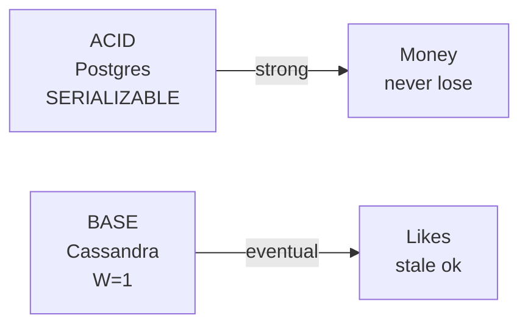

# ACID vs BASE

> ACID = strong pakka, BASE = available aur eventually pakka.

> ACID ek bank khata jaisa — har kaam pura ya zero, paisa kabhi gayab nahi. BASE ek WhatsApp group jaisa — message thodi der baad sabko dikhega, beech me kisi ko purana dikhe to chalega, par system hamesha chalu.

DB choose karte time yahi puchte hain.

## ACID

- **A Atomicity:** ya to pura, ya zero — `transfer 100` me debit+credit dono, ek fail to rollback.
- **C Consistency:** DB rules tootenge nahi — `balance >=0` constraint.
- **I Isolation:** 2 transactions ek saath to jaise ek ke baad ek — `SERIALIZABLE` ya `SELECT FOR UPDATE` se.
- **D Durability:** commit ke baad bijli gayi bhi to data safe — WAL/disk.

**Kahan:** [PostgreSQL](/hld/postgresql), MySQL — payment, tickets.

## BASE

- **BA Basically Available:** har request ka jawab mile, chahe purana.
- **S Soft state:** background me converge hote rahe.
- **E Eventual consistency:** thodi der baad sab ek — 100ms-1 sec.

**Kahan:** [Cassandra](/hld/cassandra), [DynamoDB](/hld/dynamodb) eventual mode, DNS, CDN.

## How to answer in interview

- **Bank transfer:** ACID must — `BEGIN; debit; credit; COMMIT;` + `SERIALIZABLE`.
- **Instagram like:** BASE ok — `W=1`, count 1-2 purana chalega.
- **CAP se link:** ACID → CP, BASE → AP. PACELC me ACID = PC/EC, BASE = PA/EL.

**Tradeoff:** ACID slow (lock/wait) par strong, BASE tez par stale.

**🔴 Galti:** "Cassandra me ACID" — Nahi, BASE eventual.
**✅ Sahi:** "Payment ACID Postgres, likes BASE Cassandra — is feature ACID, us BASE."

**Phrase:** "ACID bank jaisa pakka (A-C-I-D), BASE WhatsApp jaisa eventually pakka — feature dekho."

**Yaad rakho:** ACID = pura ya zero + strong, BASE = available + eventual, payment ACID, likes BASE.

**See also:** [cap-theorem](/hld/cap-theorem), [eventual-consistency](/hld/eventual-consistency), [postgresql](/hld/postgresql).
