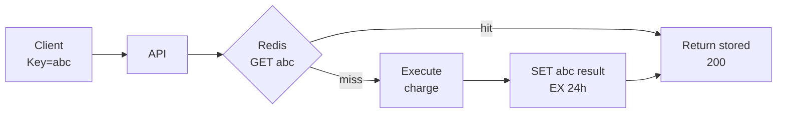
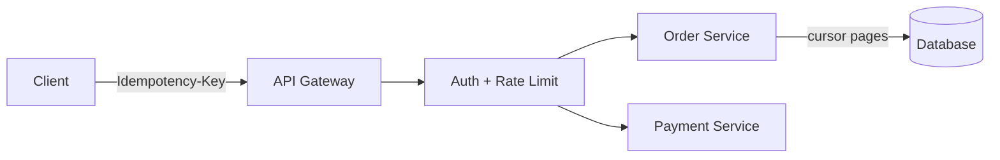

# API Design

> The contract clients code against — resources, versions, pages, errors, and safety rails.

> Good APIs are predictable: nouns for resources, verbs for methods, consistent errors, and versions that never break existing clients. Most interview API sections take five minutes — sketch 4-5 endpoints covering the core flows and move to boxes.

## REST API Design

Model the domain as **resources** with stable IDs and use HTTP methods for intent, not action names in URLs. Collections live at plural nouns (`/users`, `/orders`); items at `/users/{id}`. Nesting expresses ownership (`/users/{id}/orders`) but avoid chains deeper than two levels — prefer `/orders?user_id=` when listing gets awkward. GET must be safe and cacheable; POST creates; PUT replaces whole resources; PATCH partial updates; DELETE removes. PUT and DELETE are idempotent by definition; use query strings for filters, sorts, and field selection — not new endpoints for every variant.

- Prefer **nouns and HTTP verbs** over RPC-style `/createOrder` unless internal tools only.
- **201 + Location** on create; **204** on delete when no body.
- **Partial responses** via `?fields=` reduce mobile payload size.
- **HATEOAS** is optional in interviews — consistent URLs matter more.
- Document **auth scope** per route (public, user, admin) on the whiteboard.

## API Versioning

Clients ship slowly — mobile apps linger for years — so breaking changes need a **version boundary**. Path versioning (`/v1/users`) is obvious in logs and docs; header versioning (`Accept: application/vnd.company.v1+json`) keeps URLs clean but is harder to grep. Safe changes: new optional fields, new endpoints, new enum values with backward-compatible defaults. Breaking changes: renaming fields, changing types, removing endpoints — require `/v2`, dual-run period, metrics on v1 traffic, and **Sunset** headers with a deprecation deadline.

- **Default** to path `/v1` for public REST — interviewers recognize it instantly.
- Run **v1 and v2 in parallel** behind the gateway; route by path prefix.
- **Feature flags** for behavior, not for schema breaks — schema breaks need version bump.
- Log **version per request** to plan deprecation.
- GraphQL/gRPC: version **schemas** with compatibility rules (proto field numbers never reused).

## Pagination, Filtering, Sorting

Unbounded list endpoints DoS your DB and clients. **Offset pagination** (`?offset=100&limit=50`) is simple but degrades on large offsets (O(n) scans) and duplicates/skips rows when data changes. **Cursor pagination** (`?cursor=...&limit=50`) keys off an indexed column (`created_at`, `id`) — stable under inserts, O(1) per page. Filter via query params (`?status=paid`), sort via `?sort=-created_at`. Return **`next_cursor`** / `nextCursor` and **`has_more`**; omit expensive `total_count` unless cheap or cached.

- Cursor = **last seen sort key** (+ tie-breaker id) — must match index order.
- **Max limit** cap (e.g., 100) enforced server-side.
- Filtering: whitelist fields to avoid **SQL injection** via sort/filter params.
- **Stable sort** — always tie-break with unique id.
- For **export**, use async job + download URL, not paginated mega-fetch.

## API Gateway

The gateway is the **north-south edge**: one hostname, TLS termination, authentication, rate limits, routing, and sometimes request transformation. It keeps cross-cutting policies out of every microservice so teams ship business logic without reimplementing JWT validation. Keep the gateway **thin** — heavy orchestration belongs in a BFF; business rules in the gateway become untestable and create deployment coupling.

- **AuthN** at gateway (JWT/OAuth introspection); **AuthZ** often still in services (resource ownership).
- **Rate limit** by API key, user id, or IP — return **429** with Retry-After.
- **Path-based routing** `/orders/*` → order service; canary by header or weight.
- **Request size limits** and WAF rules at the edge.
- Gateway **HA** — active-active behind anycast or DNS failover.
- **Thin by rule:** no business logic, no cross-service joins, no heavy transforms — route and guard, never decide. A fat gateway becomes untestable shared code deployed on every change.
- **Failure modes:** single point of failure → HA pairs across zones; every hop adds latency → keep gateway logic O(1) and cacheable; rate-limit misconfig → 429s on launch day, tier limits carefully.
- **Phrase:** "Single front door — TLS, auth, rate limits, routing. Business logic stays in services."

## Request Validation and Error Handling

Validate syntax and semantics **before** business logic: types, ranges, required fields, enum values, and auth context. Fail fast with **400** and machine-readable codes (`{"code":"ORDER_NOT_FOUND"}`) plus human message and optional field errors — clients branch on code, not substring matching. **401** = not authenticated; **403** = authenticated but not allowed; **404** = missing (or hidden for enumeration); **409** = conflict; **429** = throttled; **5xx** = server fault. Never leak stack traces or internal hostnames.

- One **error envelope** across all services `{ code, message, details[] }`.
- **Correlation id** (`X-Request-Id`) in logs for support and tracing.
- **Validation** duplicated lightly at gateway (shape) and service (domain rules).
- Idempotent retries: distinguish **409** vs **500** for client retry logic.
- **Problem Details** (RFC 7807) is a nice mention for public APIs.

## Idempotency and Idempotency Keys

Networks retry — clients, gateways, and load balancers may deliver the same POST twice. **Idempotent** operations produce the same effect once: GET, PUT, DELETE by nature; POST needs design. Clients send **`Idempotency-Key`** (UUID) on mutating calls; the server stores `(key → response)` for 24–72 hours and returns the cached response on replay instead of re-executing. Essential for **payments, reservations, and inventory**; reads get idempotency free via GET semantics.

- Store idempotency record in **Redis or DB** with TTL ≥ client retry window.
- On concurrent duplicate keys, **one executes**, others wait or return 409/in-progress.
- **Different payload + same key** → 422 conflict — reject ambiguous replays.
- Combine with **DB unique constraints** (payment_id) as last line of defense.
- Webhooks and async workers should also treat delivery as **at-least-once**.
- **Mechanics:** `SET key result NX EX 24h` — hit returns the stored response, miss executes then stores. Dedup-table alternative: `processed_keys(key PK, response, created_at)` with `INSERT ... IF NOT EXISTS`.
- **Queue consumers:** dedupe on `msgId` (`SETNX msg:123` → seen, skip) — at-least-once delivery plus idempotent handler equals safe retries.
- **Phrase:** "Idempotency-Key plus SETNX — seen key returns the stored answer, new key executes once. Exactly-once effect from at-least-once delivery."

## Webhooks

Webhooks invert the pull model: your service **POSTs signed events** to subscriber URLs when state changes (`order.paid`). Sign every payload (HMAC) so receivers verify authenticity. Subscribers must respond quickly with 2xx and process **asynchronously** — heavy work off the HTTP thread. Delivery is **at-least-once**: retries with backoff, duplicates, and out-of-order arrival — receivers must be idempotent with event-id dedup.

- Include **`event_id`**, **`type`**, **`created_at`**, and resource snapshot or id.
- Retry with **exponential backoff**; disable endpoint after repeated failures (dead letter + alert).
- **Rotate secrets** without downtime — support two signing keys briefly.
- Offer **replay API** or dashboard for missed events.
- Never webhook **PII** you would not expose over REST.

## API Composition

Mobile and web clients hate chatty UIs — **composition layers** (BFF, GraphQL gateway, or dedicated aggregator) fan out one client call into parallel service calls and merge results. That cuts latency and tailors payloads per client at the cost of **partial failure**: return what succeeded, mark what failed, and degrade non-critical sections instead of failing the entire response.

- **Parallel fan-out** with deadlines — budget p99 to slowest critical dependency.
- **GraphQL** batching/N+1 risk — DataLoader or field-level caching in BFF.
- Do not put **business invariants** only in BFF — services remain source of truth.
- **Circuit breakers** on each downstream; stub missing sections gracefully.
- Separate BFF per client shape (iOS vs web) if schemas diverge materially.

## Keep in mind

- Nouns for resources, verbs for methods; GET cacheable, PUT/DELETE idempotent by default.
- Cursor pagination for changing data; offset only for stable small admin lists.
- Version in path; additive changes safe, removals need new version and sunset plan.
- Idempotency keys on every mutating retry-safe endpoint, especially payments and bookings.
- Webhooks must be signed, idempotent receivers, retried with backoff — design for duplicates.
- Validate at the edge; error codes machine-readable, correlation ids in logs, never stack traces.
