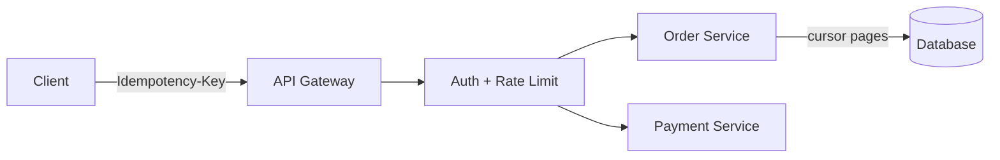

# API Design

> The contract clients code against — resources, versions, pages, errors, and safety rails.

> Good APIs are predictable: nouns for resources, verbs for methods, consistent errors, and versions that never break existing clients. Most interview API sections take five minutes — sketch 4-5 endpoints covering the core flows and move to boxes.

## REST API Design

Resources as nouns (`/users/{id}`, `/orders`), HTTP verbs as actions (GET read, POST create, PUT replace, PATCH update, DELETE remove). GET is cacheable, PUT and DELETE are idempotent by definition. Keep URLs hierarchical for ownership (`/users/{id}/orders`) and query strings for options.

## API Versioning

Never break existing clients: version in the path (`/v1/...`) or headers. Additive changes (new optional fields) are safe; renames and removals need a new version plus a deprecation window with Sunset headers.

## Pagination, Filtering, Sorting

Never return unbounded lists. Cursor pagination (`?cursor=...&limit=50`) beats offset for changing datasets — stable and O(1) per page. Filtering via query params (`?status=paid`), sorting via `?sort=-created_at`. Return `nextCursor` always, plus total counts only when cheap.

## API Gateway

One front door: TLS termination, authentication, rate limiting, routing to services. Keeps cross-cutting concerns out of business logic. Keep it thin — business rules leaking into the gateway become untestable.

## Request Validation and Error Handling

Validate at the edge: types, ranges, auth, required fields — fail fast with 400 and machine-readable error codes (`{"code":"ORDER_NOT_FOUND"}`). Use status codes correctly: 400 bad input, 401 unauthenticated, 403 forbidden, 404 missing, 409 conflict, 429 limited, 5xx server fault. Never leak stack traces.

## Idempotency and Idempotency Keys

Retries must be safe: same request twice gives one effect. Clients send `Idempotency-Key` headers; servers store the key with the result — duplicates return the stored result instead of re-executing. Payments and bookings require it; reads get it free via GET semantics.

## Webhooks

Reverse APIs: instead of polling, the server POSTs events to client URLs on state changes. Sign every payload (HMAC) so receivers verify authenticity. Receivers must be idempotent — webhooks retry with backoff and arrive duplicated and out of order.

## API Composition

One client call fanning to many services, merged by a Backend-for-Frontend or gateway layer. Keeps mobile payloads small (one round trip) at the cost of a composition layer that must handle partial failures — return what succeeded, mark what didn't.

## Keep in mind

- Nouns for resources, verbs for methods; GET cacheable, PUT idempotent.
- Cursor pagination for changing data; offset only for stable small lists.
- Version in path; additive changes safe, removals need new version.
- Idempotency keys on every mutating retry-safe endpoint, especially payments.
- Webhooks must be signed, idempotent receivers, retried with backoff.
- Validate at the edge; error codes machine-readable, never stack traces.
