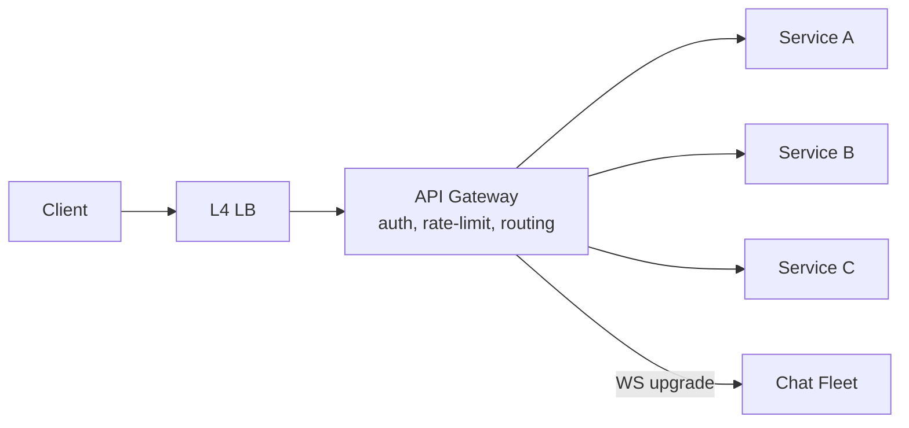

# API Gateway

> Single front door — TLS, auth, rate limits, routing. Business logic isme mat dalo.

> **TL;DR Hinglish:** Gateway ek building ka main gate hai — har request yahan se hoke jaayegi, gate pe hi ID check (auth), bheed control (rate limit), aur sahi office (service) me bhej do. Andar ka kaam service kare, gate nahi.

Ye app servers ke aage khada hota hai. Client ko bas `api.example.com` pata hai, peeche 20 services hain pata nahi. Gateway L7 (HTTP) pe kaam karta hai, Load Balancer L4 (TCP) pe. Dono saath rehte hain: LB → Gateway → Services.

## Kya karta hai? (Checklist bolo)

- **TLS terminate** — HTTPS yahan khatam, andar plain HTTP
- **Auth** — JWT verify, `userId` header aage bhejo
- **Rate limiting** — per user/IP, [Redis](/system-design/redis) counter
- **Routing** — `/v1/pay` → Payment Service, `/v1/search` → Search Service
- **Validation** — schema check, size limit
- **Observability** — request ID inject, logs/metrics

## Kya nahi karna?

Business rules, DB queries, heavy compute — gateway ko halka rakho warna har request yahi atke. Fat gateway = SPOF.

**LB vs Gateway:** LB = traffic baanto (round-robin, health check). Gateway = HTTP samjho, auth/rate-limit/routing.

## Failure — interview me bolo

- **SPOF:** Gateway gira to sab gira — multi-AZ, 3+ replicas, health check, circuit breaker.
- **Timeouts:** downstream slow to gateway queue full → 504, retry with backoff, idempotent.
- **WS draining:** deploy pe connections gracefully close + client reconnect.
- **Config:** rate limit rules etcd/Consul se, hot reload.

**🔴 Galti:** "Gateway me hi payment logic likh do" — Scale nahi hoga, deploy risky.
**✅ Sahi:** "Gateway sirf cross-cutting: auth, limit, route. Logic service me."

**Phrase:** "Gateway front door hai — auth/rate-limit/routing yahan, business logic peeche. LB L4, Gateway L7."

**Yaad rakho:** Front door, L7 vs L4, halka rakho, multi-AZ warna SPOF.

**See also:** [rate limiter](/system-design/rate-limiter), [notification system](/system-design/notification-system).
