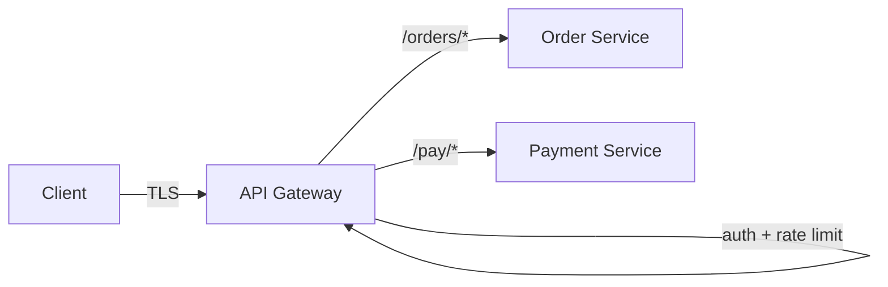

# API Gateway

> Single front door: TLS, auth, rate limits, routing. Keep business logic out of it.

> The gateway is a building's main gate — every request passes through, IDs get checked (auth), crowds get controlled (rate limits), and visitors route to the right office (service). Services handle the actual work; the gate never does.

## What it does

Terminate TLS, validate JWTs, enforce rate limits per user and IP, route by path to services, aggregate responses for mobile (Backend-for-Frontend), and emit access logs plus metrics. Cross-cutting concerns live here once instead of in every service.

## What it must not do

Business logic, data joins across services, or heavy transformation — those belong in services. A fat gateway becomes untestable shared code deployed on every change. Route and guard; never decide.

## Failure modes to mention

1. **Single point of failure** — gateway down means everything down; run HA pairs across zones.
2. **Latency added** — every hop costs; keep gateway logic O(1) and cacheable.
3. **Fat gateway** — business rules leaking in create deploy coupling; push back to services.
4. **Rate limit misconfiguration** — legitimate traffic 429s during launches; tier limits carefully.

**Mistake:** "Implement business workflows in the gateway."
**Correct:** "Gateway routes and guards — auth, limits, routing. Services own every decision."

**Phrase:** "Single front door: TLS, auth, rate limits, routing — business logic stays in services."

**Remember (Revision):** Thin gateway (route + guard), HA pairs, O(1) logic, tiered limits, BFF aggregation for mobile.

**See also:** [api design](/hld/api-design), [rate limiting](/hld/rate-limiting), [microservices](/hld/microservices).
