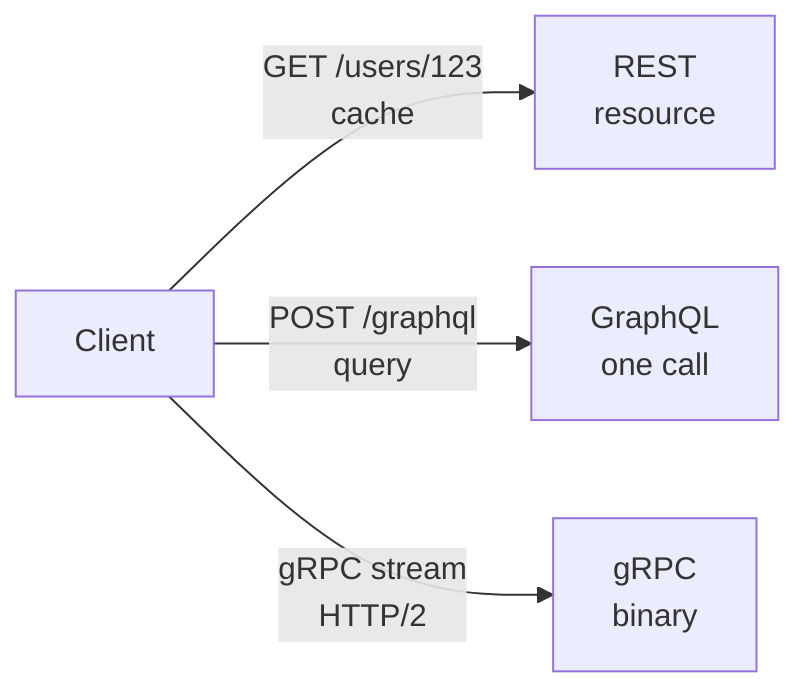

# REST vs GraphQL vs gRPC

> API kaise dikhe — resource, query, ya streaming pipe.

> REST ek menu card — `GET /users/123` fixed dish. GraphQL ek buffet — `query { user { name posts } }` jo chahiye wahi lo, ek call me. gRPC ek phone line — binary, streaming, tez par browser me nahi.

Har "API Design" me yahi puchenge.

## REST

- Resource pe verb: `GET /users/123`, `POST /orders`, `PUT`, `DELETE` — HTTP semantics, `GET` cache, `PUT` idempotent.
- Pros: simple, CDN cache, browser friendly.
- Cons: over-fetch (`/users` me pura object) ya under-fetch (N calls), versioning `/v1`.

## GraphQL

- Ek endpoint `POST /graphql` + query `query { user(id:123){ name, posts(limit:5){ title } } }` — client jo maange wahi.
- Pros: mobile ke liye best (1 call, kam bytes), strong typing.
- Cons: cache mushkil (POST), N+1 query (DataLoader se batch), file upload heavy.

## gRPC

- Proto `service Payment { rpc Charge(Req) returns (Res) }` + HTTP/2 binary + streaming (`stream`).
- Pros: 5-10x tez + chhota, streaming (chat, stock ticks), codegen.
- Cons: browser nahi (grpc-web proxy), debug binary.

## How it works

- **Public API / CRUD:** REST — cache + simple.
- **Mobile/ BFF:** GraphQL — 1 call, kam data.
- **Internal microservices / ML:** gRPC — tez + streaming.

**Hybrid:** Gateway pe REST public, andar gRPC, mobile ke liye GraphQL BFF.

**🔴 Galti:** "GraphQL har jagah" — Cache + N+1 marega.
**✅ Sahi:** "Public REST, mobile GraphQL, internal gRPC — use case dekho."

**Phrase:** "REST resource cache, GraphQL one query buffet, gRPC binary stream — public REST, mobile GraphQL, internal gRPC."

**Yaad rakho:** REST GET cache, GraphQL 1 call DataLoader, gRPC HTTP/2 stream, hybrid common.

**See also:** [api-gateway](/hld/api-gateway), [websocket](/hld/websocket), [load-balancer](/hld/load-balancer).
