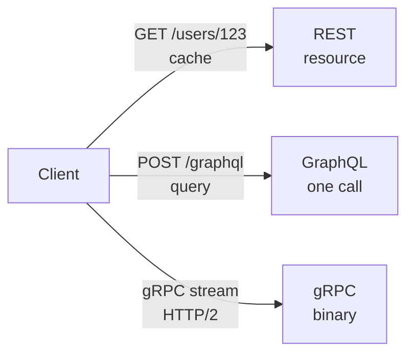

# REST vs GraphQL vs gRPC

> How the API looks — fixed resources, client-driven queries, or binary streaming RPCs.

> REST is a menu card: `GET /users/123` is a fixed dish. GraphQL is a buffet: `query { user { name posts } }` returns only what you ask for in one call. gRPC is a phone line — binary, typed, streaming, fast — but not native in the browser.

Almost every API-design discussion ends with "which paradigm, and why."

## REST

- Resource + verb: `GET /users/123`, `POST /orders`, `PUT`, `DELETE` — HTTP semantics, `GET` is cacheable, `PUT` is idempotent.
- **Pros:** Simple mental model, CDN and browser caching, universal tooling, easy for public APIs.
- **Cons:** Over-fetch (full objects) or under-fetch (N+1 round trips), versioning via `/v1` or headers.

## GraphQL

- One endpoint `POST /graphql` plus a query: `query { user(id:123){ name, posts(limit:5){ title } } }` — the client shapes the payload.
- **Pros:** Great for mobile / BFF (one round trip, fewer bytes), strong schema typing, evolved fields without new endpoints.
- **Cons:** HTTP caching is harder (usually POST), N+1 resolver risk (fix with DataLoader batching), file uploads and streaming are awkward.

## gRPC

- Protobuf service: `service Payment { rpc Charge(Req) returns (Res) }` over HTTP/2 binary, with unary and streaming RPCs.
- **Pros:** 5–10× smaller/faster payloads, first-class streaming (chat ticks, stock prices), codegen for many languages.
- **Cons:** Browsers need grpc-web or a gateway; debugging binary is harder than JSON.

## How to choose

| Surface | Prefer | Why |
|---------|--------|-----|
| Public CRUD / partner API | REST | Cache, simplicity, HTTP ecosystem |
| Mobile or complex UI BFF | GraphQL | One call, shaped payload |
| Internal microservices / ML | gRPC | Speed, streaming, contracts |

**Hybrid (common):** REST (or GraphQL BFF) at the edge for clients; gRPC between internal services.

**Anti-pattern:** "GraphQL everywhere" — you inherit cache and N+1 pain on paths that never needed it.

**Soundbite:** *"Public REST, mobile GraphQL BFF, internal gRPC — pick by surface, not fashion."*

**Remember:** REST GET caches; GraphQL needs DataLoader discipline; gRPC rides HTTP/2 streams; hybrids are normal.

**See also:** [API design](/hld/api-design) (gateway, idempotency), [Load balancing](/hld/load-balancing), [Networking](/hld/networking).
