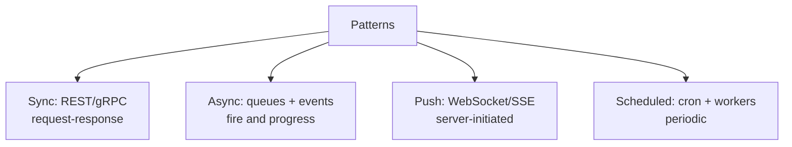

# Important Architecture Concepts

> The recurring building blocks that appear inside almost every design.

> These patterns crosscut the syllabus — each earns a paragraph here and a link where it lives in depth. In interviews, naming the right block ("this is a job queue with a scheduler") scores as much as drawing boxes.

## Reverse Proxy and API Gateway

Reverse proxies (Nginx, HAProxy) front servers with load balancing, SSL termination, caching, and compression. API gateways add auth, rate limits, and routing per system. Same box family — gateways know your APIs, proxies just forward well. Details live in load balancing and API design.

## Service Discovery

Instances churn, so addresses resolve at runtime: registries (Consul, Eureka) with heartbeats, or DNS plus load balancers. Full treatment sits in the microservices notes.

## Service Mesh Basics

Sidecar proxies beside every service handling retries, mTLS, routing, and telemetry uniformly (Istio, Linkerd). Powerful observability and control, real latency and complexity cost. Worth it past dozens of services; overkill before.

## Event-Driven Architecture and Pub/Sub

Services emit domain events; interested parties consume independently. Producers never know consumers — systems evolve without coordination. Ordering holds per key; consistency stays eventual. Deep dive in microservices and message queues.

## Webhooks

Servers calling clients back on events — signed, retried, idempotent receivers required. The inside-out API for payments, CI systems, and third-party integrations. Details in API design.

## Long Polling, WebSockets, Batch and Stream Processing

Long polling holds requests until data arrives (simple, chatty fallback). WebSockets keep two-way pipes (chat, live docs). Batch processing crunches bounded datasets on schedule (Spark, nightly jobs). Stream processing reacts per event continuously (Flink, Kafka Streams). Pick by latency need: nightly, seconds, or milliseconds.

## Job Queues, Background Workers, Distributed Scheduler

Web requests enqueue; worker fleets execute with retries — uploads, emails, transcoding never block responses. Distributed schedulers (cron across machines with leader election or atomic claims) fire periodic work exactly once. At-least-once execution demands idempotent jobs.

## Consistent Hashing

Ring-based key distribution where server changes move only `1/N` of keys — the scalable alternative to modulo hashing. Virtual nodes even the load. Every cache cluster and shard map uses it; full treatment in load balancing.

## Keep in mind

- Name the block before drawing boxes — "job queue with scheduler" scores immediately.
- Reverse proxy forwards; API gateway guards and routes; service mesh sidecars everything.
- Events decouple, webhooks notify outward, WebSockets push live.
- Batch for nightly, streams for continuous — latency need decides.
- Scheduled work needs atomic claims or leaders — never bare cron on many boxes.
- Consistent hashing underlies every scalable cache and shard map.
