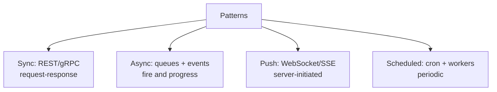

# Important Architecture Concepts

> The recurring building blocks that appear inside almost every design.

> These patterns crosscut the syllabus — each earns a paragraph here and a link where it lives in depth. In interviews, naming the right block ("this is a job queue with a scheduler") scores as much as drawing boxes.

## Reverse Proxy and API Gateway

A **reverse proxy** (Nginx, HAProxy, Envoy) sits in front of application servers and handles TLS termination, load balancing, compression, static file serving, and buffering slow clients so backends stay protected. An **API gateway** is the same edge role plus API-aware policies: authentication, rate limiting, request routing to microservices, request/response transformation, and sometimes billing or developer portals. Proxies optimize transport; gateways enforce product and security contracts at the boundary. In small systems one Nginx box does both; at scale dedicated gateways (Kong, AWS API Gateway) centralize cross-cutting rules so services stay thin.

- **SSL at the edge** — backends often speak HTTP inside the trusted network or mesh.
- **Path-based routing:** `/api/users` → user service without exposing every service publicly.
- **Rate limits and quotas** at gateway protect downstream from abuse and noisy neighbors.
- **Don't put business logic** in gateway scripts — keep validation and auth, delegate domain rules.
- **Interview:** "Reverse proxy for performance and TLS; API gateway for auth, throttle, and route."

## Service Discovery

When instances scale up and down or fail, hard-coded IP lists break — **service discovery** resolves logical service names to current healthy endpoints at call time. **Client-side discovery** (Eureka, Consul agents): clients query a registry and pick an instance. **Server-side discovery** (Kubernetes DNS, cloud load balancers): clients hit a stable VIP/DNS name; the platform routes to backends. Registries rely on **heartbeats** and health checks to drop dead nodes; TTL and cache refresh balance lookup load vs stale routes.

- **Kubernetes:** `Service` DNS `my-svc.namespace.svc.cluster.local` is discovery built-in.
- **Health checks** must match real readiness — registering before app can serve causes 502 storms.
- **Dual stacks:** IPv6 and multi-region need explicit registry or DNS design.
- **Interview contrast:** client-side (smart client) vs server-side (dumb client + LB).
- **See microservices notes** for deeper failure and cache staleness trade-offs.

## Service Mesh Basics

A **service mesh** injects a **sidecar proxy** (Envoy) beside each pod/instance to handle retries, timeouts, mTLS, traffic splitting, and telemetry without embedding that logic in every language SDK. Control plane (Istio, Linkerd) pushes policy; data plane proxies enforce it on east-west traffic. You gain uniform observability and security and fine-grained canaries; you pay latency (extra hop), memory per sidecar, and operational complexity. Worth considering past roughly **dozens of services** or strict zero-trust east-west requirements; overkill for a monolith or handful of services.

- **mTLS everywhere** — services prove identity to each other, not just north-south TLS.
- **Retries with budget** — blind retries amplify outages; cap attempts and use circuit breakers.
- **Traffic split:** 95/5 canary without custom deploy scripts in app code.
- **Cost:** sidecar CPU/RAM × replica count — model before mandating mesh org-wide.
- **Interview:** "Cross-cutting east-west policy in sidecars — power vs complexity."

## Event-Driven Architecture and Pub/Sub

In **event-driven** systems, services publish **domain events** (`OrderPlaced`, `UserSignedUp`) to a broker; consumers subscribe without the producer knowing their names or count. **Pub/Sub** decouples teams and deployment cadence — add a new analytics consumer without changing checkout code. Ordering is typically **per partition key** (all events for `order_id=123`), not global; consumers assume **at-least-once** delivery and implement idempotency. Consistency is **eventual** across read models — design for lag and duplicate events explicitly.

- **Event vs command:** events state facts; commands request action — don't mix semantics on one topic.
- **Schema evolution:** version events (Avro/Protobuf) so old consumers don't break on new fields.
- **Outbox pattern:** write DB + outbox in one transaction, then publish — avoids lost events.
- **Choreography vs orchestration:** many reactions vs one saga coordinator — pick for failure visibility.
- **Interview:** "Producers don't know consumers; idempotent handlers; ordering by key only."

## Webhooks

**Webhooks** invert the usual API flow: your server **HTTP POSTs** to a customer URL when something happens (payment captured, build finished). Receivers must verify **signatures** (HMAC of body with shared secret), respond quickly with 2xx, and process **asynchronously** if work is heavy — platforms retry with backoff on failures. Design **idempotent** handlers keyed by event ID so duplicate deliveries don't double-charge or double-ship. Webhooks are the standard integration surface for SaaS, payments (Stripe), and CI (GitHub Actions).

- **Sign payloads** — never trust unauthenticated POST bodies from the internet.
- **Expose event ID** — store processed IDs for dedup window (24–72h typical).
- **Timeout:** respond 200 within seconds; queue internal work from webhook handler.
- **Retry storms:** return 5xx only when you want redelivery; 4xx for bad signature stops retries.
- **Interview:** "Outbound push integration — signed, fast ACK, idempotent processing."

## Long Polling, WebSockets, Batch and Stream Processing

**Long polling** keeps an HTTP request open until data arrives or timeout, then client reconnects — simpler than WebSockets through strict proxies, but chatty and higher latency than a persistent socket. **WebSockets** (or SSE for server→client only) maintain a bidirectional or push channel for chat, collaborative docs, and live tickers — stateful connections need sticky sessions or shared pub/sub backplane. **Batch processing** runs bounded jobs on a schedule or trigger (Spark, nightly ETL) — minutes to hours latency, huge throughput. **Stream processing** handles unbounded events continuously (Flink, Kafka Streams) — sub-second aggregation and alerting. Choose by latency SLA: overnight reports → batch; near-real-time dashboards → streams; interactive live UI → WebSockets/SSE.

- **SSE:** one-way push over HTTP/2-friendly connections; simpler than full WebSocket for feeds.
- **Connection scale:** WebSockets need memory and LB stickiness — plan horizontal fan-out via Redis pub/sub.
- **Batch:** idempotent partitions, checkpointing, and replay on failure.
- **Streams:** windowing (tumbling, sliding) and late-arriving event handling.
- **Interview ladder:** batch (hours) → long poll (seconds) → streams/WebSockets (ms–sub-second).

## Job Queues, Background Workers, Distributed Scheduler

Interactive requests should **enqueue** slow work — email, video transcode, PDF generation — and return quickly; **worker fleets** pull from the queue, execute with retries, and mark completion. Queues absorb spikes and isolate failure: a stuck worker doesn't block the web tier. **Distributed schedulers** run cron-like jobs across many machines using **leader election** (one scheduler fires) or **atomic claim** rows (many workers, one wins per slot) so "every midnight" doesn't run N times on N boxes. Assume **at-least-once** delivery — jobs must be **idempotent** or guarded with dedup keys.

- **Visibility timeout** must exceed max job duration or work gets double-processed.
- **Priority queues** for user-visible vs housekeeping tasks.
- **Dead-letter queue** after N failures — alert and inspect poison payloads.
- **Scheduler:** Kubernetes CronJob, or DB `SELECT ... FOR UPDATE SKIP LOCKED` claim pattern.
- **Interview:** "Request path enqueues; workers scale on queue depth; idempotent handlers."

## Consistent Hashing

**Modulo hashing** (`hash(key) % N`) reshuffles almost every key when N servers change — painful during scale-out. **Consistent hashing** maps keys and servers onto a ring; adding or removing one server moves only about **1/N** of keys. **Virtual nodes** (many ring positions per physical server) spread load evenly and reduce hotspots when the ring is small. Every large **cache cluster**, **Dynamo-style partition ring**, and **load balancer with sticky shards** leans on this idea — name it when interviews ask how caches scale without full remapping.

- **Clockwise walk:** key hashes to ring position; first server vnode at or after wins.
- **Replication:** walk additional successors for replica placement on the ring.
- **Hot keys:** consistent hashing doesn't fix skew — add local cache or key splitting.
- **Jump hash / rendezvous** alternatives when you need minimal movement with simpler math — mention as variants.
- **Interview:** "O(1/N) remapping on node change vs modulo's full shuffle."

## Keep in mind

- Name the block before drawing boxes — "job queue with scheduler" scores immediately.
- Reverse proxy forwards and terminates TLS; API gateway guards and routes; service mesh sidecars east-west traffic.
- Events decouple producers and consumers; webhooks notify outward; WebSockets/SSE push live updates.
- Batch for nightly volume, streams for continuous processing — latency need decides.
- Scheduled work needs atomic claims or leader election — never bare cron on many boxes.
- Consistent hashing underlies scalable caches and shard maps — ~1/N keys move on topology change.
