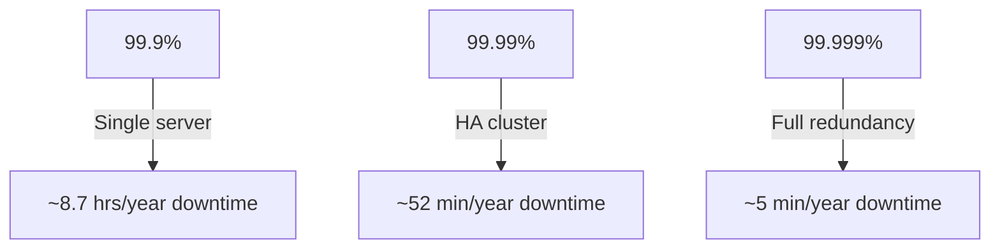

# Availability

> System kabhi bhi available re — high uptime, fault tolerance, disaster recovery.

> **TL;DR Hinglish:** Availability = system kabhi band nahi hona. SLA (Service Level Agreement) mein uptime guaranteed hota hai (99.9%, 99.99%). Redundancy — copies rakho — server, network, data sab pe. Failover automatic hona chahiye. Active-Active = high availability, Active-Passive = simpler. RTO (recovery time) aur RPO (recovery point) measure karte hain.

Availability system ka uptime hai — kitne % time accessible hai:

**SLA levels:**
- **99.9%** — ~8.7 hours downtime/year (single server, acceptable for small apps)
- **99.99%** — ~52 minutes downtime/year (HA cluster needed)
- **99.999%** — ~5 minutes downtime/year (full redundancy, very expensive)

**Key concepts:**
- **RTO (Recovery Time Objective)** — kitni time mein system recover hona chahiye
- **RPO (Recovery Point Objective)** — kitna data loss acceptable hai (last backup se)
- **Redundancy** — multiple copies — server, network, data, power, location
- **Failover** — automatic switch when primary fails

## Failure modes to mention

1. **Single point of failure** — Ek component fail = system down — redundancy se bachna
2. **Failover delay** — Automatic failover mein seconds/minutes lag — unacceptable for 99.99%
3. **Cascading failure** — Ek server fail → load shift → doosra fail → chain reaction
4. **Partition tolerance vs consistency** — Network partition me availability sacrifice hona pad sakta (CAP theorem)

**🔴 Galti:** "100% availability possible hai" — 100% impossible hai, 99.99% isliye expensive hai.
**✅ Sahi:** "Availability SLA-based: 99.9% simple, 99.99% needs HA cluster, 99.999% needs full redundancy. RTO + RPO define recovery targets."

**Phrase:** Availability system uptime hai — SLA 99.9% to 99.999%, redundancy se avoid SPOF, RTO recovery time, RPO data loss limit, failover automatic, CAP theorem trade-off.

**Yaad rakho (Revision):** SLA levels (99.9%, 99.99%, 99.999%), RTO (recovery time), RPO (data loss limit), redundancy everywhere, automatic failover, CAP theorem trade-off, SPOF avoidance.

**See also:** [Clustering](/system-design/clustering), [Load Balancing](/system-design/load-balancing), [Disaster Recovery](/system-design/disaster-recovery).
