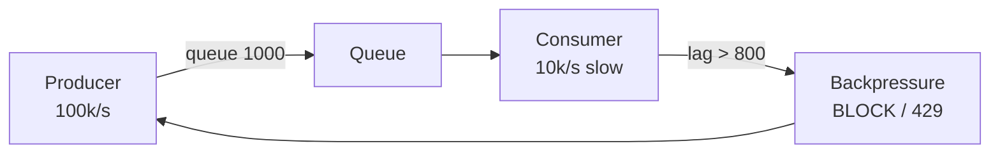

# Backpressure

> Consumer slow to producer ko bolo "dheere" — nahi to queue phat jayegi, OOM.

> **TL;DR Hinglish:** Backpressure ek factory line jaisa — packing slow to belt roko ya speed kam karo, nahi to samaan gir jayega. Queue bharo, drop karo, ya producer ko throttle karo.

Flink, Kafka, API sab me.

## How it works

**1. Buffer + Bound:** queue `size=1000` — full to `BLOCK` ya `DROP` / `503`. Java `ArrayBlockingQueue`, Go `buffered channel`.

**2. Throttle / Rate limit:** producer ko `429 + Retry-After: 2s` — client khud slow. API Gateway me token bucket.

**3. Reactive pull:** consumer `request(n)` bolega kitne chahiye — Project Reactor, gRPC flow control.

**Flink me:** credit-based — downstream kitne bytes le sakta hai batata hai, upstream utna hi bheje. Network buffer 32KB.

**Kafka me:** consumer lag badha → autoscale consumer ya pause partition.

## How to choose

- **Drop:** metrics, logs — thoda loss ok → `DROP_OLDEST`.
- **Block:** payment — loss nahi → `BLOCK` + timeout.
- **Throttle:** API → `429`.

## How to answer in interview

- **Ad click aggregator:** Flink backpressure → Kafka lag → alert + scale.
- **API → DB:** DB slow to API queue full → `503` + circuit breaker.

**🔴 Galti:** "Unbounded queue" — OOM, phir sab crash.
**✅ Sahi:** "Bounded 1000 + block/drop/429, lag monitor, autoscale."

**Phrase:** "Backpressure — queue bound, full pe block/drop/429, consumer lag dekho."

**Yaad rakho:** Queue 1000, drop vs block vs 429, Flink credit, Kafka lag.

**See also:** [flink](/system-design/flink), [kafka](/system-design/kafka), [circuit-breaker](/system-design/circuit-breaker).
