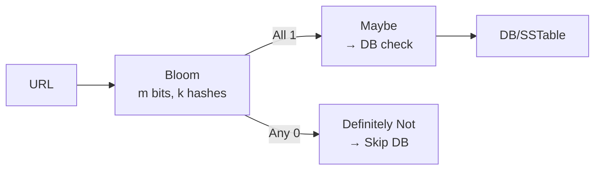

# Bloom Filter

> "Ye key exist karti hai kya?" ka tez jawab — `No` to pakka No, `Yes` to 99% Yes (1% false positive). Memory chhota.

> **TL;DR Hinglish:** Bloom filter ek jadoo ki list hai — 10 lakh naam ko 2MB me yaad rakhe. Puche "Ram hai kya?" to bolega "Nahi" to 100% nahi, "Haan" to 1% galat ho sakta. Isliye DB se pehle filter ki tarah use karo.

Web crawler me "URL pehle dekha kya?" — har URL DB me check kiya to 100k QPS DB marega. Bloom pehle pochega.

## How it works

- `m` bits ka array (sab 0), `k` hash functions.
- **Add `x`:** `k` hashes → `k` positions pe `1` karo.
- **Check `y`:** `k` positions dekho — ek bhi `0` to pakka nahi hai. Sab `1` to shayad hai (false positive).

```
m=10 bits: 0 0 0 0 0 0 0 0 0 0
Add "cat": h1=2,h2=5 → 0 0 1 0 0 1 0 0 0 0
Add "dog": h1=3,h2=7 → 0 0 1 1 0 1 0 1 0 0
Check "cat": 2,5 dono 1 → shayad hai (sahi)
Check "cow": 1,9 → 1 pe 0 → pakka nahi
```

**Tuning:** `m/n ≈ 10` to `p≈1%` with `k≈7`. `m/n=20` to `0.01%` par memory double.

## When you pick it

1. **Crawler dedup:** `urlBloon.contains(url)? skip : fetch` — false positive se ek URL skip ho jayega par DB bachega (tradeoff ok).
2. **Cache/DB guard:** `userId` hai kya? Bloom `No` → DB mat jao, `Yes` → DB jao (thoda extra DB hit false positive pe).
3. **Cassandra/LevelDB:** SSTable me har file ka bloom — `SELECT` pe pata chale kaunsi file me ho sakta hai, bina saari files khole.
4. **Chrome safe browsing:** 2MB me lakhon malicious URLs.

**Count nahi kar sakte:** delete nahi hota (dusre key ka bit delete ho jayega). Delete chahiye to **Counting Bloom** (har bit pe counter 4-bit) ya **Cuckoo Filter**.



## Failure handling

- **False positive 1%** — acceptable for cache, not for money (payment me mat use).
- **Size:** 1M keys × 1% = 1.2MB, 0.1% = 1.8MB — interview me ye numbers bolo.
- **No delete:** Counting/Cuckoo ya rebuild.
- **Alternative:** Cuckoo filter — delete + less memory for low load, par complex.

**🔴 Galti:** "Bloom 100% accurate" — Nahi, false positive hota hai.
**✅ Sahi:** "DB ke aage guard — No to skip, Yes to DB check, 1% extra DB hit acceptable."

**Phrase:** "Bloom No to pakka No, Yes to shayad Yes — m/n 10 pe 1%, DB se pehle guard."

**Yaad rakho (Revision):** `k` hashes, `m/n=10 →1% k=7`, No=pukka, Yes=maybe, no delete → counting, crawler/DB guard.

**See also:** [web-crawler](/system-design/web-crawler), [distributed-cache](/system-design/distributed-cache), [cassandra](/system-design/cassandra).
