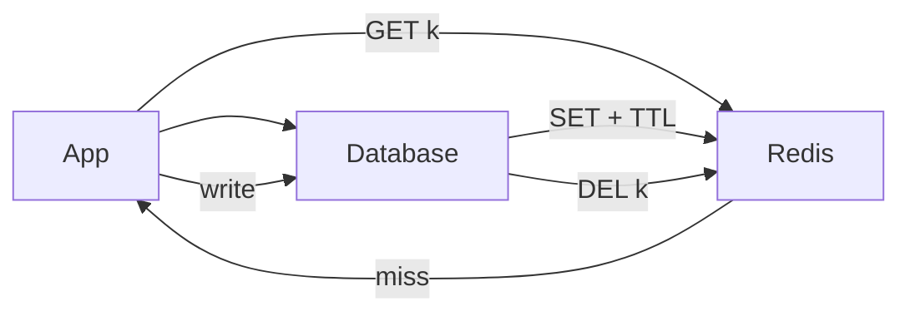

# Caching

> Serve hot data from memory — the cheapest performance win in system design, with invalidation as the price.

> Caches exist because databases are slow and traffic repeats itself: the same feed page, session, or short URL gets hit thousands of times. A cache hit answers in ~1ms; a miss pays the full database cost. Rule: cache the hot path, keep the database as source of truth.

## Why Caching

Databases melt under repeated hot reads; caches absorb them. Sessions, rate-limit counters, leaderboard snapshots, and rendered pages all live here. If the cache vanished, the system must still work (slower) — never depend on cached data for correctness.

## Cache-Aside (Lazy Loading)

The default pattern: app checks cache, on miss reads the database and stores with TTL, on write deletes or updates the key. Only hot keys get cached; cold data never pollutes memory. Pair with TTL plus delete-on-write.

## Read-Through and Write-Through

The cache library handles filling (read-through) and the app writes cache plus database together (write-through). Reads always hit; writes pay double. Good when read freshness matters more than write speed.

## Write-Behind (Write-Back)

Write to cache, flush to database asynchronously. Fastest writes, but a crash loses unflushed data — acceptable only for loss-tolerant data like metrics or counters.

## Write-Around

Writes go straight to the database, bypassing the cache; reads populate on demand. Avoids filling cache with write-once data. Best for write-heavy, rarely re-read workloads.

## TTL and Eviction

TTL bounds staleness — expire entries after seconds to hours, with slight randomization to avoid synchronized expiry. When memory fills, eviction picks victims: LRU (least recently used) is the standard; LFU and FIFO suit special cases.

## LRU in Brief

Track recency per key; evict the stalest. Implementation is hash map plus doubly linked list for O(1) get, put, and evict. The classic interview data structure — know it cold.

## Cache Invalidation

The hard problem: delete or version keys on write (delete-on-write beats update races), use short TTLs as a safety net, and version URLs for static assets (new file means new name, no purge needed).

## Cache Stampede, Penetration, Avalanche

Stampede (thundering herd): hot key expires, thousands hit the database at once — fix with singleflight locks, jittered TTLs, or stale-while-revalidate. Penetration: requests for nonexistent keys bypass cache every time — fix with Bloom filters or cached negatives. Avalanche: many keys expiring together — fix with randomized TTLs.

## Distributed Cache

Shard by consistent hashing across Redis nodes; replicate each shard for failover. Clients route by hash slot; node changes move only `1/N` of keys. Hot keys still hammer single shards — split them or front with local caches.

## Redis

The standard distributed cache: in-memory structures (strings, hashes, sorted sets for leaderboards, HyperLogLog for unique counts), ~1ms latency, optional persistence. Use for cache, sessions, rate limits, and presence — never as the sole source of truth.

## Keep in mind

- Default to cache-aside with TTL plus delete-on-write.
- Database stays source of truth — cache loss must only slow things.
- Randomize TTLs; synchronized expiry causes stampedes.
- Stampede needs singleflight, penetration needs Bloom filters, avalanche needs jitter.
- Shard caches by consistent hashing; split hot keys.
- Redis for hot path, Postgres for truth — say this line.
