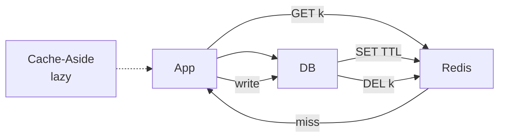

# Caching Strategies

> Cache kaise bharo aur kab khali karo — galat strategy to stale ya DB melt.

> Cache ek tiffin hai — Cache-aside me bhook lage to bazaar (DB) se lao aur tiffin me rakho. Write-through me khana banate hi tiffin me bhi daalo. TTL + delete-on-write se stale roko.

Har design me cache aayega — 90% offload yahi se.

## How it works

**1. Cache-Aside (Lazy):** App cache dekhe → miss → DB → `SET` TTL. Write pe `DEL` key. **Default yahi bolo** — simple, sirf garam keys cache.

**2. Write-Through:** Write pe cache + DB dono likho. Read hit 100%, par har write slow (2 writes).

**3. Write-Behind (Write-Back):** Cache pe likh ke turant ok, DB pe async flush. Tez par crash pe data gaya — sirf metrics jaise loss ok.

**4. Read-Through / Write-Through (cache library kare):** App ko pata bhi nahi, cache khud DB se bhare.

**TTL + Invalidation:**
- `SET key value EX 300` — 5 min baad expire, thoda random `EX 300+rand(60)` se stampede kam.
- Write pe `DEL key` — agla read fresh DB se.

## Preventing stampede

10k requests ek cold key pe → 10k DB hits. Fix:
- **Singleflight:** ek hi thread DB jaye, baaki wait.
- **Stale-while-revalidate:** expiry pe purana data 5 sec stale serve + background refresh.
- **Lock:** `SETNX lock` wala hi DB jaye.

## How to answer in interview

- **Bitly redirect:** Cache-aside + 24h TTL + write pe DEL, stampede singleflight.
- **Feed:** Write-through nahi — feed har second badle, cache-aside hi.

**🔴 Galti:** "Cache forever" — Stale dikhega, memory full.
**✅ Sahi:** "Cache-aside + TTL random + delete-on-write + singleflight."

**Phrase:** "Default Cache-aside, TTL plus delete-on-write, stampede singleflight."

**Yaad rakho:** Aside lazy, Through 2 writes, Behind lossy, TTL random, DEL on write.

**See also:** [redis](/hld/redis), [distributed-cache](/hld/distributed-cache), [thundering-herd](/hld/thundering-herd).
