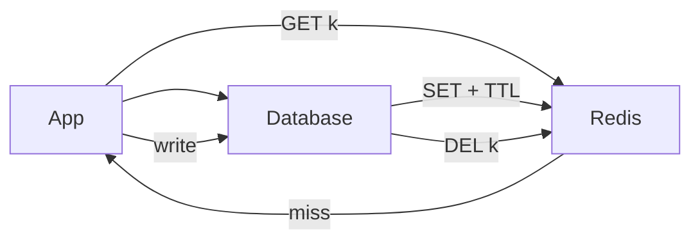

# Caching

> Serve hot data from memory — the cheapest performance win in system design, with invalidation as the price.

> Caches exist because databases are slow and traffic repeats itself: the same feed page, session, or short URL gets hit thousands of times. A cache hit answers in ~1ms; a miss pays the full database cost. Rule: cache the hot path, keep the database as source of truth.

## Why Caching

Repeated reads dominate most products — home feeds, product pages, config flags, and auth sessions hit the same keys at high QPS. A memory cache (local or Redis) cuts p99 latency by orders of magnitude and protects the database from meltdown during spikes. Cache only **derived** or **read-heavy** data; never treat the cache as authoritative for financial or safety-critical state. Design so cache loss degrades to slower DB paths, not wrong answers.

- **80/20 keys:** Often 20% of keys serve 80% of traffic — identify with metrics before sizing memory.
- **TTL vs explicit invalidation:** TTL alone allows stale windows; writes should invalidate or version keys you care about.
- **Cold start:** Empty cache after deploy causes miss storm — warm caches or gradual rollout mitigates.
- **Cost math:** Redis GB-month vs RDS read IOPS — caching usually wins when hit ratio > ~90% on hot paths.

## Cache-Aside (Lazy Loading)

Application code owns the flow: read cache → on miss load DB → populate cache with TTL → return. Writes update the DB first, then **delete** (preferred) or update cache keys — delete avoids race where stale value wins over concurrent writes. Only requested keys enter memory, so cold data never wastes RAM. This is the default pattern for most services because logic stays explicit and debuggable.

- **Delete-on-write:** Safer than write-through cache in cache-aside — next read rebuilds fresh value.
- **Stampede risk:** Hot key expiry triggers many DB loads — combine with singleflight or brief stale serve.
- **Negative caching:** Cache "not found" briefly to stop DB hammering on bogus IDs.
- **Serialization cost:** Large JSON blobs — compress or store IDs and hydrate lightly on hit.

## Read-Through and Write-Through

**Read-through:** Cache library wraps DB — miss triggers loader callback, app always talks to cache API. **Write-through:** App writes cache and DB synchronously; both stay aligned on success, writes pay double latency. Use when you want uniform read path abstraction or when stale reads are unacceptable without app-level invalidation logic. Less flexible than cache-aside for complex invalidation graphs.

- **Read-through:** Good for uniform SDK across services; loader must be idempotent and timeout-bounded.
- **Write-through:** Stronger consistency on reads immediately after write; hurts write p99.
- **Write-around variant pairing:** Sometimes read-through + write-around for write-once read-many blobs.
- **When to skip:** Highly conditional invalidation (graph of dependent keys) — cache-aside stays clearer.

## Write-Behind (Write-Back)

Accept writes into cache, acknowledge fast, flush to DB asynchronously in batches. Write throughput and burst absorption improve dramatically; crash before flush loses recent updates unless you replicate cache or use durable queues. Restrict to metrics, analytics counters, presence heartbeats — never account balances without durable WAL elsewhere.

- **Durability window:** Name max seconds of data loss on node failure — stakeholders must accept it.
- **Ordering:** Per-key serialization prevents lost updates; global order usually unnecessary.
- **Backpressure:** Flush queue full → shed writes or block — unbounded queues OOM the cache node.
- **Hybrid:** Write-through for critical fields, write-behind for view counts on same object — split keys.

## Write-Around

Writes skip cache entirely and land in DB; cache fills only on read miss. Prevents polluting RAM with data written once and never read again (audit logs, archival uploads metadata). Pair with TTL on reads if occasional re-read happens. Ideal for write-heavy ingestion where read ratio is low.

- **Bulk import:** Never warm cache during ETL — write-around keeps memory for hot keys.
- **Invalidation still needed:** If old cached copy exists from earlier read pattern, delete on write anyway.
- **Read-after-write:** User creates resource then reads — bypass cache or insert fresh entry on create response path.
- **Contrast write-through:** Choose write-around when write volume >> read volume for that entity type.

## TTL and Eviction

TTL caps staleness and reclaims memory without manual deletes — set per key type (session 24h, config 5m, HTML fragment 60s). Add **jitter** (±10–20%) so millions of keys do not expire in the same second. When memory hits `maxmemory`, eviction policies apply: **LRU** evicts least recently used keys (default for general caching); **LFU** keeps frequently accessed keys under skew; **volatile-lru** only evicts keys with TTL set.

- **No TTL + no eviction policy:** Redis can refuse writes — configure `maxmemory-policy` explicitly.
- **Too short TTL:** High miss rate and DB load; too long TTL → stale UX and memory bloat.
- **Sliding vs absolute TTL:** Refresh TTL on access for session stickiness; absolute for compliance-bound data.
- **Monitor hit ratio:** Drop below target → TTL too aggressive, wrong keys cached, or hot key eviction.

## LRU in Brief

LRU approximates "keep what we used recently" — on access, mark key most-recent; on eviction, drop least-recent. Classic implementation: hash map for O(1) lookup plus doubly linked list for O(1) promote/evict. Distributed caches use sampled LRU (Redis) for memory efficiency — good enough at scale. Interview: implement LRU with map + DLL; discuss thread safety and lock granularity for concurrent caches.

- **O(1) operations:** `get` promotes node to head; `put` inserts or updates; evict from tail when over capacity.
- **Scan resistance:** Pure LRU punishes one-time large scans — LFU or TTL helps mixed workloads.
- **Not global optimal:** LRU is heuristic; know when LFU wins (hot set smaller than cache).
- **Local vs distributed:** Process-local LRU (Caffeine) plus Redis tier — L1 shaves cross-network RTT.

## Cache Invalidation

Hardest part of caching: when source data changes, every derived cache entry must update or disappear. Prefer **delete** over in-place update to avoid races; use **versioned keys** (`product:123:v7`) for immutable snapshots. Short TTL is a safety net, not a strategy — it bounds worst-case staleness only. Static assets use content-hash filenames — "invalidate" by deploying new URL, zero purge.

- **Dependency graph:** Order update invalidates user, feed, and count keys — document or use tags (Redis cache tags pattern).
- **Event-driven purge:** Pub/sub or stream consumer deletes keys on domain events — scales better than inline deletes in every writer.
- **Thundering delete:** Mass invalidation causes miss storm — stagger or singleflight rebuild.
- **CDN layer:** Purge by path or tag; prefer immutable URLs for images and JS bundles.

## Cache Stampede, Penetration, Avalanche

**Stampede (thundering herd):** Hot key expires; thousands of threads miss together and hammer DB — mitigate with **singleflight** (one loader, others wait), **probabilistic early refresh**, or **stale-while-revalidate** (serve stale, refresh async). **Penetration:** Attacker or bug requests random nonexistent IDs; cache never helps — use **Bloom filters** upstream or cache negative results briefly. **Avalanche:** Many keys share TTL and expire together — **randomize TTL** and shard expiry windows.

- **Singleflight:** `sync.Singleflight` in Go, or Redis lock `SETNX load:key` with short lease.
- **Bloom false positives:** Only block definitely-missing keys; tune false positive rate vs memory.
- **Circuit breaker on loader:** Stop DB retry loops when backend unhealthy — return degraded default.
- **Pre-warm:** Cron or deploy hook loads top-N keys before traffic shifts.

## Distributed Cache

Scale-out uses **consistent hashing**: keys map to ring slots; adding/removing a node moves roughly `1/N` of keys, not the whole cache. Replicate each slot to a follower for failover (Redis Cluster, Memcached proxy setups). Clients must handle **MOVED/ASK** redirects and topology changes. Hot keys still land on one shard — replicate hot key to local L1 or logical sub-keys.

- **1/N key movement:** Why consistent hashing beats modulo `hash(key) % N` on node add/drop.
- **Virtual nodes:** More vnodes per physical node smooths uneven load on small clusters.
- **Local L1:** Caffeine in-process + Redis L2 — watch consistency window between tiers.
- **Multi-AZ:** Place replicas across zones; accept cross-AZ latency for durability vs local replicas for speed.

## Redis

De facto distributed cache: strings, hashes, lists, sets, sorted sets (leaderboards), HyperLogLog (UV), streams (light queue), pub/sub (not durable). Sub-ms LAN latency; optional RDB snapshots and AOF for restart recovery — still not your system of truth. Use for sessions, rate limiting (`INCR` + EXPIRE), distributed locks (with fencing caveats), and ephemeral coordination.

- **Data structures match use case:** Sorted set for rank; hash for object fields; set for unique tags.
- **Single-threaded model:** One big command blocks others — avoid `KEYS *`, use `SCAN`, keep values small.
- **Cluster limits:** Multi-key transactions only in same hash slot — design key names with hash tags `{user}:session:1`.
- **Memory:** `allkeys-lru` vs `volatile-lru` — align with whether every cached key has TTL.

**When Redis fits:** hot keys that would melt Postgres (sessions, feed page 1, short URL lookups); counters and sliding windows for rate limiting; pub/sub or presence heartbeats for chat; distributed locks (`SET key nx ex`) with leases plus fencing; small job lists — big backlogs belong in a message queue. **Don't store:** large blobs, full search indexes, or years of analytics — RAM is expensive and eviction surprises.

**Redis failure modes:** eviction — treat Redis as possibly empty; failover — replica promotes with seconds of stale or lost writes; persistence — AOF vs RDB is acceptable because caches rebuild from the database.

**Phrase:** "Redis is the hot path, Postgres is the source of truth — TTL plus delete-on-write, stampede protection on the hottest keys."

## Bloom Filters

A Bloom filter answers "definitely not in set vs probably in set" in tiny memory — `m` bits plus `k` hash functions. Adding sets `k` bits; checking finds any `0` → definitely absent, all `1` → probably present (false positive). Tuning rule: `m/n ≈ 10` gives ~1% false positives with `k ≈ 7` — 1M keys at 1% fits ~1.2MB. No deletes (a shared bit may belong to another key) — need deletes → counting Bloom or Cuckoo filter.

- **Cache/DB guard:** Bloom says No → skip the DB; Yes → check the DB (1% extra hits acceptable) — never on money paths.
- **Crawler dedup:** "URL seen?" without a database lookup per URL.
- **SSTable skip:** Cassandra/LevelDB keep a Bloom per file to avoid opening files that cannot match.

**Phrase:** "Bloom No is definitely No, Yes is maybe — 1% at m/n 10, a guard before disk, never for money."

## HyperLogLog, Count-Min Sketch, Merkle trees

Probabilistic structures beyond Bloom show up in analytics and sync interviews:

| Structure | Answers | Error | Interview use |
|-----------|---------|-------|---------------|
| **HyperLogLog (HLL)** | Approximate distinct count (UV, unique IPs) | ~1–2% with small fixed memory | Redis `PFCOUNT`, dashboard uniques |
| **Count-Min Sketch (CMS)** | Approximate frequency of items in a stream | Over-estimates, never under (with high probability) | Heavy hitters, "top URLs", rate abuse |
| **Merkle tree** | Hash tree over data chunks | Exact mismatch localization | Replica sync (Cassandra repair), blockchain, file sync (Dropbox-style) |

- **HLL:** Don't store every user id to count uniques — HLL merges across shards with union.
- **CMS:** Pair with a heap for approximate Top-K; good when exact counts are too expensive.
- **Merkle:** Compare root hashes; descend only differing branches — O(log n) to find diverged leaves instead of full scan.
- **Never** for billing money totals — use exact ledgers; sketches are for product metrics and sync efficiency.

**Soundbite:** *"HLL for uniques, Count-Min for frequencies, Merkle to find which replicas diverge — approximate where exact is too expensive."*

## Keep in mind

- Default to cache-aside with TTL plus delete-on-write; DB remains source of truth.
- Cache loss must only slow the system — never change correctness or lose committed money state.
- Randomize TTLs; synchronized expiry causes stampedes and avalanches.
- Stampede → singleflight/stale-while-revalidate; penetration → Bloom or negative cache; avalanche → jitter.
- Shard with consistent hashing; split or L1-cache hot keys that dominate one slot.
- Redis for hot path latency, SQL for truth — say it clearly in interviews.
