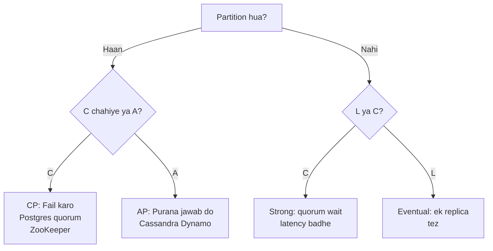

# CAP Theorem

> Distributed system me 3 me se 2 hi pakka ek saath: **Consistency, Availability, Partition tolerance**. Partition aaya to C ya A me se ek chunna padega.

> Network toot gaya (partition) to socho — sabko same jawab doge (Consistency) ya sabko kuch na kuch jawab doge (Availability). Dono ek saath partition me nahi. CP = Postgres quorum, AP = Cassandra/Dynamo. PACELC bhi yaad rakho.

CAP ka matlab ye nahi ki 3 me se hamesha 2 chuno — **P to hamesha chahiye**, partition aata hi hai. Asal sawaal: **partition me C ya A?** Aur normal me (no partition) **Latency vs Consistency (PACELC)**.

## How it works

- **Consistency (C):** har read ko latest write dikhe — jaise bank balance. `X=5` likha to agla padhne wala 5 hi dekhe, chahe kisi bhi replica pe pade.
- **Availability (A):** har request ka jawab mile (fail nahi), chahe thoda purana ho.
- **Partition tolerance (P):** network cut ke baad bhi system chale — nodes alag ho gaye to bhi kaam kare.

**Example:** 3 nodes, user `balance=100`. Network cut: Node A-B ek side, Node C dusri. Client C pe `balance=90` likhe (pay). Agar C chuno to A-B pe purana 100 dikhega (available par inconsistent). Agar A chuno to C pe write fail kar doge (consistent par unavailable).

## PACELC — Extension of CAP

- **P**artition me **A** vs **C** (CAP)
- **E**lse (normal) **L**atency vs **C**onsistency

Normal me bhi tradeoff: strong consistency ke liye quorum wait → latency badhe. Eventual pe ek replica se fast read — latency kam, consistency thodi lose.

- **PC/EC:** HBase, ZooKeeper — partition me consistent, normal me bhi consistent (latency zyada)
- **PA/EL:** Cassandra, Dynamo — partition me available, normal me bhi latency pe focus (eventual)
- **PA/EC:** Cosmos? Hybrid.

## System mapping

- **CP:** Postgres (primary), ZooKeeper, etcd, HBase, Redis Cluster quorum — partition me minority fail.
- **AP:** Cassandra, DynamoDB, Riak — partition me bhi write lo, baad me hinted handoff + read repair se converge.
- **CA:** single node DB — partition nahi hota to CAP lagta hi nahi — interview me CA mat bolo 3 nodes pe.

## Tunable consistency

Cassandra/Dynamo me `R + W > N` to strong-ish: `W=QUORUM, R=QUORUM` → majority ne dekha. `W=1, R=1` → tez par purana.

**Quorum example:** `N=3, W=2, R=2` — write 2 pe, read 2 pe → overlap 1 se latest mil hi jayega.

## How to answer in interview

- Ticketmaster seat: **CP** — double-book nahi chahiye, thoda unavailable chalega → Postgres `SERIALIZABLE` / `SELECT FOR UPDATE`.
- Instagram likes: **AP** — thoda count purana chalega, available raho → Cassandra `W=1`.
- Rate limiter: **AP** with best-effort — thoda over-limit chalega.

**🔴 Galti:** "Hum teeno CAP le lenge" — Partition me impossible.
**✅ Sahi:** "Partition me CP ya AP, normal me L vs C — is feature ke liye CP chahiye isliye quorum, us feature ke liye AP chalega."

**Phrase:** "P to pakka, partition me C vs A, normal me L vs C — is use-case me CP (quorum) isliye, us me AP (eventual)."

**Yaad rakho (Revision):** P hamesha, partition me C=consistent fail ya A=available stale, normal me L vs C, `R+W>N` = strong, Ticket=CP, Likes=AP.

**See also:** [cassandra](/hld/cassandra), [dynamodb](/hld/dynamodb), [postgresql](/hld/postgresql), [zookeeper](/hld/zookeeper).
