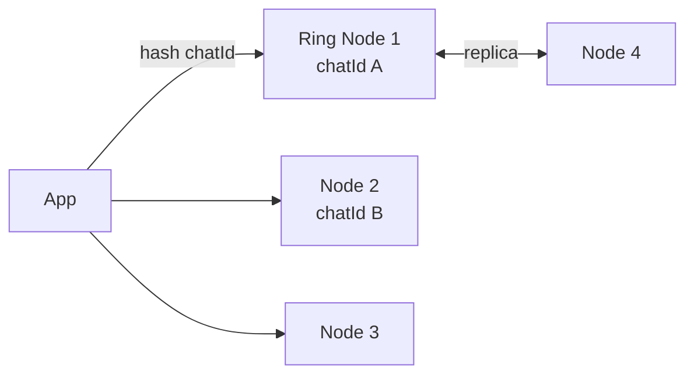

# Cassandra

> Wide-column store, boht zyada writes aur jahan key pata ho. Relations pe nahi, queries pe model karo.

> **TL;DR Hinglish:** Cassandra ek badi diary hai jahan har page (partition) me rows time pe sorted hain. Write sasta, read tabhi tez jab tumhe pata ho kaunsa page kholna hai (`chatId`). Query pehle socho, table baad me banao.

SQL me pehle tables normal karte ho. Cassandra me ulta — **query per table**. Messages ke liye `PRIMARY KEY ((chatId), sentAt)` — matlab `chatId` ka partition, andar time pe sorted. Dusri query chahiye to dusra table.

Ring me nodes, har key `hash(key) % ring` pe ek node leader, 2 replicas.

## Kab lena hai?

- Boht zyada writes, time-series (chat messages, metrics, events) — 100k writes/sec
- Key pe lookup — `chatId`, `userId`
- TTL chahiye — `WITH default_time_to_live = 86400`

**Mat lo:** joins, ad-hoc search, transactions — wahan [PostgreSQL](/system-design/postgresql).

## Kaise likhte hain — example

```sql
-- Hinglish: chatId = partition, sent_at = clustering (order)
CREATE TABLE messages (
  chat_id  UUID,
  sent_at  BIGINT,
  msg_id   UUID,
  body     TEXT,
  PRIMARY KEY ((chat_id), sent_at)
) WITH CLUSTERING ORDER BY (sent_at DESC);
-- Query: WHERE chat_id = ? AND sent_at < ? LIMIT 50  → ek partition se, tez
```

## Deep dive — hot partition & quorum

**Hot partition:** Ek celebrity chatId pe lakhon writes ek node pe. Fix: `chatId:shard` bucket (`chatId#1`, `chatId#2`) ya time bucket (`chatId:2026-08`).

**Quorum:** `R + W > N` to strong-ish. `W=QUORUM` likho, `R=QUORUM` padho → majority ne dekha. `R=1, W=1` tez par stale.

**CQL ≠ SQL:** `ALLOW FILTERING` mat bolo — full scan karega, interview me fail.



**🔴 Galti:** "Ek hi table se saare queries" — Cassandra me nahi.
**✅ Sahi:** "Har query ke liye alag table, partition key soch ke."

**Phrase:** "Cassandra me query pehle, table baad me. Partition key se distribution, clustering se order, R+W>N se quorum."

**Yaad rakho:** Query-per-table, `((partition), clustering)`, hot partition → bucket, quorum R+W>N.

**See also:** [whatsapp](/system-design/whatsapp), [metrics-monitoring](/system-design/metrics-monitoring), [dynamodb](/system-design/dynamodb).
