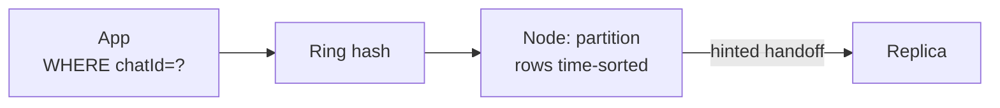

# Cassandra

> Wide-column store for huge write volume and known keys. Model around queries, not relations.

> Cassandra is a big diary where every page (partition) holds time-sorted rows. Writes stay cheap, reads stay fast only when you know which page to open (`chatId`). Think queries first, tables second — each access pattern may own its table.

## When to pick it

1. Massive write throughput (chat messages, time-series, activity logs)
2. Known-key lookups at scale (no ad-hoc joins needed)
3. Multi-datacenter active-active with tunable consistency
4. Time-ordered data with TTL expiry built in

**Don't use for:** joins, ad-hoc search, multi-row ACID — that's [PostgreSQL](/hld/postgresql).

## How data models work

**Partition key** picks the node on the hash ring; **clustering columns** sort rows inside the partition. Denormalize freely — **one table per query**. Example chat: `PRIMARY KEY ((chatId), ts, messageId)` so "latest messages in chat" is a sequential read.

Consistency tunes **per operation** (`ONE`, `LOCAL_QUORUM`, `ALL`). Rule of thumb: if **R + W > N**, read and write sets overlap → you see the latest write (under last-write-wins). Hinted handoff + read repair + anti-entropy (repair) converge replicas.

## Consistency story (say this)

- **Chat send path:** often `LOCAL_QUORUM` write so two replicas in the region have it before ack.
- **Read recent messages:** `LOCAL_QUORUM` or `ONE` + accept brief lag for timelines.
- **Money / inventory:** usually **not** Cassandra — use Postgres or Dynamo with careful transactions.

## Multi-region

Active-active DCs with `LOCAL_*` levels keep latency low inside a region; global quorum is expensive. Conflict resolution is typically last-write-wins on timestamps — design so conflicting updates are rare (immutable message appends beat mutable counters).

## Failure modes to mention

1. **Hot partitions** — celebrity keys overload nodes; split keys or front with cache.
2. **Unbounded partitions** — partitions grow forever; bucket by time (`chatId + yyyyMM`).
3. **Tombstone storms** — mass deletes slow reads; prefer TTL expiry.
4. **Lightweight transactions (CAS)** — exist but cost ~4 RTTs; avoid on hot paths.
5. **Repair debt** — skip repairs long enough and replicas drift — ops must schedule them.

**Mistake:** "Model like Postgres with joins in mind."
**Correct:** "Query-first tables, partition key from access pattern, denormalize freely."

**Phrase:** "Cassandra is the big diary — think query first, table second; writes cheap, reads fast by known key."

**Remember (Revision):** Partition key → node; clustering sorts; quorum tunes consistency; TTL expires; hot partitions split; LWT avoided on hot path.

**See also:** [whatsapp](/hld/whatsapp), [nosql databases](/hld/nosql-databases), [dynamodb](/hld/dynamodb), [sharding](/hld/sharding).
