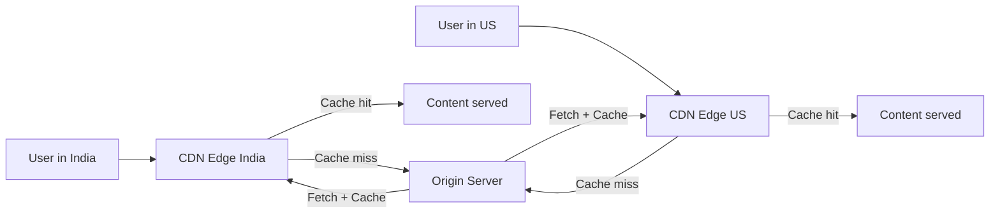

# Content Delivery Network

> CDN — content geographically distributed servers pe rakhta hai, user ke paas kaam ki jagah se deliver karta hai.

> CDN content (images, videos, JS, CSS) edge servers pe store karta hai jo user ke paas hain. Cache hit = fast delivery (10-50ms), cache miss = origin se fetch. PoP (Point of Presence) globally hain. TTL se cache control. CDN latency reduce karta hai, origin load bhi kam hota hai.

CDN content ko geographically distribute karta hai taaki user ko nearest server se mil sake:

**How CDN works:**
1. User request CDN edge server pe aata hai (nearest PoP)
2. Agar content cached hai (cache hit) → directly serve karo (10-50ms)
3. Agar not cached (cache miss) → origin server se fetch → cache karo → serve karo
4. **PoPs** globally hain — America, Europe, Asia me alag alag
5. **TTL** cache duration decide karta — expire hone pe refresh hota hai

## Failure modes to mention

1. **Cache stampede** — Cache expire hone pe sab requests origin pe — lock/singleflight use karo
2. **Stale content** — Cache expired, naya content nahi aaya — TTL carefully set karo
3. **CDN outage** — Entire site slow — multi-CDN strategy ya origin fallback
4. **Cache invalidation** — Content update hone pe purana cache delete karna mushkil — versioned URLs

**🔴 Galti:** "CDN sab content cache karta hai" — Dynamic content (API responses) CDN pe cache nahi hota easily, static content (images, JS, CSS) hota hai.
**✅ Sahi:** "CDN caches static content (images, JS, CSS) at edge PoPs globally. Dynamic content goes to origin. TTL controls cache expiry, invalidation versioned URLs se."

**Phrase:** CDN content ko edge servers pe globally store karta hai — nearest PoP se fast delivery, cache hit fast, cache miss origin se, TTL cache control, static content ke liye best.

**Yaad rakho (Revision):** CDN edge PoPs globally, cache hit fast (10-50ms), cache miss origin se fetch, TTL controls, static content (images/JS/CSS), dynamic not cached easily, multi-CDN for HA.

**See also:** [Load Balancing](/hld/load-balancing), [Proxy](/hld/proxy), [DNS](/hld/domain-name-system).
