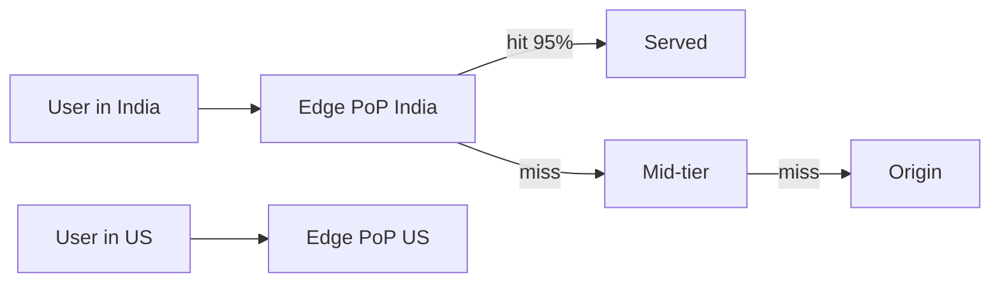

# CDN

> Serve static bytes from next door — edge locations absorb the traffic origins cannot.

> Content Delivery Networks replicate cacheable content to edge points of presence worldwide, so users download from nearby servers. Hit rates above 95% turn terabyte-scale video and image traffic into a solved problem. Dynamic API responses stay at origin; everything static moves to the edge.

## CDN Fundamentals and Edge Locations

A CDN is a geographically distributed cache layer in front of your origin: PoPs in major metros terminate TLS close to users and serve bytes from RAM or SSD when possible. Routing uses DNS (CNAME to CDN hostname), anycast, or GeoDNS so Mumbai users hit Mumbai edges, not Virginia. Edges often tier — edge PoP → regional shield/mid-tier → origin — so one origin miss fans out to many edges through a smaller set of mid-tier fetches. Capacity planning focuses on egress bandwidth and cache footprint; a 95% hit rate means origin sees only 5% of request volume but 100% of miss latency sensitivity.

- PoP = point of presence; more PoPs mean shorter RTT for last-mile delivery.
- Tiered caching reduces origin load superlinearly — shield PoPs are deliberate choke points.
- CDNs also absorb SYN floods and large DDoS by scrubbing at the edge before origin.
- Measure hit ratio, origin bandwidth, and TTFB separately — high hits with slow misses still hurt UX.

## Origin Server

The origin is authoritative storage and compute for cache misses — S3 bucket, custom nginx, or API that generates static artifacts. It must survive thundering herds when popular objects expire simultaneously: thousands of edges requesting the same URL at once. Mitigate with request collapsing (single origin fetch serves many edge waiters), stale-while-revalidate (serve stale, refresh async), and short TTL on hot keys with background revalidation. Origins should not run heavy app logic for assets meant to be static — bake files at build/deploy time and let the CDN do delivery.

- Origin is the bottleneck on miss storms — design for collapse, not peak concurrent users × edges.
- Private origins sit behind OAI/OAC (AWS) or authenticated pull — never expose buckets publicly “because CDN.”
- Health and capacity at origin still matter; CDN is not infinite if every request is `Cache-Control: private`.
- Separate origins per environment (prod vs staging) to avoid cache poisoning across envs.

## Static Content Caching

Images, video segments, JS bundles, CSS, fonts, and PDFs are ideal CDN payloads: same bytes for many users, large relative to HTML, and tolerant of seconds-level staleness when versioned correctly. Immutable assets use content hashes in filenames (`main.a3f9c2.js`) so `Cache-Control: public, max-age=31536000, immutable` is safe — deploy equals new URL, zero purge. HTML entry documents often stay short-TTL or `no-cache` so users pick up new chunk references quickly. Vary headers and cache keys on User-Agent or Accept-Encoding only when output truly differs — each Vary dimension multiplies cache entries and drops hit rate.

- Hash-named assets = cache forever; unversioned `/app.js` = purge pain on every deploy.
- Compress at edge (Brotli/gzip) for text; images may use separate image optimization tiers.
- Large video uses segment caching (HLS/DASH `.ts`/`.m4s`) not whole-file edge storage when possible.
- `ETag`/`If-None-Match` helps revalidation; strong ETags on dynamic-looking static paths reduce origin bytes.

## Cache-Control and TTL

`Cache-Control` directives tell browsers and shared caches (CDN) how long a response is fresh and whether intermediaries may store it. `max-age=3600` means fresh for one hour; `s-maxage` overrides for shared caches only while browsers keep their own `max-age`. `private` keeps user-specific responses off shared CDNs; `no-store` forbids caching entirely (PII, auth). `stale-while-revalidate=60` lets edges serve slightly stale content while fetching fresh in background — huge for origin protection. TTL is a product decision encoded in HTTP: live sports scores need seconds; logo PNGs need years when versioned.

- Shorter TTL = fresher content, higher origin load and miss rate.
- `must-revalidate` after expiry forces revalidation, not silent stale serve (unless SWR says otherwise).
- Default CDN behaviors often cache GET/HEAD only — know what your provider passes through on POST.
- Align browser and CDN TTL intentionally — long browser cache on HTML without versioning traps users on old apps.

## Cache Invalidation

When content changes before TTL expires, you purge by URL, cache tag, or prefix — eventually consistent and rate-limited on all major CDNs. Purge storms during incidents can overload origin if every edge misses at once; prefer soft invalidation via new object keys. Versioned deploy artifacts make invalidation a non-event: ship `v2/` or new hash, old cache entries die unused. For editorial CMS updates on unversioned paths, tag-based purge (CloudFront cache policies, Cloudflare Cache-Tag) beats maintaining URL lists. Emergency purges exist; normal workflow should not depend on them.

- Purge is not instant globally — plan for minutes of mixed old/new at edges.
- Wildcard purges are dangerous — narrow tags or paths to limit origin blast radius.
- `CDN-Cache-Status: HIT/MISS/EXPIRED` headers help debug what users actually got.
- Soft purge vs hard purge semantics differ by vendor — read docs before designing CMS integration.

## CloudFront and Cloudflare

Amazon CloudFront integrates tightly with S3, ACM certificates, Lambda@Edge/CloudFront Functions for auth and URL rewriting, and AWS WAF in the same billing universe — natural choice when the stack is already AWS. Cloudflare offers a massive anycast network, Workers for edge compute, bundled WAF/DDoS, and DNS in one control plane — strong when you want edge logic without Lambda cold starts or multi-vendor TLS. Both support signed URLs/cookies for private media, origin shield, and HTTP/2/3. Pick based on cloud affinity, edge compute model, pricing on egress vs requests, and compliance regions — feature parity on basic caching is close; differentiation is ops integration and security extras.

- CloudFront + S3 OAI/OAC is the textbook static site pattern on AWS.
- Cloudflare Workers suit lightweight auth, A/B, and header rewrites at millions of RPS.
- Compare egress pricing when origin is outside the CDN vendor's cloud — cross-cloud egress adds up.
- Test TLS, HTTP/3, and geographic routing in target markets — PoP maps differ by provider.

## Keep in mind

- Static content to edges, dynamic APIs to origin — never cache personalized JSON as public unless you mean it.
- Versioned URLs beat purges for routine deploys; reserve purge for true takedowns and CMS hotfixes.
- Tiered edges plus request collapsing and stale-while-revalidate protect origins from miss storms.
- TTL balances freshness against origin load — seconds for live data, years for hashed assets.
- Signed URLs and cookies gate private content at the edge without streaming bytes through app servers.
