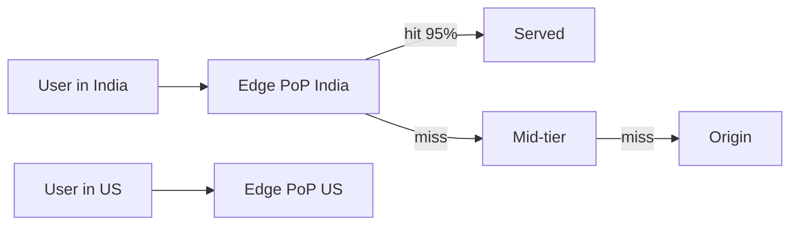

# CDN

> Serve static bytes from next door — edge locations absorb the traffic origins cannot.

> Content Delivery Networks replicate cacheable content to edge points of presence worldwide, so users download from nearby servers. Hit rates above 95% turn terabyte-scale video and image traffic into a solved problem. Dynamic API responses stay at origin; everything static moves to the edge.

## CDN Fundamentals and Edge Locations

PoPs sit in major metros near users; requests route to the nearest healthy edge via DNS anycast. Edges form tiers — edge fetches from regional mid-tier caches before origin, shielding origins further.

## Origin Server

The source of truth that edges fill from on cache misses. Origins must survive miss storms (thundering herds on expiry) via request collapsing, stale-while-revalidate, and tiered caching. Keep origins lean — they serve misses only.

## Static Content Caching

Images, videos, JS, CSS, fonts — immutable-versioned URLs (`app.a3f9.js`) cache forever with far-future expiry. Cache keys include what varies (device, region) sparingly — over-varying fragments hit rates.

## Cache-Control and TTL

`Cache-Control: max-age` sets edge and browser lifetimes; `s-maxage` separates shared caches; `must-revalidate` forces freshness checks. TTL blends freshness needs with origin protection — minutes for feeds, years for versioned assets.

## Cache Invalidation

Purge by URL, tag, or wildcard when content changes early. Prefer versioned URLs (new deploy, new name) over purges — invalidation is eventually consistent and rate-limited. Purge APIs exist for emergencies, not workflows.

## CloudFront and Cloudflare

CloudFront (AWS-native, tight S3 and Lambda@Edge integration) versus Cloudflare (global edge network with Workers, WAF, and DDoS bundled). Both do caching, TLS, and signed URLs; pick by existing cloud plus edge-compute and security needs.

## Keep in mind

- Static content to edges, dynamic APIs to origin — never mix.
- Versioned URLs beat purges for cache invalidation.
- Tiered edges plus request collapsing protect origins from miss storms.
- TTL balances freshness against origin load — minutes to years by content.
- Signed URLs and cookies gate private content at the edge.
