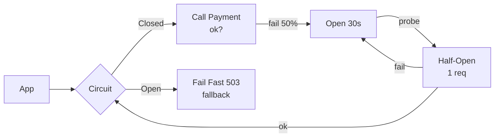

# Circuit Breaker

> Downstream mar gaya to usko aur mat maaro — fail fast, thodi der baad fir try.

> **TL;DR Hinglish:** Circuit breaker ghar ka MCB jaisa — light short hua to MCB trip, baar-baar switch on nahi karte. Thodi der baad half-on karke dekho, theek to chalu.

Microservices me har call pe lagao — Payment, Search, sab.

## How it works

- **Closed:** sab normal — request jaane do, fail gino.
- **Open:** fail 50% ya 10 lagatar → trip → turant `503` fail fast (downstream ko call hi nahi).
- **Half-Open:** 30 sec baad 1 probe request bhejo → ok to Closed, fail to Open wapas.

**Threshold:** 20 requests me 50% fail ya latency p95 > 500ms → open.

## Retry se fark?

- **Retry:** `3 times backoff` — downstream thoda slow to ok, par pura down to aur marega (retry storm).
- **Circuit breaker:** down hai to retry bhi nahi — fail fast + fallback.

**Fallback:** cache se purana data, default value, ya `503 + Retry-After: 30`.

## Kahan lagau?

- **Sync call:** `Order → Payment` — breaker must.
- **Async:** Kafka pe nahi — queue bacha lega.

**Hystrix / Resilience4j:** `circuitBreaker { failureRate 50%, wait 30s, halfOpen 1 }`.

**🔴 Galti:** "Har fail pe retry 5" — Downstream aur marega.
**✅ Sahi:** "Fail fast + half-open probe + fallback, retry sirf idempotent pe backoff."

**Phrase:** "Circuit MCB jaisa — fail pe open + fast fail, 30 sec baad half-open probe."

**Yaad rakho:** Closed normal, Open fast fail, Half-open probe, retry storm rokho, fallback.

**See also:** [load-balancer](/system-design/load-balancer), [api-gateway](/system-design/api-gateway), [replication](/system-design/replication).
