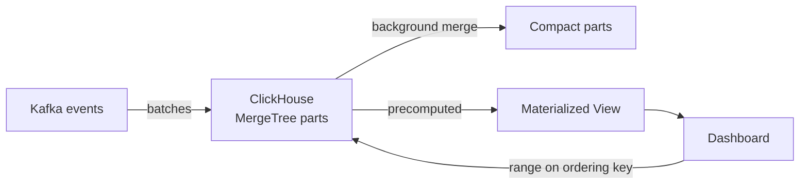

# ClickHouse

> Analytics ka engine — arabon rows pe dashboard queries seconds me, columnar storage ki wajah se.

> OLTP databases (Postgres) rows store karte hain — poori row padhni padti hai. ClickHouse columns store karta hai — `SUM(revenue)` me sirf revenue column padhta hai, baaki touch nahi hota. Isliye dashboards, ad-tech aggregates, log analytics aur observability iski jagah hai. Writes append-only batches me aate hain, updates se nafrat hai.

Core **MergeTree** engine hai: data parts me likha jaata hai, background me merge hote hain. **Ordering key** sabse important decision hai — queries isi order me tez chalti hain (time + campaign jaisa). **Partitioning** (month-wise) purana data drop karna aasan karta hai. **Materialized views** pehle se aggregate karke rakhti hain taaki dashboard precomputed numbers uthaye. Replicas + shards ZooKeeper/Keeper ke saath chalte hain.

## When you pick it

1. Dashboards hon arabon rows pe (ad-tech, product analytics) — real-time aggregates chahiye hon
2. Log/observability analytics ho ([metrics](/system-design/metrics-monitoring) jaisa) — high-ingest, fast group-by
3. Funnels aur cohorts nikalne hon — ordering key pe range scans tez hain
4. Batch appends hon (Kafka se) — trickle writes ke bajaye batches daalo

**Mat lo:** transactions (Postgres lo), full-text search ([Elasticsearch](/system-design/elasticsearch) lo), frequent updates/deletes (mutations bhaari hain), ya chhota data (Postgres kaafi hai).

## How it works

**Write:** [Kafka](/system-design/kafka) se batches aate hain → parts me likhe jaate hain → background merge. **Read:** query ordering key pe range lagati hai → sirf zaroori columns padhti hai → materialized view ho to precomputed jawab. **Scale:** shard key pe distribute, har shard ke replicas Keeper se coordinate hote hain.

## ClickHouse vs others

- **vs Postgres:** OLTP rows vs OLAP columns — transactions Postgres, analytics ClickHouse.
- **vs Elasticsearch:** Search (text relevance) ES ka hai; numbers pe group-by ClickHouse tez aur sasta hai.
- **vs Druid/Pinot:** Same parivaar — ClickHouse ops me halka, SQL jaisi query bhasha deta hai.
- **vs Flink:** Flink stream compute karta hai; ClickHouse computed ko store + serve karta hai — saath chalte hain.

## Failure modes to mention

1. **High-cardinality GROUP BY** — userId pe group karo to memory phat-ti hai — approx (HLL/uniq) ya pre-aggregation lo.
2. **Too many parts** — Chhote-chhote inserts parts ka dher banate hain — async inserts / batches rakho.
3. **Heavy JOINs** — Distributed joins mehengi hain — denormalize karo, star schema yahan nahi chalta.
4. **Mutations** — UPDATE/DELETE part rewrite karta hai — design append-only rakho.
5. **Wrong ordering key** — Galat key matlab har query full scan — query pattern pehle, key baad me.

**🔴 Galti:** "Postgres me billion-row analytics" — Row store pe dashboard crawl karega; analytics alag engine mangta hai.
**✅ Sahi:** "Real-time analytics ClickHouse me — MergeTree + ordering key + materialized views, Kafka se batches, joins nahi denormalize karo."

**Phrase:** "ClickHouse columns padhta hai rows nahi — isliye arabon rows pe dashboard tez hai. Ordering key sahi rakho, batches me likho, joins mat maango."

**Yaad rakho (Revision):** Columnar vs row store, MergeTree + parts + background merge, ordering key = sabse important decision, partitioning (month), materialized views, replicas via Keeper, async inserts, denormalize (no joins).

**See also:** [elasticsearch](/system-design/elasticsearch), [flink](/system-design/flink), [kafka](/system-design/kafka), [metrics-monitoring](/system-design/metrics-monitoring).
