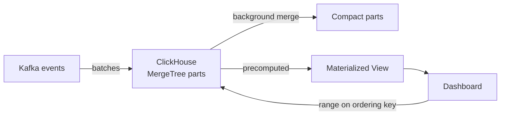

# ClickHouse

> Analytics engine — dashboard queries over billions of rows in seconds, thanks to columnar storage.

> OLTP databases store rows — every query reads whole rows. ClickHouse stores columns — a `SUM(revenue)` reads only the revenue column, touching nothing else. Dashboards, ad-tech aggregates, log analytics, and observability live here. Writes arrive as append-only batches; updates are unwelcome.

## When to pick it

1. Dashboards over billions of rows (ad-tech, product analytics) needing real-time aggregates
2. Log and observability analytics ([metrics](/hld/metrics-monitoring) style) — heavy ingest, fast group-bys
3. Funnels and cohorts — range scans on ordering keys run fast
4. Batch appends (from Kafka) — trickle writes hurt, batches fly

**Don't use for:** transactions (Postgres), full-text search (a search engine like Elasticsearch), frequent updates or deletes (mutations cost dearly), or small data (Postgres suffices).

## How it works

**Write:** [Kafka](/hld/kafka) batches land as parts; background merges compact them. **Read:** queries range over the ordering key, touching only needed columns; materialized views serve precomputed answers. **Scale:** distribution by shard key, replicas coordinated via Keeper.

## ClickHouse vs others

- **vs Postgres:** OLTP rows vs OLAP columns — transactions to Postgres, analytics to ClickHouse.
- **vs Elasticsearch:** text relevance belongs to search engines; numeric group-bys run faster and cheaper here.
- **vs Druid/Pinot:** same family — ClickHouse operates lighter with SQL-like queries.
- **vs Flink:** Flink computes streams; ClickHouse stores plus serves results — they pair up.

## Failure modes to mention

1. **High-cardinality GROUP BY** — grouping by userId explodes memory; approximate (HLL/uniq) or pre-aggregate.
2. **Too many parts** — tiny inserts pile parts endlessly; use async inserts and batches.
3. **Heavy JOINs** — distributed joins cost dearly; denormalize, star schemas don't apply.
4. **Mutations** — UPDATE/DELETE rewrites parts; design append-only.
5. **Wrong ordering key** — bad keys force full scans; pick keys from query patterns first.

**Mistake:** "Billion-row analytics in Postgres."
**Correct:** "Real-time analytics in ClickHouse — MergeTree plus ordering keys plus materialized views, batches from Kafka, denormalized not joined."

**Phrase:** "ClickHouse reads columns, not rows — dashboards over billions stay fast. Order keys right, write in batches, never ask for joins."

**Remember (Revision):** Columnar vs row stores, MergeTree plus parts plus background merge, ordering key as top decision, monthly partitioning, materialized views, Keeper replicas, async inserts, denormalize always.

**See also:** [flink](/hld/flink), [kafka](/hld/kafka), [metrics monitoring](/hld/metrics-monitoring).
