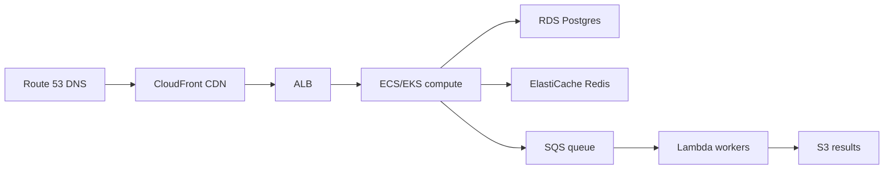

# Cloud Architecture

> Rent primitives, don't rack servers — map each workload to the managed service that fits.

> Cloud interviews test service selection, not vendor trivia. Know what each primitive does, when it beats self-hosting, and what it costs at scale. The same patterns repeat across AWS, GCP, and Azure — learn concepts, translate names.

## EC2, ECS, EKS Basics

**EC2** is rent-a-VM: you choose instance type, OS, and networking, and you own patching, scaling scripts, and failure recovery — maximum control, maximum ops burden. **ECS** runs Docker containers on AWS-managed infrastructure with task definitions and services — no Kubernetes API, simpler mental model for "just run containers." **EKS** is managed Kubernetes: control plane operated by AWS, you manage node groups and manifests — standard when teams already speak kubectl and Helm. Climb the ladder when requirements demand it: EC2 for legacy or special hardware, ECS for straightforward container services, EKS when you need the Kubernetes ecosystem at scale.

- **EC2:** Auto Scaling Groups + ALB for stateless tiers; avoid pet servers without replacement automation.
- **ECS:** Fargate removes node management; EC2 launch type when you need GPU or custom AMIs.
- **EKS:** add-ons (CNI, ingress, cluster autoscaler) — budget ops time, not just control plane fee.
- **Cost:** EC2 reserved/savings plans for steady load; spot for fault-tolerant batch on EC2/EKS nodes.
- **Interview ladder:** "Control → ECS simplicity → EKS when K8s skills and tooling already exist."

## Lambda

**Lambda** runs code on demand in response to events — API Gateway HTTP, S3 object created, SQS message, EventBridge schedule — with no servers to provision and billing per invocation and GB-second. Concurrency scales automatically including to zero, which saves money on spiky or rare workloads. **Cold starts** (hundreds of ms to seconds for JVM/.NET) and the **15-minute max duration** make Lambda wrong for steady high-QPS hot paths and long transcodes; it's ideal for webhooks, image thumbnails, lightweight ETL, and glue between managed services.

- **Triggers:** design idempotent handlers — SQS and retries mean duplicate invocations happen.
- **Concurrency limits:** account-wide and per-function caps prevent runaway bills and downstream overload.
- **VPC attachment:** adds ENI cold start latency — only when Lambdas must reach private RDS.
- **Package size / memory:** more memory increases CPU proportionally; tune for duration vs cost.
- **Interview:** "Event-driven, scale-to-zero glue — not a replacement for always-on API servers."

## S3, RDS, DynamoDB

**S3** is object storage for any size blob — media, backups, static sites, data lake files — with eleven-nines durability, versioning, lifecycle rules to Glacier, and presigned URLs for controlled client upload/download. **RDS** runs managed relational engines (Postgres, MySQL) with automated backups, Multi-AZ failover, and read replicas — default for transactional data needing joins and ACID. **DynamoDB** is managed key-value/document at single-digit millisecond latency with partition-key design determining scale; on-demand or provisioned capacity suits massive session, feed, or meter tables when access patterns are key-based, not ad hoc SQL.

- **S3:** strong consistency for new objects; use CloudFront in front for read-heavy public assets.
- **RDS:** size connection pools — too many Lambdas/containers can exhaust `max_connections`.
- **DynamoDB:** hot partitions from poor key choice; use composite keys and write sharding patterns.
- **Default split:** files → S3, relational core → RDS, high-scale keyed lookups → DynamoDB.
- **Interview trio:** name all three and one access pattern each fits.

## ElastiCache, SQS, SNS

**ElastiCache** hosts managed Redis or Memcached — session store, rate limit counters, hot key cache, leaderboards — so you don't operate Redis failover yourself. **SQS** is a durable queue between producers and consumers: visibility timeout, dead-letter queues (DLQ) for poison messages, and at-least-once delivery that requires idempotent workers. **SNS** fan-out publishes one message to many subscribers (SQS queues, Lambdas, HTTP endpoints) — classic pattern for "order placed → email, analytics, warehouse." Together they decouple services in time and absorb traffic spikes without synchronous coupling.

- **Cache:** TTL + explicit invalidation on writes; cache-aside is the usual interview pattern.
- **SQS:** standard vs FIFO (ordering + dedup); DLQ alarm when depth > 0 sustained.
- **SNS + SQS:** filter policies so subscribers only get relevant event types.
- **Backpressure:** queue depth metric drives scale-out of consumer fleet.
- **Interview backbone:** "Async work off the request path — SQS buffer, workers scale, DLQ for failures."

## CloudFront, Route 53, ALB, API Gateway

**Route 53** is DNS with routing policies — latency, weighted, failover health checks — the first hop that resolves your domain to infrastructure. **CloudFront** CDN caches static and cacheable dynamic content at edge, terminates TLS close to users, and can sign URLs for private S3 content. **ALB** layer-7 load balances HTTP inside a VPC with path/host rules and target groups pointing at EC2, ECS, or IP targets. **API Gateway** fronts REST/WebSocket APIs and Lambda with throttling, API keys, Cognito/JWT authorizers, and request validation. Typical north-south path: **Route 53 → CloudFront (optional) → ALB or API Gateway → compute**.

- **CloudFront:** cache-control headers from origin decide hit ratio — don't cache personalized HTML blindly.
- **Route 53 health checks:** failover to secondary region only if health probe matches real user paths.
- **ALB vs NLB:** ALB for HTTP routing; NLB for TCP/static IPs/extreme low latency.
- **API Gateway:** use when you need centralized auth/throttle on Lambdas; ALB for long-lived container APIs.
- **Interview path:** recite DNS → CDN → load balancer → service in order with one sentence each.

## CloudWatch

**CloudWatch** collects AWS service metrics (EC2 CPU, Lambda invocations, RDS connections), ingests application logs and custom metrics, and drives **alarms** to SNS → PagerDuty/email. **Dashboards** track golden signals and SLOs; **Logs Insights** queries structured logs without exporting to a third party first. Emit **custom metrics** for business KPIs (orders/min) alongside infra — same alarm pipeline. Nearly every AWS whiteboard design should end with what you watch and who gets paged when it breaks.

- **Alarms:** combine metrics (e.g. error rate AND latency) to reduce false positives.
- **Log retention:** set per log group — indefinite retention gets expensive fast.
- **X-Ray** (optional): ties into Lambda and API Gateway for distributed traces on AWS-native stacks.
- **Composite alarms:** roll up many child alarms for one incident ticket.
- **Interview closer:** "CloudWatch metrics + logs + alarms on SLO symptoms, SNS to on-call."

## Keep in mind

- EC2 for control, ECS for container simplicity, EKS for Kubernetes scale and ecosystem.
- Lambda for event-driven glue — never for steady hot paths or jobs over ~15 minutes.
- S3 for files, RDS for relations, DynamoDB for massive keyed access with designed partition keys.
- SQS plus SNS form the async backbone; ElastiCache holds hot state — mind cache invalidation.
- Route 53 → CloudFront → ALB/API Gateway → compute is the standard request path.
- CloudWatch closes every design: metrics, logs, alarms, and custom business signals.
