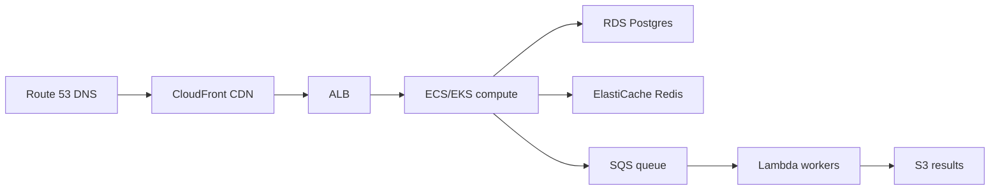

# Cloud Architecture

> Rent primitives, don't rack servers — map each workload to the managed service that fits.

> Cloud interviews test service selection, not vendor trivia. Know what each primitive does, when it beats self-hosting, and what it costs at scale. The same patterns repeat across AWS, GCP, and Azure — learn concepts, translate names.

## EC2, ECS, EKS Basics

EC2 rents virtual machines — full control, you manage patching and scaling. ECS runs containers without servers to manage at the cluster level. EKS is managed Kubernetes for container orchestration at scale. Ladder: EC2 for control, ECS for simplicity, EKS for Kubernetes-native scale.

## Lambda

Serverless functions triggered by events (HTTP, S3 uploads, queue messages) — zero servers, per-millisecond billing, automatic scale to zero. Cold starts and 15-minute limits rule out steady hot paths and long jobs; perfect for webhooks, thumbnails, and glue code.

## S3, RDS, DynamoDB

S3 stores objects at any scale (media, backups, static sites). RDS runs managed Postgres and MySQL (backups, failover, read replicas included). DynamoDB serves managed key-value at any throughput (partition keys, on-demand billing). Default trio: files to S3, relations to RDS, massive key lookups to DynamoDB.

## ElastiCache, SQS, SNS

ElastiCache runs managed Redis and Memcached — sessions, caches, and rate counters without operating clusters. SQS queues work between services (with dead-letter queues); SNS fans notifications out to subscribers. Together they form the standard async backbone.

## CloudFront, Route 53, ALB, API Gateway

CloudFront is the CDN — edge caching plus signed URLs in front of S3 and origins. Route 53 is DNS with health-based routing and failover. ALB balances HTTP traffic with path rules inside a VPC. API Gateway fronts Lambdas and services with auth, throttling, and keys. Request path in order: Route 53 → CloudFront → ALB/API Gateway → compute.

## CloudWatch

Metrics, logs, and alarms in one place — EC2 stats, Lambda invocations, custom business metrics. Alarms page on-call; dashboards track SLOs; Logs Insights queries centralized logs. Every AWS design ends with "and CloudWatch watches it."

## Keep in mind

- EC2 for control, ECS for simplicity, EKS for Kubernetes scale.
- Lambda for event-driven glue — never for steady hot paths.
- S3 for files, RDS for relations, DynamoDB for massive key lookups.
- SQS plus SNS form the async backbone; ElastiCache holds hot state.
- Route 53 → CloudFront → ALB → compute is the standard request path.
- CloudWatch closes every design: metrics, logs, alarms.
