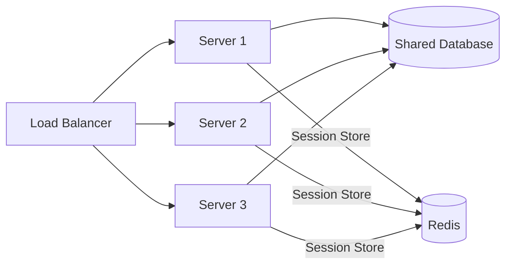

# Clustering

> Multiple servers ek saath kaam karte hain — fault tolerance, scalability, availability sab badhte hain.

> **TL;DR Hinglish:** Clustering ek se zyada servers ko ek system jaisa dikhata hai. Types: Active-Active (sab handle karte hain), Active-Passive (backup ready). Stateless vs Stateful — stateless easy scale hota hai, stateful session sync mushkil. Shared nothing architecture preferred hai — server me kuch shared nahi, DB alag hai.

Clustering mein multiple servers ek saath kaam karte hain — agar ek fail ho, doosre take over karte hain:

**Types of clustering:**
- **Active-Active** — sab servers handle karte hain, load balanced
- **Active-Passive** — ek active, ek standby — fail hota hai to standby take over
- **Shared-nothing** — har server apni memory/disk, DB alag (preferred, scalable)
- **Shared-everything** — shared memory/disk (hard to scale)

**Stateless vs Stateful:**
- **Stateless** — koi session data server pe nahi, any server handle kar sakta (easy to scale)
- **Stateful** — session data server pe hai, same server pe jaana zaroori (scaling mushkil)

## How it works

1. Load balancer traffic distribute karta hai cluster servers pe
2. Har server alag request handle karta hai
3. Agar ek server fail → health check detect → LB usse remove
4. Stateless cluster mein — kisi bhi server pe ja sakte ho
5. Stateful cluster mein — session replication zaroori hai (sticky sessions ya session store)

## Failure modes to mention

1. **Split-brain** — Cluster nodes communicate nahi, do groups independent kaam karte — quorum se bachna
2. **Session loss** — Server fail, session data lost — session store (Redis) se bachna
3. **Failover delay** — Server fail se detect hone me time lag — automatic failover faster hona chahiye
4. **Scalability limit** — Shared-nothing easy, shared-everything hard

**🔴 Galti:** "Clustering mein sab servers shared memory rakhte hain" — Shared-nothing preferred hai, DB alag, session Redis pe store.
**✅ Sahi:** "Clustering = multiple servers as one. Active-Active for scale, Active-Passive for HA. Stateless + shared-nothing = easy scaling. Session store in Redis."

**Phrase:** Clustering mein multiple servers ek saam kaam karte hain — active-active (scale) ya active-passive (HA). Stateless preferred, session store in Redis, shared-nothing architecture.

**Yaad rakho (Revision):** Active-Active vs Active-Passive, stateless vs stateful, shared-nothing preferred, session store (Redis), split-brain risk, quorum se bachna.

**See also:** [Load Balancing](/system-design/load-balancing), [Redis](/system-design/redis), [Availability](/system-design/availability).
