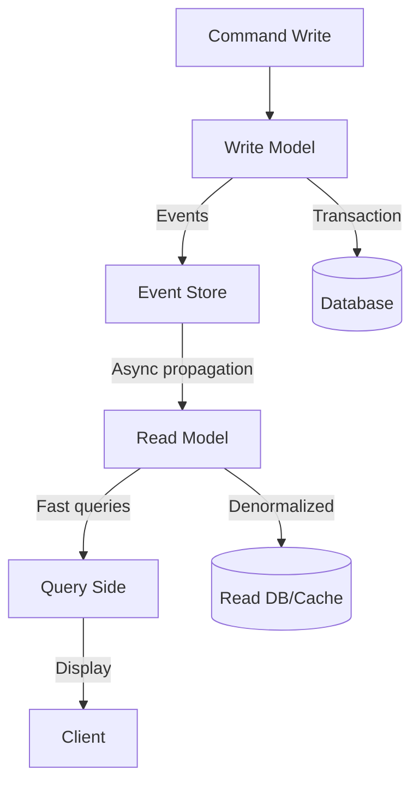

# Command and Query Responsibility Segregation

> Reads aur writes separate models — optimize karo alag-alag ke liye.

> CQRS reads aur writes ko separate models mein split karta hai. Command (write) side data update karta hai, Query (read) side data display karta hai. Benefits: each side optimize kar sakte ho — read side optimized for fast queries, write side for transactions. Eventual consistency — reads lag behind writes. Works best with event sourcing. Monolith mein CQRS overkill, but microservices mein powerful.

CQRS reads aur writes ko separate models mein divide karta hai:

**How it works:**
1. **Command side** — Handles writes (create, update, delete) → updates write model
2. **Query side** — Handles reads → optimized read model
3. **Sync** — Events from command side propagate to query side (async)
4. **Eventual consistency** — Read model lag behind write model
5. **Event sourcing** — Command events stored, query model derived from events

**Benefits:**
- Read optimized — Denormalized data for fast queries
- Write optimized — Normalized, transactional
- Independent scaling — Read model scale horizontally, write model differently
- Security — Different access patterns for read/write

## Failure modes to mention

1. **Eventual consistency lag** — Read model stale after write — acceptable for most apps
2. **Complexity** — Two models to maintain — overkill for simple apps
3. **Read model rebuild** — Query model rebuild from events — snapshot + replay needed
4. **Synchronization failure** — Events not propagated — DLQ, manual fix

**🔴 Galti:** "CQRS = microservices" — CQRS pattern hai, microservices mein use hota hai but standalone bhi possible.
**✅ Sahi:** "CQRS = commands and queries separate. Write model + read model, eventual consistency. Works best with event sourcing. Overkill for simple apps."

**Phrase:** CQRS reads aur writes separate models mein split karta hai — command (write) side, query (read) side, eventual consistency, works best with event sourcing.

**Yaad rakho (Revision):** CQRS = commands (write) + queries (read) separate, eventual consistency, read optimized denormalized, works best with event sourcing, overkill for simple apps.

**See also:** [Event Sourcing](/hld/event-sourcing), [Event-Driven Architecture](/hld/event-driven-architecture), [Message Queue](/hld/message-queue).
