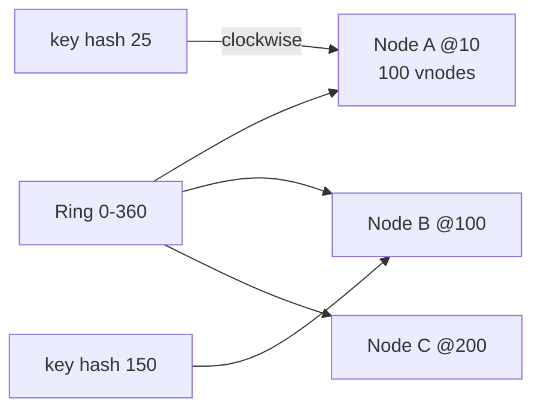

# Consistent Hashing

> Nodes add/remove pe kam se kam data hile. Normal `hash(key) % N` pe ek node badla to 90% keys hil jayengi — consistent pe sirf `1/N`.

> **TL;DR Hinglish:** Normal hashing me 4 dabbe se 5 dabbe kiye to saara samaan hil gaya. Consistent me gol ghadi (ring) pe dabbe aur keys dono, key ko agla dabba mil jata hai — sirf ek dabbe ka samaan hilega, baaki safe.

Har distributed cache, sharding, aur WS fleet me yahi use hota hai.

## Normal kyun fail?

`hash(userId) % 4` → user 123 → node 3. Node 5 add → `%5` → 80% users ka node badal gaya — cache miss storm.

**Consistent:** ring `0 .. 2^32-1`. `hash(node) → ring pe`, `hash(key) → ring pe`, key ko clockwise agla node.

```
Ring: 0 ---- A(10) ---- key(25) ---- B(100) ---- C(200) ---- 360
key 25 ka owner B (agla node)
Node D add at 30 → sirf 25 jaise keys A se D pe jayengi, B/C ka nahi hilega.
```

## Virtual nodes — load barabar

Ek physical node ko 100 virtual points ring pe (`node1#0`, `node1#1`...). Isse bina virtual ke ek node ko bada arc mil jata — hot spot. Virtual se barabar bante.

## When you pick it

- **Distributed cache:** `key → Redis node` (Memcached, Dynamo)
- **Sharding:** `userId → DB shard`, `chatId → Cassandra node`
- **WS presence:** `userId → Chat Fleet node` (WhatsApp)
- **Load balancer:** `userId → API node` for cache locality

**Alternative:** Rendezvous hashing (`max hash(node+key)`) — simpler par har key pe N hash.



## Replication — ek key 2 nodes pe

`key` ko agle 2 nodes pe bhi rakho → ek node mara to dusra de dega. `N=3` pe write 2, read 2 → quorum.

## Failure handling

1. **Hot key:** celebrity `userId` ek node pe — key split `feed:123:0`, `feed:123:1` ya local cache.
2. **Load skew:** virtual nodes badhao (150-200) + `load` aware rebalancing.
3. **Join/leave storm:** gossip + hinted handoff — naya node aaya to purane se range copy.
4. **Heterogeneous:** bade node ko double vnodes.

**🔴 Galti:** "`hash % N` hi kaafi" — Node add pe cache pighal jayega.
**✅ Sahi:** "Consistent ring + 100 vnodes + next-N replication + `hash(key)` stable."

**Phrase:** "Consistent ring pe nodes + virtual nodes, key ko clockwise agla node, add pe sirf 1/N hilega."

**Yaad rakho (Revision):** `hash%N` fail, ring + clockwise, virtual 100, replication next N, hot key split.

**See also:** [distributed-cache](/system-design/distributed-cache), [sharding](/system-design/sharding), [load-balancer](/system-design/load-balancer).
