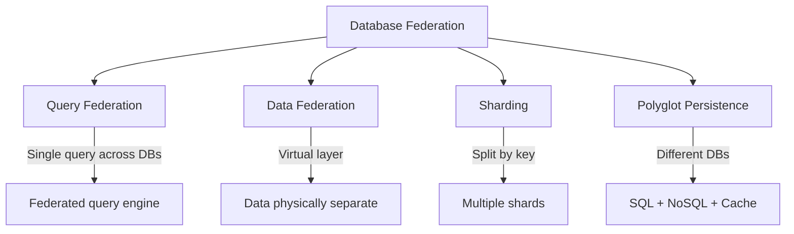

# Database Federation

> Multiple databases ek saath use karo — sharding, federation, virtualization.

> **TL;DR Hinglish:** Database federation multiple databases ko ek logical database jaisa dikhata hai. Query federation — ek query saari databases pe run karo. Data federation — data physically alag, logically ek. Sharding data ko multiple databases mein split karo by key. Federation useful jab data across multiple systems ho — read from DB1, DB2, write to both. Polyglot persistence — alag DBs alag data ke liye.

Database federation multiple databases ko integrate karta hai:

**Approaches:**
- **Query federation** — Single query across multiple databases (federated query engine)
- **Data federation** — Virtual layer, data physically in different DBs
- **Sharding** — Data split by key across multiple databases (horizontal partition)
- **Polyglot persistence** — Different DBs for different purposes (SQL + NoSQL + cache)

**Use cases:**
- Legacy system + modern system integration
- Multi-region deployments (data closer to users)
- Read-heavy workloads (read replicas + federation)

## Failure modes to mention

1. **Cross-shard queries** — Queries spanning shards slow — shard key choose carefully
2. **Data inconsistency** — Multiple DBs, sync issues — eventual consistency
3. **Complexity** — Federation layer adds latency and complexity — operational overhead
4. **Rebalancing** — Shards grow unevenly — re-sharding painful

**🔴 Galti:** "Federation simple hai" — Federation adds complexity, cross-shard queries slow, rebalancing hard.
**✅ Sahi:** "Database federation integrates multiple DBs — query federation (single query), sharding (split by key), polyglot persistence (different DBs). Cross-shard queries slow, rebalancing painful."

**Phrase:** Database federation multiple databases ko integrate karta hai — query federation, data federation, sharding (split by key), polyglot persistence (SQL + NoSQL + cache).

**Yaad rakho (Revision):** Query federation (single query), data federation (virtual layer), sharding (split by key), polyglot persistence, cross-shard queries slow, rebalancing painful, operational complexity.

**See also:** [Sharding](/system-design/sharding), [Consistent Hashing](/system-design/consistent-hashing), [Partitioning](/system-design/partitioning).
