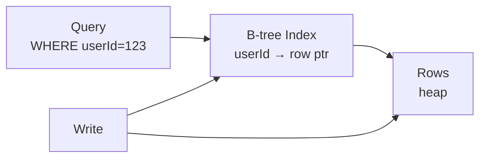

# Database Indexing

> Index kitaab ka index jaisa — bina index poori kitaab palatna (`O(N)`), index se seedha page (`O(log N)`).

> **TL;DR Hinglish:** Index ek alag chhota table jo `userId → row location` yaad rakhta hai, B-tree me sorted. `WHERE userId=123` 1M rows me 10ms, bina index 1 sec. Par har write pe index bhi update — balance.

Har DB ke peeche B-tree ya LSM.

## B-tree (Postgres)

Sorted tree, har node 100s keys. `WHERE userId=123 AND ts> вчера` → **composite `(userId, ts)`** — left se match. `(a,b)` index `WHERE a=?` pe chalega, `WHERE b=?` pe nahi.

**Types:**
- **Primary:** PK pe auto.
- **Secondary:** `CREATE INDEX idx ON users(email)` — alag tree.
- **Composite:** `(userId, ts)` — order important.
- **Partial:** `WHERE is_active` pe hi — chhota tez.
- **GIN:** JSONB, full-text.

**LSM (Cassandra/LevelDB):** write tez — memory me buffer fir SSTable, read pe bloom + merge.

## When to create an index

- `WHERE, JOIN, ORDER BY` pe banao.
- `EXPLAIN ANALYZE` → `Seq Scan` dikhe to index lagao, `Index Scan` to ok.
- **Cardinality:** `WHERE country='IN'` (4 values) pe index bekar, `email` pe best.

**Cost:** har `INSERT` pe har index update — 5 indexes to write 5x slow. Isliye zaruri pe hi.

## How to answer in interview

- **Feed:** `WHERE userId=? ORDER BY ts DESC` → `(userId, ts DESC)` index.
- **Bad index:** `(ts, userId)` — `userId` pe use nahi hoga.

**🔴 Galti:** "Har column pe index" — Write marega, vacuum bhaari.
**✅ Sahi:** "Composite query pattern pe, EXPLAIN dekho, write penalty batao."

**Phrase:** "B-tree left-match, composite query pe, EXPLAIN, write pe cost."

**Yaad rakho:** Index = chhota sorted map, composite left, partial chhota, LSM write tez, EXPLAIN.

**See also:** [postgresql](/system-design/postgresql), [elasticsearch](/system-design/elasticsearch), [sharding](/system-design/sharding).
