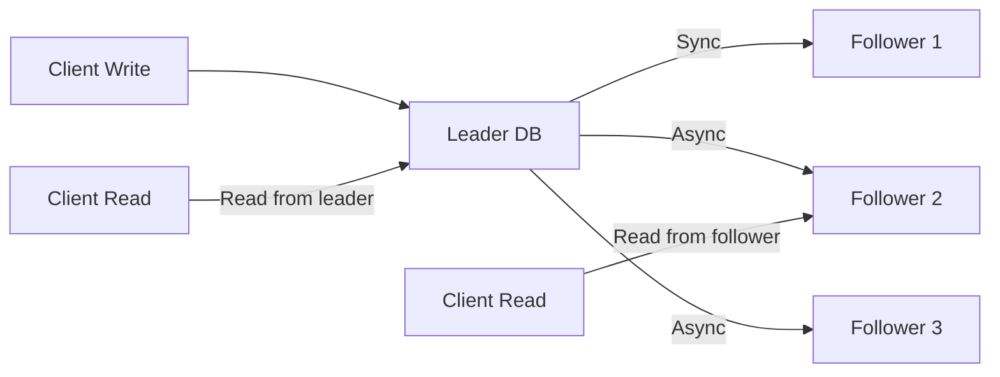

# Database Replication

> Data ko multiple servers pe copy karo — availability badhegi, reads faster hongi.

> **TL;DR Hinglish:** Database replication data ko multiple servers pe copy karna. Types: Leader-Follower (ek leader, baaki followers), Multi-Leader (sab leaders), Leaderless (quorum). Synchronous (write wait karta follower pe) vs Asynchronous (follower baad me aata). Read replicas reads fast karte hain, writes leader pe hote hain. Replication lag — data stale ho sakti hai follower pe.

Replication data availability aur read scalability badhata hai:

**Types:**
- **Leader-Follower** — Ek leader handles writes, followers replicate and serve reads
- **Multi-Leader** — Multiple leaders, conflict resolution needed
- **Leaderless** — Quorum-based (Cassandra) — no single leader

**Synchronous vs Asynchronous:**
- **Synchronous** — Write waits for all replicas → no data loss, slower
- **Asynchronous** — Write returns after leader, follower catches up → faster, possible lag

## Failure modes to mention

1. **Replication lag** — Follower stale data — read-your-writes consistency issue
2. **Leader fail** — Leader down, need automatic failover — leader election
3. **Split-brain** — Two leaders think they are leader — fencing, quorum
4. **Data loss** — Async replication, leader crashed before follower got data

**🔴 Galti:** "Replication mein sab data always consistent" — Async replication mein lag hota hai, follower pe stale data.
**✅ Sahi:** "Replication copies data across servers. Leader-follower common. Sync = no loss (slow), async = faster (lag possible). Read replicas for reads."

**Phrase:** Database replication data multiple servers pe copy karta hai — leader-follower common, sync vs async, read replicas for faster reads, replication lag risk, leader election on fail.

**Yaad rakho (Revision):** Leader-follower, multi-leader, leaderless types, sync vs async replication, read replicas, replication lag, leader failover, split-brain risk.

**See also:** [Replication](/system-design/replication), [CAP Theorem](/system-design/cap-theorem), [Quorum](/system-design/quorum).
