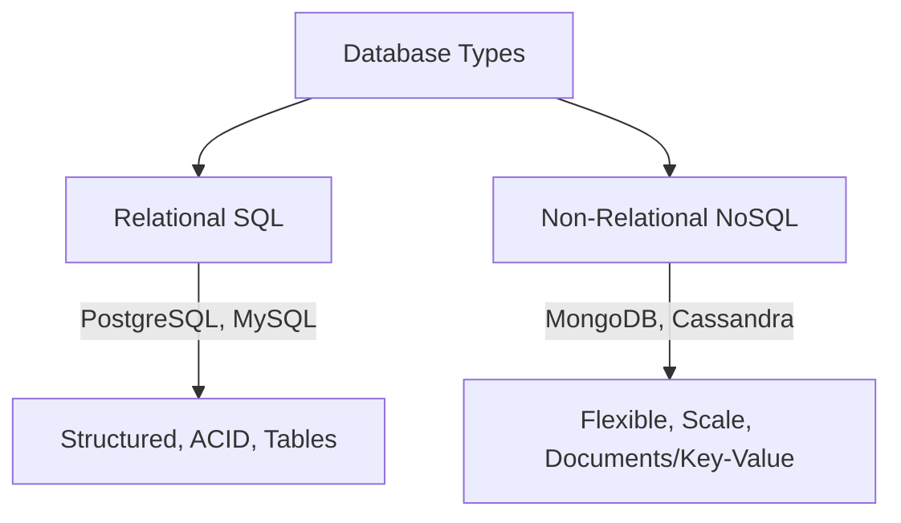

# Databases and DBMS

> Structured data ko organize, store, manage karne ke liye software system.

> **TL;DR Hinglish:** Database structured data store karta hai — tables, rows, columns. DBMS (Database Management System) database manage karta hai — create, read, update, delete (CRUD). Relational databases (Postgres, MySQL) tables with relationships, Non-relational (MongoDB, Cassandra) flexible schema. ACID properties reliability ensure karte hain.

Database structured data ko organize karta hai:

**Relational (SQL) Databases:**
- Tables with rows and columns, predefined schema
- Relationships (FKs), joins, ACID properties
- Examples: PostgreSQL, MySQL, Oracle
- Best for: structured data, complex queries, transactions

**Non-Relational (NoSQL) Databases:**
- Flexible schema, JSON/documents, key-value, graphs
- Horizontal scaling, high throughput
- Examples: MongoDB (document), Cassandra (wide-column), Redis (key-value)
- Best for: unstructured data, high scale, flexible schema

## Failure modes to mention

1. **Schema rigidity** — SQL schema change hard — migrations needed, downtime possible
2. **Connection limit** — Too many connections = pool exhausted — connection pooling
3. **Data inconsistency** — No ACID, partial writes — eventual consistency model

**🔴 Galti:** "NoSQL always better for scale" — NoSQL trade-offs — consistency, joins, transactions sacrifice hota hai.
**✅ Sahi:** "SQL = structured, ACID, joins. NoSQL = flexible schema, scale, no joins. Choose based on data structure and consistency needs."

**Phrase:** Database structured data store — SQL (relational, ACID, tables) vs NoSQL (flexible, scalable, documents). DBMS manages CRUD operations.

**Yaad rakho (Revision):** SQL vs NoSQL, ACID properties, relational (Postgres/MySQL) vs NoSQL (Mongo/Cassandra/Redis), schema rigidity vs flexibility, choose based on needs.

**See also:** [SQL databases](/system-design/sql-databases), [NoSQL databases](/system-design/nosql-databases), [PostgreSQL](/system-design/postgresql).
