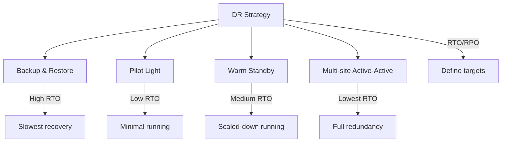

# Disaster Recovery

> System fail hone pe recover karo — backup, restore, failover plans.

> **TL;DR Hinglish:** Disaster Recovery (DR) system fail hone pe recover karne ka plan hai. RTO (Recovery Time Objective) = kitni time mein recover hona chahiye. RPO (Recovery Point Objective) = kitna data loss acceptable hai. Strategies: Pilot Light (minimal running), Warm Standby (scaled-down), Multi-site Active-Active (full redundancy). Backup strategies: full, incremental, differential. DR testing regular karo — plan without testing = no plan.

Disaster Recovery system fail hone pe recover karne ka plan hai:

**Key metrics:**
- **RTO** — Recovery Time Objective: maximum acceptable downtime
- **RPO** — Recovery Point Objective: maximum acceptable data loss
- Example: RTO=1 hour, RPO=5 minutes = 1 hour mein recover, 5 min ka data loss acceptable

**DR strategies:**
- **Backup and Restore** — Full backup, restore after disaster (high RTO)
- **Pilot Light** — Minimal infrastructure always running (low RTO)
- **Warm Standby** — Scaled-down version running (medium RTO)
- **Multi-site Active-Active** — Full redundancy, failover automatic (lowest RTO)

## Failure modes to mention

1. **Untested DR plan** — Plan fails during actual disaster — regular DR drills
2. **Data corruption** — Backup corrupt, can't restore — multiple backup copies
3. **Slow recovery** — RTO too high — Pilot Light/Warm standby help
4. **Regional disaster** — Entire region down — multi-region DR needed
5. **Human error** — Manual failover mistakes — automate as much as possible

**🔴 Galti:** "DR = backup" — DR backup + recovery + testing plan hai. Backup alone = insufficient.
**✅ Sahi:** "DR = backup + recovery + testing. RTO (recovery time) + RPO (data loss). Strategies: Backup→Pilot Light→Warm→Multi-site. Test regularly."

**Phrase:** Disaster Recovery fail hone pe recover karne ka plan — RTO (recovery time) + RPO (data loss), strategies (backup→pilot→warm→multi-site), regular testing.

**Yaad rakho (Revision):** RTO (recovery time), RPO (data loss), strategies (backup/restore, pilot light, warm standby, multi-site active-active), test regularly, regional disaster = multi-region.

**See also:** [Availability](/system-design/availability), [Clustering](/system-design/clustering), [Database Replication](/system-design/database-replication).
