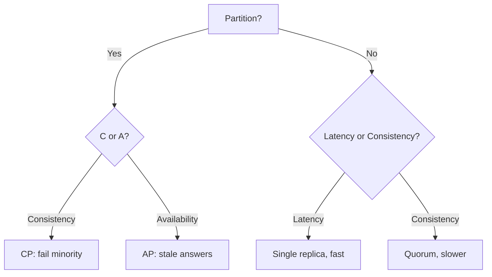

# Distributed Systems

> Many machines acting as one — with partitions, clocks, and failures as permanent facts of life.

> Distribution buys scale and availability at the price of coordination. Networks partition, clocks skew, nodes crash — every pattern here exists because pretending otherwise fails in production. CAP, quorum, and retries are the load-bearing ideas.

## Distributed Systems Fundamentals

Fallacies to drop: the network is reliable, latency is zero, bandwidth is infinite, the topology never changes. Design assumes partitions happen, messages duplicate, and any node may die mid-operation. Idempotency and timeouts belong everywhere.

## CAP Theorem

During a partition, choose Consistency (every read sees the latest write, some requests fail) or Availability (every request answers, possibly stale). Partition tolerance is mandatory — the real question is C vs A. CP systems: Postgres primary, ZooKeeper, etcd. AP systems: Cassandra, DynamoDB. Single nodes sidestep CAP entirely.

## PACELC Extension

CAP covers partitions; PACELC adds normal operation: Else choose Latency or Consistency. Quorum reads stay fresh but slow; single-replica reads stay fast but stale. PA/EL (Cassandra/Dynamo) vs PC/EC (Postgres quorum, ZooKeeper) — name both sides per feature.

## Consistency Models and Availability

Strong consistency: linearizable reads and writes, slowest. Eventual consistency: replicas converge, reads may lag — fine for feeds, fatal for money. Availability means answering despite failures; the two trade off under partitions and latency budgets.

## Replication and Leader/Follower

Copy data across nodes: leaders take writes, followers replicate and serve reads. Synchronous replication loses nothing but waits; asynchronous is fast but lags and risks loss on failover. Read replicas scale reads; leader election (ZooKeeper, Raft) automates failover.

## Quorum

`R + W > N` gives strong reads: with 3 replicas, write 2 and read 2 guarantees overlap on the latest value. Tune per operation — `W=ALL` for money, `W=1` for likes. Quorum is how AP systems offer strong consistency on demand.

## Distributed Locks

Mutual exclusion across machines via fencing tokens and leases (ZooKeeper, etcd, Redis Redlock with care). Locks need expiry (dead holders must release) and fencing (stale holders must fail writes). Prefer lock-free designs (idempotency, CAS, partitioning) where possible — locks are coordination bottlenecks.

## Distributed Transactions

Two-phase commit (prepare plus commit) is blocking with a single coordinator point of failure. Saga chains local transactions with compensating actions — the microservices answer (choreography via events, orchestration via coordinator). Accept eventual consistency where the business allows.

## Idempotency

Same request twice, one effect — via idempotency keys stored with results. Required for retries, webhooks, and payments. Design every mutating endpoint to be safely repeatable.

## Fault Tolerance, Failover, Retry, Timeout

Tolerate faults with redundancy; fail over automatically with leader election and health checks; retry transient errors with exponential backoff plus jitter; bound everything with timeouts (no timeout means one slow dependency freezes threads). Retry budgets cap total retry load.

## Exponential Backoff

Retry delays doubling (100ms, 200ms, 400ms) plus random jitter spreads thundering retries. Cap attempts and total time; distinguish retryable (timeouts, 503) from fatal (400, auth) errors.

## Keep in mind

- Partitions are certain — design for C vs A, never assume perfect networks.
- PACELC adds the normal-case trade: latency vs consistency.
- Quorum (`R + W > N`) buys strong reads on demand.
- Idempotency keys everywhere retries happen.
- Retry with backoff plus jitter, capped, with timeouts on everything.
- Prefer lock-free patterns; fence and expire any lock you must take.
