# Distributed Systems

> Many machines acting as one — with partitions, clocks, and failures as permanent facts of life.

> Distribution buys scale and availability at the price of coordination. Networks partition, clocks skew, nodes crash — every pattern here exists because pretending otherwise fails in production. CAP, quorum, and retries are the load-bearing ideas.

## Distributed Systems Fundamentals

Single-machine assumptions fail at scale: latency is never zero, packets drop, switches fail, and deploys restart nodes mid-request. Design every remote call with **timeouts**, **retries with caps**, and **idempotency** because duplicates and partial failures are normal, not edge cases. Prefer stateless app tiers behind load balancers; push state to databases, caches, and queues with explicit consistency models. Observability (trace IDs, RED metrics) is mandatory — you cannot debug what you cannot see across hops.

- **Eight fallacies of distributed computing:** Know at least network unreliable, latency non-zero, bandwidth finite, topology changes.
- **Partial failure:** Caller sees timeout — did the write happen? Use idempotency keys and reconcilers, not blind retry forever.
- **Tail latency:** p99 dominates UX — parallel fan-out multiplies tails; hedge or limit concurrency.
- **Stateless workers:** Session in Redis/DB; any instance handles any request — enables roll and scale.

## CAP Theorem

During a **network partition**, a distributed store cannot simultaneously guarantee **Consistency** (every read returns the latest write or errors) and **Availability** (every request gets a response, possibly stale). **Partition tolerance** is non-optional in real WAN/multi-AZ systems — the trade is **CP vs AP** under partition. CP (ZooKeeper, etcd, Postgres primary with sync replica): reject minority writes/reads to stay linearizable. AP (Cassandra, DynamoDB default paths): accept writes/reads on both sides, reconcile later. Single-node databases sidestep the theorem until you replicate.

- **Partition definition:** Nodes that cannot talk — not "slow network" alone, though timeouts blur the line in practice.
- **Choose per operation:** Same system can be CP for wallet and AP for likes — not one label for whole product.
- **Minority side behavior:** CP systems fence or read-only minority; AP systems may conflict-merge.
- **Interview trap:** CAP is about partition period, not normal operation — pair with PACELC.

## PACELC Extension

When **no partition**, systems still trade **Latency (L)** vs **Consistency (C)** — else in PACELC. Quorum reads/writes across replicas stay fresher but add RTT; reading one local replica is fast but may lag. Label systems: Dynamo/Cassandra often **PA/EL** (available under partition, low latency else); strongly consistent stores **PC/EC** when you pay quorum or leader reads always. Name both axes for a feature: "checkout reads leader; product catalog reads nearest replica."

- **PA/EL:** Optimize for speed and uptime — tune R/W per query when money involved.
- **PC/EC:** ZooKeeper, etcd for coordination — consistency and correctness over raw latency.
- **Latency budgets:** 100ms p99 page load leaves few ms for cross-region quorum — design regions accordingly.
- **Not a ranking:** PACELC describes tradeoffs, not "better/worse" — match to business requirement.

## Consistency Models and Availability

**Strong / linearizable:** Behaves like one copy, one at a time — expensive, often leader-based. **Sequential / causal:** Respect cause-effect order without full global lock. **Eventual:** Replicas converge; reads may return old values for a bounded (or unbounded) window. **Availability** means serving despite node loss — often conflicts with strong consistency under partition. Product language maps to models: bank balance → strong; Twitter follower count → eventual with TTL display.

- **Read-your-writes:** Session stickiness or leader read after own write — common UX compromise.
- **Monotonic reads:** Never go backward in time for one user — cheaper than full linearizability.
- **RPO/RTO:** Recovery point/time objectives drive sync vs async replication choice.
- **SLA honesty:** "Highly available" with stale reads is valid — document what users see during failure.

## Replication and Leader/Follower

**Leader** accepts writes and replicates log entries to **followers**; followers apply in order and serve read traffic if allowed. **Sync replication** waits for follower ack before commit — smaller data loss window (RPO≈0), higher write latency. **Async** commits locally first — fast writes, followers lag, possible loss on leader death before replicate. **Leader election** (Raft in etcd, Patroni for Postgres) promotes healthy follower on failure — requires odd-member quorum or fencing to avoid split-brain writers.

- **Split-brain:** Two leaders write divergent histories — prevent with STONITH, fencing tokens, or quorum writes only.
- **Read scaling:** Followers offload SELECT; writes still single-leader until multi-leader (conflict-prone).
- **Chain replication:** Leader → intermediate → tail — latency vs durability tuning niche.
- **Geo-replication:** Async across regions for latency; sync within AZ for durability — tiered strategy.

## Quorum

With **N** replicas, require **W** nodes to ack writes and **R** nodes for reads; if **R + W > N**, read and write sets overlap, so at least one read replica participated in the latest acknowledged write. This improves freshness, but it is not by itself a universal linearizability proof when writes race, clocks resolve conflicts, or sloppy quorums use fallback nodes. Example N=3: W=2, R=2 overlaps; W=1, R=1 is faster and more likely stale. Dynamo-style stores expose tunable levels such as `LOCAL_QUORUM` vs `ONE`.

- **Sloppy quorum + hinted handoff:** Writes temporarily on fallback nodes during partition — know repair path.
- **Strict invariants:** Use conditional writes / consensus / a transactional leader for uniqueness, balances, and inventory rather than relying on quorum arithmetic alone.
- **Read repair:** Read path fixes stale replicas — reduces drift without full anti-entropy scan load.
- **Math check:** Interview quick calc — N=5, W=3, R=3 → overlap 1 node minimum; adjust for desired staleness.

## Distributed Locks

Coordinate exclusive work across nodes (cron leader, inventory hold) with locks backed by ZooKeeper, etcd, or Redis (Redlock debated — prefer etcd/ZK for fencing). Locks need **TTL/lease** so dead processes release; **fencing tokens** (monotonic counter passed to storage) so delayed old lock holders cannot commit writes after new leader elected. Locks serialize and add failure modes — prefer **idempotent workers**, **partitioned jobs**, or **compare-and-swap** on rows when possible.

- **Lease renewal:** Long work must extend lease heartbeat — or split work into subtasks under short leases.
- **Redlock caveat:** Clock skew and pause times break naive Redis lock — use consensus store for correctness-critical paths.
- **Split-brain writer:** Lock without fencing → two writers both think they won — storage must reject lower fence token.
- **Alternatives:** DB `UPDATE ... WHERE status=pending` row claim — lock-free pattern for job queues.

## Coordination with ZooKeeper (and etcd)

Tiny strongly-consistent metadata store (znodes in a tree) that systems use to agree: who leads, who holds the lock, what the config says. Clients create **ephemeral** znodes (vanish on session loss) and set **watches** for change notifications. Odd-sized ensembles (3 or 5) order writes through a leader (Zab consensus); reads can be local, writes need a quorum. CP by design — the minority stops serving during partitions rather than risk two leaders. Coordination only — never application payloads, queues, or high-throughput reads.

- **Recipes** (locks, elections, barriers) compose from sequential ephemeral nodes + watches; locks still need fencing tokens.
- **Failure modes:** herd effect (everyone watching one node thunders on change — hierarchical watches); session expiry from long GC pauses (tune timeouts to pause times); write bottleneck through the leader (keep data tiny).
- **etcd / Consul** fill the same role in Kubernetes-native stacks — same interview ideas apply.
- **Phrase:** "ZooKeeper is the agreement box — leaders elected, locks fenced, config watched, all strongly consistent."

## Distributed Transactions

**Two-phase commit (2PC):** Coordinator prepares all participants, then commits — blocking if coordinator dies after prepare; not ideal across microservices. **Three-phase** reduces some blocking but rarely used in apps. **Saga:** Sequence of local transactions with **compensating actions** (cancel reservation, refund payment) — **choreography** via events or **orchestration** via central coordinator. Accept **eventual consistency** between steps; design visible intermediate states and idempotent compensations.

- **2PC when:** Same data center, few participants, homogeneous DB — rare in greenfield microservices.
- **Saga failure:** Forward recovery vs compensation — business defines which steps are reversible.
- **Outbox + events:** Each service commits locally and publishes — avoids cross-DB 2PC for cross-service consistency.
- **TCC (Try-Confirm-Cancel):** Reserve → confirm pattern for inventory/payment — explicit business phases.

## Idempotency

Processing the same logical request twice yields one effect — store **idempotency keys** (client-supplied UUID) with response snapshot in DB or cache before performing irreversible side effects. Required for payment APIs, webhooks, message consumers, and any retried HTTP POST. Keys expire after 24–72h typically; scope per user or tenant to prevent collision.

- **Key storage:** Unique index on `(user_id, idempotency_key)` — second insert returns cached response.
- **At-least-once + idempotency = safe retries:** Default microservice contract.
- **Side effect order:** Persist idempotency record in same transaction as ledger write when possible.
- **Webhook replays:** Provider sends same event ID — dedupe on event ID, not only HTTP layer.

## Fault Tolerance, Failover, Retry, Timeout

**Redundancy:** N+1 instances, multi-AZ, replicated data — no single point of failure on critical path. **Failover:** Health checks remove bad nodes; leader election promotes replica — automate, drill regularly. **Retry:** Transient errors only, exponential backoff + jitter, budget total retry volume so one outage does not amplify load. **Timeout:** Every outbound call bounded — default "no timeout" freezes thread pools and cascades failure; set connect vs read timeouts separately.

- **Circuit breaker:** Open after an error threshold — fail fast while downstream recovers (Hystrix / Resilience4j pattern).
- **Bulkhead:** Isolate thread pools per dependency — one slow service cannot exhaust all workers.
- **Graceful degradation:** Feature flags disable non-core paths under stress — core checkout stays up.
- **Chaos drills:** Kill leader, partition AZ — validate runbooks before production does it for you.

## Exponential Backoff

Retry delay grows multiplicatively (e.g., base 100ms × 2^attempt) plus **random jitter** spread across clients so retries do not align into synchronized waves. Cap max attempts (3–7) and max elapsed time; classify errors — retry 408/429/502/503/timeouts, not 400/401/404 logic errors. **Retry budgets** at gateway limit aggregate retry fraction of traffic.

- **Full jitter:** `sleep = random(0, min(cap, base * 2^attempt))` — AWS recommended pattern.
- **Equal jitter / decorrelated jitter:** Variants when you need tighter bounds — know full jitter is simplest default.
- **Idempotency prerequisite:** Backoff without idempotency creates duplicate side effects on success-after-timeout.
- **Thundering herd on recovery:** Stagger client reconnects when broker returns — combine with jittered backoff.

```mermaid
graph TD
    A[Partition?] -->|Yes| B{C or A?}
    B -->|Consistency| C[CP: fail minority]
    B -->|Availability| D[AP: stale answers]
    A -->|No| E{Latency or Consistency?}
    E -->|Latency| F[Single replica, fast]
    E -->|Consistency| G[Quorum, slower]
```

## Keep in mind

- Partitions are certain — design CP vs AP per feature, never assume a reliable LAN forever.
- PACELC covers normal case: latency vs consistency when the network is fine.
- Quorum (`R + W > N`) creates read/write overlap, not magic linearizability — state conflict and conditional-write semantics too.
- Idempotency keys on every retried or queued mutating operation — consumers and HTTP alike.
- Retry with backoff, jitter, caps, and timeouts on every remote dependency; use circuit breakers at scale.
- Prefer lock-free/idempotent designs; if you lock, use leases plus fencing and a consensus-backed store.
