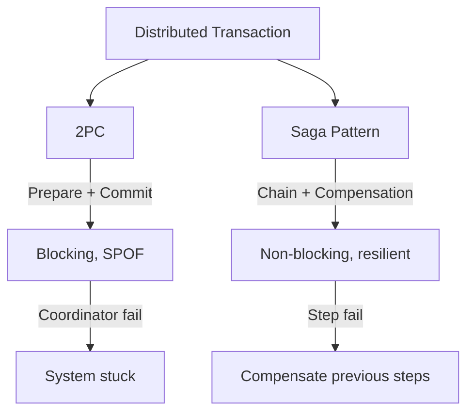

# Distributed Transactions

> Multiple databases pe transaction — consistency maintain karna mushkil.

> **TL;DR Hinglish:** Distributed transactions multiple databases pe kaam karte hain — consistency maintain karna mushkil. Two-Phase Commit (2PC) — prepare phase (sab agree karo) + commit phase (sab commit karo) — but blocking hai. Three-Phase Commit (3PC) — non-blocking but complex. Saga pattern — chain of local transactions, compensation if fail — best for microservices. Eventual consistency accept karo where possible.

Distributed transactions multiple nodes/databases pe transaction kaam karte hain:

**Two-Phase Commit (2PC):**
- **Prepare phase** — Coordinator asks all participants: can you commit?
- **Commit phase** — If all yes, commit; if any no, rollback
- **Blocking** — Participants blocked until coordinator decides
- **Single point of failure** — Coordinator fail = system stuck

**Saga Pattern (preferred for microservices):**
- Chain of local transactions
- Each step publishes event, next step listens
- **Compensation** — If step fails, undo previous steps (reverse operations)
- **Choreography** — No central coordinator (event-driven)
- **Orchestration** — Central coordinator manages steps

## Failure modes to mention

1. **Coordinator failure** — 2PC stuck, participants blocked — 3PC or timeouts
2. **Network partition** — Participants can't communicate — heuristic decisions
3. **Compensation failure** — Saga step fails, can't undo previous — manual intervention
4. **Long blocking** — 2PC holds locks long — contention, deadlocks

**🔴 Galti:** "2PC best for microservices" — 2PC blocking, SPOF. Saga pattern better for distributed/microservices systems.
**✅ Sahi:** "2PC = prepare + commit (blocking, SPOF). Saga = chain of local transactions with compensation (non-blocking, resilient). Use Saga for microservices."

**Phrase:** Distributed transactions multiple databases pe — 2PC (prepare+commit, blocking, SPOF) vs Saga (chain+compensation, non-blocking, resilient). Eventual consistency preferred where possible.

**Yaad rakho (Revision):** 2PC (prepare+commit, blocking, SPOF), 3PC (non-blocking), Saga pattern (local txns + compensation), choreography vs orchestration, use Saga for microservices.

**See also:** [Transactions](/system-design/transactions), [ACID vs BASE](/system-design/acid-vs-base), [Event-Driven Architecture](/system-design/event-driven-architecture).
