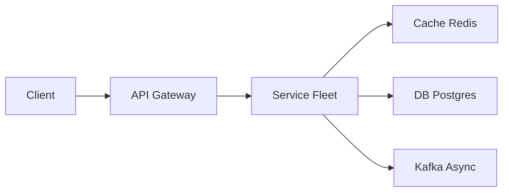

# Dropbox

> File sync. The product is **metadata + chunks**, not "put one blob in a table." Conflict handling and upload resume are the senior bits.

> **TL;DR Hinglish:** File ko chunks me kaato, metadata Postgres me, chunks S3 me. Sync me delta + deduplication, conflict me last-write-wins ya version.

## Kya poochte hain? (What they ask) — Hinglish me samjho

**Scenario:** "Design Dropbox — upload a file from laptop A, see it on laptop B and the web. Share a folder. Don't re-upload the whole 2GB video after a Wi-Fi blip."

**What the interviewer really tests:**
- Do you separate **content (chunks in object storage)** from **metadata (file tree, versions, ACLs)**?
- Can you design **resumable, deduplicated, delta uploads** — not naive whole-file PUT?
- How you achieve **sync correctness**: offline edits, conflicts, compare-and-swap commits.
- Whether you can push **change notifications** efficiently to many devices without polling storms.

**Example scale:** 500M users, avg 50 files, avg file 1 MB chunked into 4 MB pieces. Metadata ~tens of TBs; chunk storage dominates (exabytes logically, PBs physically with dedup). Sync QPS dominated by `delta` polls and heartbeats.

## Requirements — Kya chahiye? (Functional / Non-functional)

**Functional:**
- Upload / download files and folders (hierarchical namespace).
- Sync across multiple devices per user (laptop, phone, web).
- Share files/folders via link or ACL (view/edit permissions).
- Version history: keep last N versions per file (e.g., 30 days), restore previous.
- Resumable uploads, deduplication, incremental sync (only changed chunks).
- Offline edits with conflict detection (don't silently overwrite).

**Non-functional:**
- **Durability:** 11 9's for chunks (S3), metadata strongly consistent per user.
- **Availability:** sync should work even if notification pipeline lags (clients poll).
- **Performance:** upload throughput near disk/network limit; `delta` < 200ms; battery-friendly sync.
- **Consistency:** per-user linearizable metadata commits; chunk storage eventual is fine.
- **Security:** ACL enforcement, pre-signed URLs, encryption at rest.

**Clarify — questions to ask:**
- Max file size? (2 GB? 100 GB?) Chunk size fixed or adaptive?
- How many devices per user? (3-5 typical)
- Sharing model — link-based vs explicit user ACL vs team namespaces?
- Version retention policy and trash/restore semantics?
- Client-side encryption or server-managed? Compliance requirements?
- Need selective sync (choose folders) or full sync?

**Out of scope (v1):**
- Full collaborative editing like [Google Docs](/system-design/google-docs) (operational transform / CRDT).
- Real-time co-authoring cursors, comments, or preview generation beyond thumbnails.
- Full-text search inside file contents.

## Scale ka andaaza — Kitna load? (Math jo design badle)

| Metric | Assumption | Math | Result |
|--------|-----------|------|--------|
| Users | 500M | — | 500M |
| Files per user | 50 avg, 5k p99 | 500M * 50 | 25B file records (metadata) |
| Avg file size | 1 MB (many small, few large) | 500M * 50 * 1MB | ~25 PB logical (before dedup) |
| Chunk size | 4 MB | 1 GB file → 250 chunks | Few large files dominate bytes but not row count |
| Dedup savings | 30% cross-user identical (OS images, etc.) | 25 PB * 0.7 | ~17.5 PB physical |
| Metadata storage | ~500B per file row + revisions | 25B * 500B | ~12.5 TB (+ indexes ~25 TB) — shardable |
| Upload QPS | 1% users upload/day, 5 files each | 5M * 5 / 86400 | ~290 uploads/s avg, ~3k/s peak |
| Delta poll QPS | Each device polls every 60s or long-poll | 1B devices / 60 | ~16M polls/min → ~270k QPS (needs caching) |

**Takeaway:** chunk bytes in S3 scale horizontally; metadata DB is the hard part — must be sharded by `user_id` / `namespace_id`.

## API Design — Endpoints kya honge?

| Method | Path | Description |
|--------|------|-------------|
| `POST` | `/files/begin` | Start resumable upload session |
| `PUT` | `/files/{uploadId}/chunks/{n}` | Upload chunk n (idempotent) |
| `POST` | `/files/{uploadId}/complete` | Commit file (CAS) |
| `GET` | `/files/{id}/url` | Get pre-signed S3 GET for download |
| `GET` | `/files/{id}/metadata` | Get file metadata + chunk list |
| `GET` | `/namespace/delta?cursor=&limit=` | What changed since cursor |
| `POST` | `/shares` | Create share link / ACL |
| `DELETE` | `/files/{id}` | Move to trash (soft delete) |

**Begin upload:**
```json
POST /files/begin
{ "name": "vacation.mp4", "parentId": "fld_abc", "size": 2147483648, "checksum": "sha256:..." }
→ { "uploadId": "upl_123", "chunkSize": 4194304, "chunkCount": 512 }
```

**Upload chunk (idempotent, retries safe):**
```
PUT /files/upl_123/chunks/42
Content-MD5: <hash>
Body: <4 MB bytes>
→ 200 { "chunkHash": "sha256:abcd...", "received": true }
```

**Complete (compare-and-swap):**
```json
POST /files/upl_123/complete
{
  "name": "vacation.mp4",
  "parentId": "fld_abc",
  "chunkHashes": ["sha256:a...", "sha256:b...", ...],
  "expectedParentRev": 17
}
→ 201 { "fileId": "fil_xyz", "revision": 18 }
→ 409 Conflict { "error": "parent modified", "latestRev": 18 }
```

**Delta sync:**
```
GET /namespace/delta?cursor=17&limit=100
→ { "entries": [{ "fileId": "...", "rev": 18, "op": "upsert" }], "cursor": "18", "hasMore": false }
```

All chunk uploads/downloads use **pre-signed S3 URLs** so API servers don't proxy gigabytes: block server returns `https://bucket.s3.amazonaws.com/chunks/<hash>?X-Amz-Signature=...`.

## High-Level Design (HLD) — Boxes kaise judenge? (Hinglish)

```
Desktop / Mobile Clients  <---WebSocket / Long Poll--->  Notification Service
        |                                                    ^
        |  (1) begin/complete metadata                       | (6) "cursor moved"
        v                                                    |
   API Gateway (auth, rate limit)                            |
        |                                                    |
   +----+----+----+                                         |
   |         |    |                                          |
 Block    Metadata  Share                                   |
 Service  Service  Service                                   |
   |         |      |                                        |
   +----+----+------+                                        |
        |                                                    |
   +----+--------------------------------+                   |
   |   Object Storage (S3) — chunks      |                   |
   |   hash(content) → chunk id          |                   |
   +-------------------------------------+                   |
        |                                                    |
   Postgres (sharded) — users, namespaces, files, revisions, chunks
        |
   [Redis](/system-design/redis) — delta cursor cache, folder listing cache
        |
   [Kafka](/system-design/kafka) — async: thumbnail, virus scan, search index
```



**Component roles:**
- **Block Server:** handles chunk upload sessions, validates chunk hashes, issues pre-signed S3 URLs. Stateless, scales horizontally. Verifies `Content-MD5` and stores `chunkHash` mapping.
- **Metadata Service:** owns file tree, revisions, and commit logic. Writes to Postgres with CAS. Serves `delta` queries. The consistency boundary.
- **Object Storage (S3):** holds chunks **content-addressed** (`sha256(bytes)` = chunk id). Identical chunks across users stored once — **deduplication**. Immutable after write; GC orphans later.
- **Notification Service:** after successful commit, publishes `NamespaceUpdated{ namespaceId, newCursor }`. Pushes via WebSocket/long-poll to subscribed devices. Clients then pull `delta`.
- **[Kafka](/system-design/kafka) workers:** thumbnails, preview, antivirus, search indexing — off hot path.
- **[Redis](/system-design/redis):** caches `delta` pages and folder listings per user; stores presence/heartbeat.

**Write flow (upload):** Client `begin` → server returns `uploadId` + `chunkSize`. Client splits file, hashes each chunk, uploads chunks in parallel via pre-signed PUTs (retries idempotent). Then `complete` with ordered `chunkHashes` + `expectedParentRev`. Server validates all chunk hashes exist in S3, then **CAS commit** of metadata row (fails if parent rev changed).

**Read flow (download/sync):** Client has `cursor`. Calls `delta?cursor=17` → gets list of changed fileIds + new cursor. For each file, fetch metadata (chunk list), then download missing chunks via pre-signed S3 GETs in parallel, reconstruct file. Folder browse hits Redis cache, else DB.

## Low-Level Design (LLD) — DB + Classes (Hinglish notes)

**Database schema (Postgres, sharded by `namespace_id`):**
```sql
CREATE TABLE users (
  id            BIGSERIAL PRIMARY KEY,
  email         VARCHAR(255) UNIQUE NOT NULL,
  created_at    TIMESTAMPTZ DEFAULT now()
);

CREATE TABLE namespaces (  -- one per user + one per shared folder
  id            BIGSERIAL PRIMARY KEY,
  owner_id      BIGINT REFERENCES users(id),
  type          VARCHAR(16) NOT NULL, -- 'user_root' | 'shared_folder'
  cursor        BIGINT NOT NULL DEFAULT 0, -- monotonic per namespace
  created_at    TIMESTAMPTZ DEFAULT now()
);

CREATE TABLE namespace_members (
  namespace_id  BIGINT REFERENCES namespaces(id),
  user_id       BIGINT REFERENCES users(id),
  role          VARCHAR(16) NOT NULL, -- 'owner' | 'editor' | 'viewer'
  PRIMARY KEY (namespace_id, user_id)
);

CREATE TABLE files (  -- logical file (latest version pointer)
  id            BIGSERIAL PRIMARY KEY,
  namespace_id  BIGINT NOT NULL REFERENCES namespaces(id),
  parent_id     BIGINT REFERENCES files(id), -- folder parent (NULL for root)
  name          VARCHAR(255) NOT NULL,
  type          VARCHAR(16) NOT NULL, -- 'file' | 'folder'
  latest_rev    BIGINT NOT NULL DEFAULT 1,
  is_deleted    BOOLEAN DEFAULT false,
  created_at    TIMESTAMPTZ DEFAULT now(),
  UNIQUE (namespace_id, parent_id, name) -- prevents duplicate names in folder
);
CREATE INDEX idx_files_namespace_parent ON files(namespace_id, parent_id);
CREATE INDEX idx_files_cursor ON files(namespace_id, latest_rev);

CREATE TABLE revisions (
  id            BIGSERIAL PRIMARY KEY,
  file_id       BIGINT NOT NULL REFERENCES files(id),
  rev           BIGINT NOT NULL,
  size          BIGINT NOT NULL,
  checksum      VARCHAR(128) NOT NULL,
  chunk_count   INT NOT NULL,
  created_at    TIMESTAMPTZ DEFAULT now(),
  UNIQUE (file_id, rev)
);

CREATE TABLE chunks (
  hash          CHAR(64) PRIMARY KEY, -- sha256 hex
  size          INT NOT NULL,
  ref_count     INT NOT NULL DEFAULT 1,
  created_at    TIMESTAMPTZ DEFAULT now()
);

CREATE TABLE revision_chunks (
  revision_id   BIGINT REFERENCES revisions(id),
  seq           INT NOT NULL,  -- order within file
  chunk_hash    CHAR(64) REFERENCES chunks(hash),
  PRIMARY KEY (revision_id, seq)
);

CREATE TABLE upload_sessions (
  id            VARCHAR(32) PRIMARY KEY,
  owner_id      BIGINT REFERENCES users(id),
  file_name     VARCHAR(255) NOT NULL,
  parent_id     BIGINT REFERENCES files(id),
  total_size    BIGINT NOT NULL,
  chunk_size    INT NOT NULL,
  created_at    TIMESTAMPTZ DEFAULT now(),
  expires_at    TIMESTAMPTZ NOT NULL
);
```

**Key classes:**
```python
class BlockService:
    def begin_upload(self, user_id, name, parent_id, size) -> UploadSession: ...
    def upload_chunk(self, upload_id, seq, data: bytes) -> str: ... # returns hash, stores to S3
    def commit(self, upload_id, chunk_hashes, expected_rev) -> File: ... # CAS

class MetadataService:
    def cas_commit(self, namespace_id, parent_id, name, chunk_hashes, expected_cursor) -> Revision: ...
    def get_delta(self, namespace_id, cursor, limit) -> DeltaPage: ...
    def resolve_conflict(self, file_id, rev_a, rev_b) -> Revision: ...

class SyncClient:
    journal: LocalJournal  # tracks local cursor, pending uploads
    def push_local_changes(self): ...
    def pull_remote_delta(self): ...

class NotificationService:
    def publish(self, namespace_id, new_cursor): ...
    def subscribe(self, user_id, namespace_id): ... # WebSocket
```

**Algorithms / concurrency:**
- **Content-defined chunking:** for large files, use rolling hash (Rabin) to split on content boundaries so 1-byte insert shifts only one chunk — enables delta sync with minimal upload. Simpler v1: fixed 4 MB.
- **Dedup:** `hash = sha256(chunk)`; before S3 PUT, `HEAD` bucket for hash — if exists, skip upload, just `ref_count++`.
- **CAS commit:** `UPDATE files SET latest_rev = expected+1 WHERE id=:fid AND latest_rev=:expected` — if `rowcount==0`, conflict. On conflict, create `name (conflicted copy).ext` instead of overwriting.

**Patterns:** Content-Addressable Storage, Compare-And-Swap, Event-Driven (Kafka), Pre-signed URL (offload pattern), Journal/Sync pattern.

## Deep Dive — Gehrai se (Interview yahi puchega) — conflicts and consistency

**Problem:** Two laptops edit `notes.txt` offline. Both upload new chunks and try to commit revision 2. Last-write-wins loses data.

**Solution — CAS + conflict copy:** Commit is `INSERT revision WHERE file.latest_rev == expected`. If Laptop B wins, Laptop A's commit gets `409 Conflict`. Client then renames its version to `notes (LaptopA's conflicted copy).txt` and commits as a new file. Both revisions preserved. User merges manually. Same logic for folder moves.

**Dual-write trap:** Never do `S3 PUT + DB INSERT` without ordering. Correct order: upload chunks to S3 first (orphans OK, GC later via mark-and-sweep of unreferenced hashes older than 24h), then commit DB row. If DB fails, retry `complete`; chunks already there (idempotent by hash). If DB succeeds and notification fails, clients eventually poll `delta` — no data loss.

**Split-brain on share:** ACL check on every `delta` and `complete`. Don't leak via guessable `fileId` — use UUIDs and verify `namespace_members` membership.

## Deep Dive — Gehrai se (Interview yahi puchega) — resumable uploads and delta sync

**Resumable:** `upload_sessions` tracks which `seq` already received (via `revision_chunks` temp table or Redis set). Client on reconnect queries `GET /files/{uploadId}/status` → `{ received: [0,1,3] }`, re-uploads only missing. Each `PUT /chunks/{n}` idempotent — `sha256` must match.

**Delta sync (like Dropbox `delta`):** Server maintains monotonic `cursor` per namespace (incremented on each commit). `delta` is paginated log of `(fileId, rev, op)` since cursor. Client stores `cursor` locally in journal. On startup, `GET /delta?cursor=localCursor` → apply changes. Long-poll variant: server holds request 60s until cursor moves, then responds — avoids busy polling.

**Large file diff:** Client computes rolling hash locally, compares with server's chunk hashes for that file, uploads only changed chunks. Server can also expose `GET /files/{id}/chunkHashes` for client diff.

## Deep Dive — Gehrai se (Interview yahi puchega) — sharing and scale

**Sharing:** A shared folder is a `namespace` with multiple members. `namespace_members` ACL governs read/write. Share link = capability URL `https://dbx.sh/s/<token>` mapping to `(namespaceId, fileId, permission)` with expiry. Validate token on each access; don't expose internal IDs.

**Hot metadata caching:** Folder listings cached in [Redis](/system-design/redis) as `namespace:{id}:listing:{path} → [fileIds]` with TTL 60s + invalidation on commit. `delta` pages also cached. Reduces DB QPS from 270k/s to <10k/s.

**Sharding:** Shard `files`/`revisions` by `namespace_id` hash. Each shard owns a set of namespaces; cross-namespace queries rare. S3 buckets partitioned by `hash[0:2]` prefix for request rate.

## Hinglish Tip — Galti vs Sahi

**🔴 Galti:** Hot path pe DB direct without cache/queue.
**✅ Sahi:** Cache/queue beech me, DB source of truth.

## Failures & Scale — Kya tootega aur kaise bachenge? (Hinglish)

- **S3 durability:** 11 9's; cross-region replication for disaster recovery. Chunk GC: daily job deletes `chunks` with `ref_count==0` and `created_at < now()-24h`.
- **DB replication:** per-shard primary + read replicas; metadata writes go to primary, `delta` reads can go to replicas with bounded staleness (cursor from primary).
- **Notification fallback:** if WebSocket push fails, client poll interval backoff (30s → 60s). Persist `NamespaceUpdated` in Kafka so missed pushes replay on reconnect.
- **Chunk upload failure:** client retries with exponential backoff; server verifies `Content-MD5` and `sha256` after S3 write. Corrupt chunk → 400.
- **Thundering herd on shared folder:** 1000 members editing same doc — delta fan-out via Kafka partitioned by `namespaceId`, consumers batch-notify.
- **Sharding growth:** consistent hash ring for namespaces; move shard via dual-write + backfill, then cut over. Use Vitess-style tooling if on MySQL.

## Aur kya puch sakte hain? (Extra probes) / Interview follow-ups

1. How to handle **selective sync** (user chooses folders)? Client sends `sync_filter` to server; `delta` filters by `parent_id` subtree.
2. How to support **team/enterprise** with 100k members? ACL becomes RBAC + groups table; `namespace_members` too large — use group membership resolution at request time with caching.
3. **Encryption:** client-side — chunk hash is of ciphertext; server can't dedup across keys. Trade-off: dedup vs zero-knowledge. Mention both.
4. **Preview/thumbnails:** async [Kafka](/system-design/kafka) workers generate via ImageMagick; store in separate S3 prefix, CDN-cached.
5. **Trash & restore:** soft delete (`is_deleted=true`, `deleted_at`), retain 30 days, then hard delete revisions + decrement chunk `ref_count`.

**Yaad rakho (Revision):** Write durable, read cache, async Kafka/Flink, failure me degrade gracefully.

**Phrase:** S3 stores chunks addressed by hash. Postgres stores the tree and which hashes make a file. Clients sync deltas. Commits are CAS so two offline edits become two versions, not a silent overwrite.
