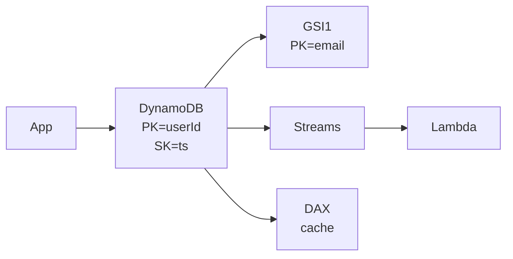

# DynamoDB

> Managed key-value, scale ka tension AWS le. Partition keys, GSIs, aur hot partitions se bacho.

> **TL;DR Hinglish:** DynamoDB ek managed auto-scale locker hai — chabi (partition key) do, samaan lo. GSIs se dusri chabi se bhi dhoondh sakte ho, par har GSI alag kharcha. Hot key ek hi locker ko garam kar degi to throttle.

Table me **Partition Key (PK)** zaruri — `hash(PK) % partitions` pe data. **Sort Key (SK)** optional — andar range query (`PK=userId, SK=ts`).

## Kab lena hai?

- Key-value lookups 10k-100k QPS, auto-scale chahiye, ops nahi karna
- Serverless — Lambda + Dynamo
- Streams se async fan-out (Dynamo Streams → Lambda → ES)

**Mat lo:** heavy joins, ad-hoc analytics — wahan [PostgreSQL](/system-design/postgresql).

## Important cheezein — Hinglish me

**Hash vs Range:** PK sirf = point query. PK+SK = `userId` ke saare items time order me, `begins_with`, `between`.

**GSI/LSI:** GSI = naya PK/SK, alag throughput, eventual consistent. LSI = same PK, alag SK, sirf bana ke time. Interview me 1-2 GSI enough bolo.

**Single-table design:** Sab entities ek table me `PK=USER#123, SK=ORDER#456`. Senior ke liye wow, junior ke liye overkill — tradeoff bolke jao.

**Hot partition:** Ek PK pe 10k WPS → ek partition throttle (3000 RCU/1000 WCU per partition). Fix: `PK = userId#shard` random suffix.

**Limits:** Item 400KB, partition 10GB, strongly consistent read double cost. Throttling pe SDK retry + exponential backoff.

**Streams:** CDC jaisa — har write ka image Lambda me.

**DAX:** Dynamo ka Redis — cache, par alag cost.

**🔴 Galti:** "Scan se saare users nikalo" — pura table scan, paise aur time dono gaye.
**✅ Sahi:** "Query on PK, GSI tabhi jab access pattern clear ho, Scan kabhi hot path pe nahi."

**Phrase:** "PK se distribution, SK se range, GSI se dusra access pattern, hot key ko shard karo, Streams se async."

**Yaad rakho:** PK=hash, SK=range, GSI alag table jaisa, 400KB limit, hot partition → `userId#rand`.

**See also:** [cassandra](/system-design/cassandra), [postgresql](/system-design/postgresql), [chatgpt](/system-design/chatgpt).
