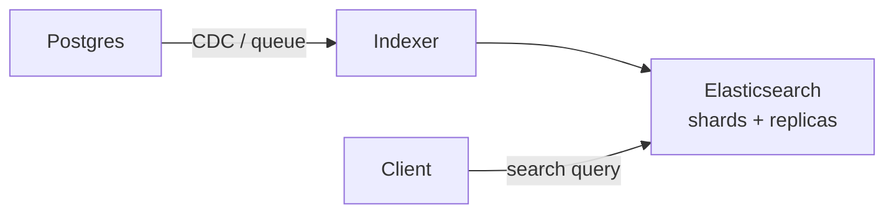

# Elasticsearch

> Full-text search and aggregations. Index asynchronously from the database; accept a little lag.

> Elasticsearch is a book index for your data — it knows where every word appears instantly. The database stays source of truth; Elasticsearch is its search-optimized copy, typically 1-2 seconds behind. Product search, log analytics, and autocomplete live here.

## When to pick it

1. Text search with relevance ranking (products, posts, docs)
2. Facets and aggregations (filters, counts, histograms)
3. Log analytics at volume (paired with Kibana)
4. Autocomplete and typo tolerance

**Don't use for:** primary storage, transactions, or exact analytics over billions of rows (ClickHouse territory).

## How indexing works

Documents flow from the database via CDC or queue into index shards; analyzers tokenize text (lowercase, stem, remove stopwords); inverted indexes map terms to documents. Writes refresh segments on a schedule — near-real-time, not instant. Size shards around 20-50GB; route by tenant or time.

## Queries worth naming

- **Match and multi-match** with analyzers for relevance-ranked text search.
- **Term and terms filters** for exact faceting (cheap, cacheable).
- **Aggregations** for counts, histograms, and stats over result sets.
- **Completion suggesters** for as-you-type autocomplete.

## Failure modes to mention

1. **Shard imbalance** — hot tenants overload shards; route deliberately.
2. **Mapping explosions** — unbounded dynamic fields bloat cluster state; use explicit mappings.
3. **Refresh lag** — just-written docs may not search for a second; say it upfront.
4. **Deep pagination cost** — `from + size` across shards is expensive; use search-after.

**Mistake:** "Make Elasticsearch the primary database."
**Correct:** "Database is truth, Elasticsearch is its async search copy — slight lag accepted."

**Phrase:** "Elasticsearch is the book index — async from the database, slight lag accepted, relevance plus facets out of the box."

**Remember (Revision):** Inverted index, analyzers tokenize, near-real-time refresh, explicit mappings, search-after pagination, database stays truth.

**See also:** [fb post search](/hld/fb-post-search), [yelp](/hld/yelp), [kafka](/hld/kafka).
