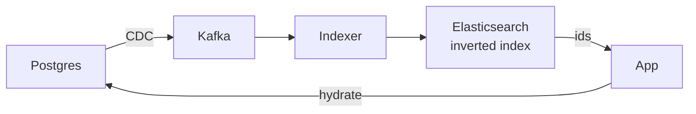

# Elasticsearch

> Full-text search aur aggregations. DB se async index banao; thoda lag chalega.

> **TL;DR Hinglish:** Elasticsearch ek kitaab ka index jaisa hai — har shabd kahan aaya, turant batata hai. DB source of truth, ES uska photocopy jo search ke liye optimize hai. Thoda stale chalega (1-2 sec).

DB me `LIKE '%shoe%'` slow. ES me **inverted index** — `shoe → [doc1, doc42]`. Analyzers word todte hain, stopwords hatate hain, stemming karte hain.

## Kab use karo?

- Text search — Yelp "coffee near me", FB post search, autocomplete, filters
- Aggregations — `GROUP BY category` tez, analytics
- Geo + text combo

**Mat bano:** primary store — ES me update mehenga, consistency weak. Hamesha DB + async pipe.

## Kaise banta hai — Hinglish me

**Pipe:** `App → DB → Kafka topic db.changes → Indexer workers → ES → hydrate from DB` (ES me sirf id + search fields, pura data DB se).

**Hydrate:** ES se ids nikalo, DB se full rows lo — ES ko fat mat banao.

**Privacy deep dive (FB):** Har doc me `visibleTo = [userIds]` mat rakho (fat + stale). Better: ES se candidate ids nikalo, fir Postgres me `WHERE docId IN (...) AND hasAccess(user, doc)` filter karo — ya ES me per-user filter plugin.

## Aggregations & near real-time

Near real-time (~1 sec refresh), strong consistent nahi. Search me `refresh=wait_for` slow.

**🔴 Galti:** "ES hi DB" — Lose karoge, recovery mushkil, update heavy.
**✅ Sahi:** "Async index, thoda lag ok, hydrate from DB, privacy DB pe check."

**Phrase:** "Elasticsearch search ke liye — DB se async index, inverted index, hydrate from DB, privacy filter DB pe."

**Yaad rakho:** DB source, ES photocopy, inverted index, hydrate pattern, privacy ≠ ES dump.

**See also:** [yelp](/system-design/yelp), [fb-post-search](/system-design/fb-post-search), [yelp](/system-design/yelp).
