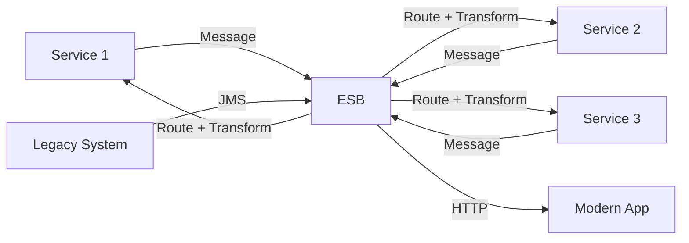

# Enterprise Service Bus

> Central hub — sab services communicate karte hain ESB ke through.

> ESB ek central middleware hub hai jo enterprise services ko connect karta hai. Message routing, transformation, protocol conversion karta hai. Legacy system integration ke liye useful. Service-oriented architecture (SOA) mein use hota tha. But ESB SPOF hai, bottleneck banta hai — microservices era mein less popular. ESB vs API Gateway — ESB heavy transformation, API Gateway simpler routing.

ESB enterprise ke services ko central hub se connect karta hai:

**How it works:**
1. Services ESB pe messages send karte hain
2. ESB route karta hai, transform karta hai, protocol convert karta hai
3. Target service message receive karta hai
4. **Centralized** — ESB sab communication manage karta hai

**Key features:**
- **Message routing** — Based on content, header
- **Protocol conversion** — HTTP ↔ JMS ↔ AMQP
- **Data transformation** — XML ↔ JSON ↔ SOAP ↔ REST
- **Monitoring** — Central logging, auditing

**ESB vs API Gateway:**
- **ESB** — Heavy transformation, protocol bridging, enterprise SOA
- **API Gateway** — Simple routing, auth, rate limiting, modern microservices

## Failure modes to mention

1. **ESB SPOF** — Central hub fail = all services down — cluster, replication
2. **Bottleneck** — All traffic through ESB — throughput limit
3. **Complexity** — ESB configuration complex — hard to maintain, update
4. **Tight coupling** — Services depend on ESB contracts — not truly decoupled

**🔴 Galti:** "ESB best for modern microservices" — ESB old pattern, heavy, bottleneck. API Gateway better for microservices.
**✅ Sahi:** "ESB = central hub for enterprise services, SOA era. Heavy transformation, SPOF risk, bottleneck. API Gateway better for modern microservices."

**Phrase:** ESB enterprise services ka central hub hai — message routing, protocol conversion, data transformation. SOA era, SPOF + bottleneck risk, API Gateway better now.

**Yaad rakho (Revision):** ESB central hub, SOA pattern, message routing + transformation + protocol conversion, ESB vs API Gateway, SPOF + bottleneck, less popular in microservices era.

**See also:** [API Gateway](/hld/api-gateway), [Microservices](/hld/microservices), [Message Brokers](/hld/message-brokers).
