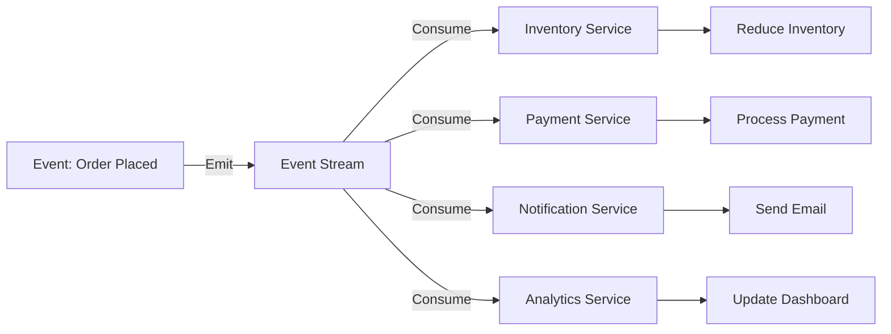

# Event-Driven Architecture

> Events se system react karta hai — async, decoupled, scalable.

> Event-Driven Architecture (EDA) events ke basis pe kaam karta hai — koi event hota hai, sab interested services react karte hain. Producer event emit karta hai, consumers listen karte hain. Asynchronous, decoupled, scalable. Kafka, RabbitMQ events handle karte hain. Event sourcing + CQRS EDA ke popular patterns hain. Benefits: real-time processing, scalability, fault isolation. Challenges: debugging, ordering, eventual consistency.

Event-Driven Architecture events se system operates:

**How it works:**
1. Event happen hota hai (order placed, payment completed)
2. Producer event emits karta hai (event stream)
3. Consumers event listen karte hain, react karte hain
4. **Decoupled** — Producer ko consumer ka pata nahi
5. **Asynchronous** — Producer wait nahi karta

**Key patterns:**
- **Event sourcing** — State ke liye events store karo (history preserved)
- **CQRS** — Reads aur writes separate models
- **Eventual consistency** — Events propagate async, data eventually consistent

## Failure modes to mention

1. **Event ordering** — Events processed out of order — partition by key, sequence numbers
2. **Event duplication** — Consumer restart, duplicate processing — idempotent handlers
3. **Dead letter queue** — Failed events → DLQ, manual intervention needed
4. **Event storm** — Too many events, system overwhelmed — throttling, backpressure

**🔴 Galti:** "EDA = synchronous" — EDA inherently asynchronous hai — producers don't wait for consumers.
**✅ Sahi:** "EDA = events drive system, async + decoupled. Producer emits, consumers react. Event sourcing + CQRS popular patterns. Eventual consistency."

**Phrase:** Event-Driven Architecture events se system operates — async, decoupled, scalable. Producers emit events, consumers react. Event sourcing, CQRS, eventual consistency.

**Yaad rakho (Revision):** Events se system operates, async + decoupled, producer emits + consumers react, event sourcing + CQRS, event ordering + duplication challenges, eventual consistency.

**See also:** [Event Sourcing](/hld/event-sourcing), [CQRS](/hld/command-and-query-responsibility-segregation), [Publish-Subscribe](/hld/publish-subscribe).
