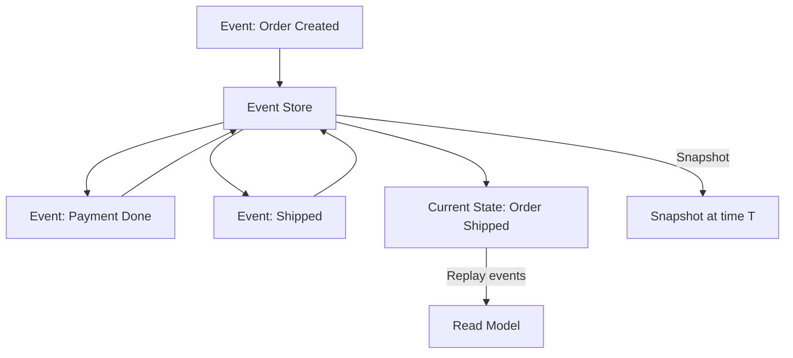

# Event Sourcing

> State ke liye events store karo — history preserved, audit trail available.

> **TL;DR Hinglish:** Event Sourcing state ke liye events store karta hai — current state events ka aggregate hai. Jab state change ho, event append hota hai (append-only log). Query = events replay karo. Benefits: audit trail, time travel, reproducibility. Challenges: event replay slow, schema changes. CQRS ke saath use hota hai — events store, read model separate build karo.

Event Sourcing state ke liye event history maintain karta hai:

**How it works:**
1. State change event create hota hai
2. Event append-only log mein store hota hai
3. Current state = events replay karke compute hota hai
4. **Append-only** — Events modify/edit nahi hote, never delete
5. **Audit trail** — Full history available

**Key concepts:**
- **Event store** — Append-only log of all events
- **Snapshot** — Periodic state snapshots (replay fast)
- **Replay** — Events se state rebuild
- **Projection** — Read model derived from events

## Failure modes to mention

1. **Event replay slow** — Many events, rebuild state takes time — snapshots help
2. **Schema evolution** — Events structure change over time — versioning, upcasting
3. **Eventual consistency** — Read model lag behind events — async projection
4. **Debugging** — Events hard to trace — correlation IDs, event metadata

**🔴 Galti:** "Event sourcing = regular database" — Event store append-only hai, state events se derive hota hai, not stored directly.
**✅ Sahi:** "Event sourcing = events stored as append-only log, state = replay. Audit trail + time travel. Snapshot for speed. CQRS se saath use."

**Phrase:** Event sourcing state ke liye events store karta hai — append-only log, replay se state rebuild, audit trail, snapshots for speed, CQRS se saath.

**Yaad rakho (Revision):** Event sourcing append-only log, state = replay events, snapshots for speed, audit trail + time travel, schema evolution challenge, CQRS + event sourcing = powerful combo.

**See also:** [CQRS](/system-design/command-and-query-responsibility-segregation), [Event-Driven Architecture](/system-design/event-driven-architecture), [Message Queue](/system-design/message-queue).
