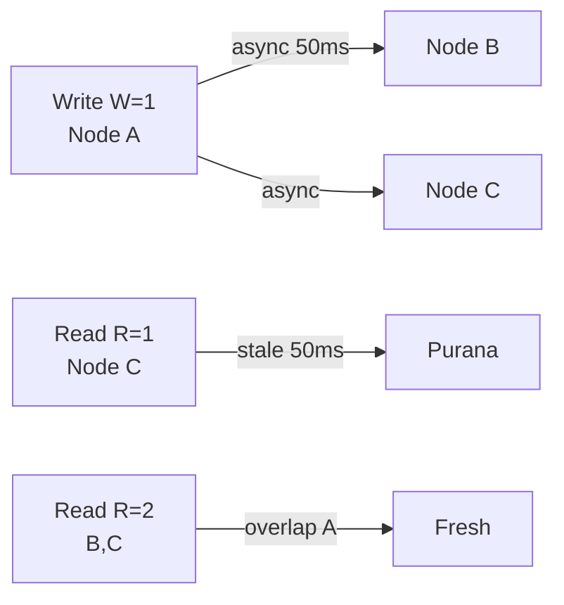

# Eventual Consistency

> Write ke baad turant sabko fresh nahi — thodi der baad sab converge.

> Eventual ek WhatsApp group jaisa — ek ne message bheja, 2 sec me sabke phone pe aaya, beech me kisi ne purana dekha to chalega. Strong me sabko turant same dikhega par slow.

AP systems (Cassandra, Dynamo, S3) me yehi.

## How it works

- **Strong (linearizable):** write ke baad har read latest — `W=QUORUM,R=QUORUM`. Bank, ticket — paise galat nahi.
- **Eventual:** write `W=1` → async replicas → 100ms baad sab ek. Read `R=1` → kabhi purana. Likes, feed — chalega.
- **Read-your-writes:** tumne likha to tumhe fresh dikhe (master se), dusre ko purana chalega.

**Quorum se tune:** `R+W>N` → strong-ish, warna eventual.

## How it converges

- **Read repair:** read pe 2 replicas se pucha, ek purana to background me fix.
- **Anti-entropy (Merkle tree):** background me hash compare, diff sync.
- **Hinted handoff:** node down to dusre pe likh, up aaya to handoff.

## How to answer in interview

- **Instagram like count:** eventual ok — `W=1`, 1 sec purana chalega.
- **Ticket hold:** strong chahiye — `SELECT FOR UPDATE` ya `W=QUORUM`.
- **S3:** `PUT` ke baad `GET` immediate me `404` aa sakta tha (ab strong, par example ke liye).

**Session / Monotonic / Causal:** beech ke levels — session me tumhara order pakka, causal me `comment` ka `reply` pehle nahi dikhega.

**🔴 Galti:** "Eventual me data lose" — Nahi, converge hota hai, bas delay.
**✅ Sahi:** "Likes eventual `W=1`, payment strong `QUORUM` + read-your-writes master."

**Phrase:** "Eventual thodi der stale par converge — likes pe ok, bank pe strong quorum."

**Yaad rakho:** Strong=R+W>N, eventual R=1, read repair + hinted handoff, likes vs bank.

**See also:** [quorum](/hld/quorum), [cap-theorem](/hld/cap-theorem), [replication](/hld/replication).
