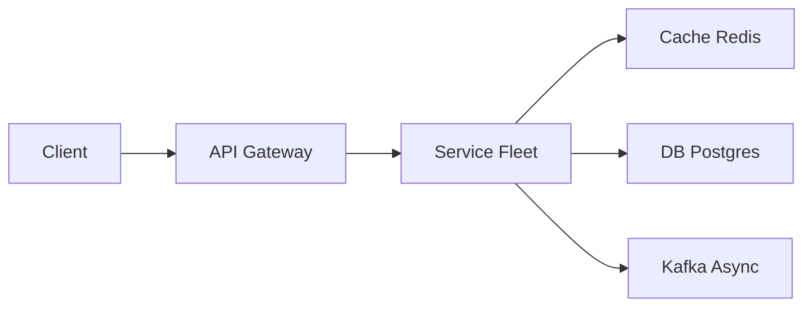

# FB Post Search

> Search **posts you are allowed to see**. Privacy is the product. A naked Elasticsearch cluster of all of Facebook would fail the interview.

> **TL;DR Hinglish:** ES se candidate ids, privacy filter Postgres me `hasAccess`. Naive ES dump nahi — hydration + filter.

## Kya poochte hain? (What they ask) — Hinglish me samjho

Interviewer: "Design Facebook Post Search — user types 'birthday photos', sees posts from friends, groups, and public pages they have access to, ranked in <200ms. There are 3B users and 100s of billions of posts." If you propose a single [Elasticsearch](/system-design/elasticsearch) index of every post and filter in the UI, you fail privacy.

**What they really test:** (1) Privacy-aware indexing — ACL as first-class, not afterthought. (2) How to avoid stuffing 4000 friend IDs into every query. (3) Index is derived, not source of truth — hydration + re-check ACL. (4) Handling unfriend/block with near-real-time invalidation. (5) Ranking signals beyond BM25 (affinity, recency, social proof).

**Scale anchor:** 3B users, ~500M posts/day (including edits), ~100B searchable posts retained (last few years). Search QPS ~200k globally (peak). Index size ~100TB+ (replicated). Friend list avg ~300, P99 ~5000. Typeahead QPS 2x search QPS but lighter.

## Requirements — Kya chahiye? (Functional / Non-functional)

**Functional:**
- Keyword search over post text (and optionally alt-text/OCR, comments).
- Filters: `from:person`, `date:`, `group:`, `location:`.
- **Privacy-aware:** only return posts where `viewer` ∈ `audience` (public, friends, friends-of-friends, custom lists, group members). Never leak private posts, even briefly.
- Real-time indexing: new post searchable within seconds.
- Pagination via cursor; typeahead suggestions optional.
- Respect block, unfriend, deactivated users, post deletion/edit, audience change.

**Non-functional:**
- Latency p95 <200ms for search; indexing freshness <10s for 99% posts.
- Correctness over recall: better to miss a result than leak a private post.
- Scalable to billions of posts and 200k QPS (read-heavy).
- Fault-tolerant: ES shard failure doesn't lose posts (replicas + DB source of truth).
- Operable ACL updates: audience change propagates within seconds.

**Clarify:**
- Who can search what? Friends-only vs public vs custom? (Answer: all audience types.)
- Do we search comments/media or posts only? (V1: post text only; v2: nested comments, OCR.)
- Is personalization/ranking required or just chronological? (BM25 + recency + affinity.)
- Language: multilingual tokenization?
- Do we need real-time deletes (GDPR) and how fast does block take effect? (Say <10s.)

**Out of scope (v1):**
- Full web search / external pages.
- Personalized feed ranking (different product).
- Image/video content search (async OCR pipeline v2).
- Typeahead as separate service (mention but not deep dive).

## Scale ka andaaza — Kitna load? (Math jo design badle)

| Dimension | Assumption | Math | Result |
|-----------|-----------|------|--------|
| Posts indexed | 100B posts retained (3 years) | 100B * 2KB avg doc | ~200 TB raw, ~100 TB index with compression |
| Writes | 500M posts/day (inc edits) | 500M / 86400 | ~5.8k writes/sec avg, ~20k peak |
| Search reads | 200k QPS | 200k * 10 results | ~2M doc fetches/sec after fan-out |
| Index shards | 100TB / 50GB per shard | 2000 shards | ~666 nodes at 3 shards/node + replicas |
| Friend list fetch | 200k QPS * 300 friends | 60M IDs/sec | Must cache — no per-query DB friend fetch |
| Hydration cache | 10 results * 200k QPS = 2M post fetches/sec | 2M * 5KB | 10 GB/s if uncached → needs [Memcached](/system-design/memcached) |

Index dominates cost; ACL tricks save query fan-out.

## API Design — Endpoints kya honge?

```http
// Search posts
GET /v1/search/posts?q=birthday+photos&cursor=eyJ...&limit=20&filters=from:123,date:2026-05-01..2026-05-10
Authorization: Bearer <viewer token>
=> 200
{
  "query": "birthday photos",
  "results": [
    { "postId": "p_123", "authorId": "u_456", "snippet": "... <em>birthday</em> <em>photos</em> ...", "createdAt": "2026-05-10T12:00:00Z", "audience": "friends", "score": 2.34 },
    { "postId": "p_124", "authorId": "u_789", "snippet": "...", "createdAt": "2026-05-09T...", "audience": "public" }
  ],
  "nextCursor": "eyJ...",
  "tookMs": 87
}

// People search (optional second type)
GET /v1/search/people?q=mark&limit=10
=> 200 { "results": [ { "userId": "u_1", "name": "Mark", "mutualFriends": 12 } ] }

// Internal indexing hook (post service -> indexer via Kafka, not REST in steady state)
POST /internal/index/post
{ "postId": "p_123", "authorId": "u_456", "text": "Happy birthday!", "audience": { "type": "friends", "allow": ["friends"], "deny": [] }, "createdAt": "...", "updatedAt": "..." }

// Typeahead
GET /v1/search/typeahead?q=birthd&limit=5
=> 200 { "suggestions": ["birthday photos", "birthday cake"] }
```

All search requests carry `viewerId` derived from auth token — never trust client-supplied viewer.

## High-Level Design (HLD) — Boxes kaise judenge? (Hinglish)

```
Post Service (DB source of truth) -> [Kafka] post_events (create/edit/delete/audienceChange) -> Indexer Workers -> [Elasticsearch] posts index (sharded)
                                                                                                          |
User -> API Gateway -> Search Service -> Social Graph Cache ([Redis]/TAO) -> ES Query (constrained) -> Hydration (Post Service + ACL re-check) -> Ranker -> Response
                         |                      ^                               |
                         v                      |                               v
                    [Memcached] post hydrate  FriendList / Group Membership   Typeahead Index (prefix, separate)
```



**Components:**
- **Post Service + DB:** MySQL/Cassandra sharded by `postId`. Source of truth for post content + audience. Emits CDC events to [Kafka](/system-design/kafka) on every mutation. Never queried per search fan-out directly — via cache.
- **[Kafka](/system-design/kafka):** `post_events` topic, 100+ partitions, retention 7 days. Carries `{ postId, authorId, text, audience, op: create|update|delete|audienceChange, ts }`. Ordering per `postId` matters.
- **Indexer Workers:** Stateless consumers, batch 100 docs or 1 sec. Build ES document: `{ postId, authorId, text, tokens, createdAt, audienceType, visibilitySet?, groupId? }`. For friends-only posts, store `authorId` + `audience=friends` rather than expanding 4000 friend IDs into doc (that would bloat index and stale on unfriend). Update is upsert; delete is hard delete.
- **[Elasticsearch](/system-design/elasticsearch):** Sharded by `postId` hash (not author — avoids hot shards for celebrities). 2000 shards across 600+ nodes, 1 replica. Index mapping includes `text` (BM25), `authorId` (keyword), `createdAt` (date), `audienceType` (keyword), `groupId`. Refresh interval 5-10s for near-real-time.
- **Social Graph Service / TAO Cache:** [Redis](/system-design/redis) + TAO-like cache for `friendList(viewer)` and `groupMembership(viewer)`. Precomputed "searchable author set" — not raw 5000 IDs per query, but a cached bitset/roaring bitmap of authors you interact with most plus tiered expansion. Hit rate critical.
- **Search Service:** Stateless. Steps: (1) resolve viewerId, (2) fetch constrained author set from graph cache, (3) build ES query: `text match + filter(authors in set OR audience=public OR groupId in memberGroups)`, (4) ES returns top 100 IDs, (5) hydrate from Post Service via [Memcached](/system-design/memcached) bulk get, (6) re-check ACL via Post Service (source of truth) and drop any leaked hit, (7) rank.
- **Ranker:** BM25 + recency decay (`exp(-age/30days)`) + author affinity (interaction count) + social proof (likes/comments). Not Google quality — simple weighted sum. Optional second-stage ML re-rank for top 50.

**Write path:** create post -> DB -> Kafka -> indexer -> ES (5-10s).
**Read path:** `GET /search/posts?q=...` -> Search Service -> graph cache -> ES (50ms) -> hydration + ACL re-check (20ms) -> rank -> response.

## Low-Level Design (LLD) — DB + Classes (Hinglish notes)

**DB schema — posts + audience (source of truth)**

```sql
-- Posts table (sharded by postId hash, shown as single logical)
CREATE TABLE posts (
  post_id     VARCHAR(32) PRIMARY KEY,
  author_id   VARCHAR(32) NOT NULL,
  text        TEXT NOT NULL,
  created_at  TIMESTAMPTZ NOT NULL,
  updated_at  TIMESTAMPTZ NOT NULL,
  audience_type VARCHAR(16) NOT NULL, -- 'public','friends','friends_of_friends','custom','group'
  is_deleted  BOOLEAN NOT NULL DEFAULT FALSE
);
CREATE INDEX ON posts (author_id, created_at DESC);
CREATE INDEX ON posts (created_at DESC);

-- Custom audience / allow/deny lists (for custom audience posts)
CREATE TABLE post_audience_members (
  post_id   VARCHAR(32) NOT NULL REFERENCES posts(post_id) ON DELETE CASCADE,
  user_id   VARCHAR(32) NOT NULL,
  permission VARCHAR(8) NOT NULL, -- 'allow','deny'
  PRIMARY KEY (post_id, user_id, permission)
);

-- Friend graph edge (TAO / social graph, simplified)
CREATE TABLE friendships (
  user_a   VARCHAR(32) NOT NULL,
  user_b   VARCHAR(32) NOT NULL,
  status   VARCHAR(16) NOT NULL, -- 'friends','blocked','pending'
  created_at TIMESTAMPTZ NOT NULL,
  PRIMARY KEY (user_a, user_b)
);
CREATE INDEX ON friendships (user_b, user_a);

-- ES document mapping (conceptual)
-- PUT /posts/_mapping
-- {
--   "properties": {
--     "postId": {"type": "keyword"},
--     "authorId": {"type": "keyword"},
--     "text": {"type": "text", "analyzer": "standard"},
--     "createdAt": {"type": "date"},
--     "audienceType": {"type": "keyword"},
--     "groupId": {"type": "keyword"},
--     "tokens": {"type": "text"}
--   }
-- }
```

**Key classes & responsibilities**

```java
class Post { String postId, authorId, text; Instant createdAt, updatedAt; Audience audience; }
class Audience { String type; Set<String> allow; Set<String> deny; String groupId; }
class Indexer {
  void onPostEvent(PostEvent e); // upsert/delete ES doc; audience change triggers doc update
  EsDoc toEsDoc(Post p);         // maps audience to ES fields
}
class SocialGraphCache {
  Set<String> searchableAuthors(String viewerId); // cached, tiered: close friends + public + groups
  Set<String> memberGroups(String viewerId);
  boolean isFriend(String viewer, String author);
}
class SearchService {
  SearchResponse search(String viewerId, String query, Filters f, String cursor);
  // builds ES bool query, hydrates, re-checks ACL, ranks
}
class Hydrator {
  List<Post> hydrate(List<String> postIds); // bulk get via Memcached -> DB on miss
  boolean canView(String viewerId, Post p); // source-of-truth ACL check
}
class Ranker {
  double score(Post p, String query, String viewerId, EsScore bm25);
  List<Post> rank(List<Post> posts, String viewerId);
}
```

**Concurrency handling / algorithms:**
- **Indexing order:** Kafka partition key = `postId` guarantees per-post ordering (create before edit). Indexer uses `updatedAt` version check — ignore stale events (`if e.ts < doc.updatedAt skip`).
- **Friends-only at scale:** Naive `authorId IN (4000 ids)` makes every query heavy and ES `terms` query hits `maxClauseCount`. Instead: **tiered author constraint**. Maintain per-viewer "searchable set" = top ~500 interacted authors + public posts (no author filter) + group posts. For friends-only posts, ES filter is `audienceType=friends AND authorId IN (searchableFriendsSubset)` — much smaller clause. Full 4000 expansion only if user explicitly filters `from:friends`. Cache this set in [Redis](/system-design/redis) 5 min with invalidation on friend change.
- **ACL re-check (read-time):** Even if ES returns a hit, hydrator calls `canView(viewer, post)` against DB/cache — ES is a hint, not ACL. Drop leaked hits (log for auditing). This guards against stale index windows after unfriend/block.
- **Near-dup detection:** SimHash on post text to collapse reposts in ranking (demote duplicates).
- **Pagination:** Cursor = `sort=[score, postId]` with `search_after` (ES deep pagination without `from` overhead). Cursor is opaque base64 of last sort values.

**Design patterns:**
- **CQRS / Derived Index:** DB is truth, ES is derived view rebuilt from log.
- **Cache-Aside + Write-Through:** Hydration cache aside; graph cache write-through on friend changes via CDC.
- **Decorator / Filter Chain:** Query pipeline: text match → ACL filter → hydration → re-check → rank.
- **Outbox Pattern:** Post Service writes `post_events` via transactional outbox to avoid dual-write failure (DB commit + Kafka publish atomic).

## Deep Dive — Gehrai se (Interview yahi puchega) — Privacy vs recall (the hard trade-off)

Interviewers push: "How do you not leak private posts?" Three-layer defense: **index-time** field (`audienceType` + `authorId`/`groupId`) prunes 90% of invisible posts at query time; **query-time** filter constrains to `searchableAuthors` + `public` + `memberGroups`; **read-time** ACL re-check against Post Service drops anything that slipped through stale index (e.g., post just changed from public to friends, but ES still shows old doc for 5s). Staleness window is explicit: say 5-10s ES refresh + 5s graph cache = 15s worst-case leak window, acceptable if you can name it and re-check mitigates. Never expand 4000 friend IDs into each post doc at index time (that would require reindexing 10k posts when you unfriend one person). Prefer storing author + audience type and filtering at query time. Alternative per-user index (each user's friends' posts copied to per-user shard) is write-amplified (1 post * 500 friends = 500 writes) and rejected for 3B users. **Hybrid** is the senior answer: constrain candidates, then refine.

## Deep Dive — Gehrai se (Interview yahi puchega) — Unfriend, block, edits and ranking

**Unfriend/block propagation:** Friendship change emits event to `graph_events` Kafka. Graph cache entry for both users invalidated (delete key, next read rebuilds). In-flight ES queries may still use stale friend list for ~5s — mitigated by read-time ACL re-check (block is checked hydrator-side, so even if ES returned blocked user's post, hydrator drops it). For immediate block enforcement (<1s), also maintain a short-lived `blocked:{viewer}:{author}` denylist in [Redis](/system-design/redis) checked on hydration. **Edits/deletes:** Edit → indexer upserts doc (version bump); delete → hard delete + tombstone in hydrator cache (negative cache 1h to avoid rehydrating ghosts). Audience change from public→friends triggers doc update (`audienceType` change) — no full reindex. **Ranking:** Start with ES BM25, then multiply by `recencyBoost = exp(-hoursSincePost/72)` and `affinityBoost = 1 + log(1+interactionCount(viewer,author))`. Don't promise learning-to-rank; mention second-stage ranker as v2. For typeahead, separate edge-ngram index with lower latency SLA.

## Hinglish Tip — Galti vs Sahi

**🔴 Galti:** Hot path pe DB direct without cache/queue.
**✅ Sahi:** Cache/queue beech me, DB source of truth.

## Failures & Scale — Kya tootega aur kaise bachenge? (Hinglish)

- **ES shard failure:** Replica serves reads; indexer retries failed docs via DLQ; source of truth remains DB so index can be rebuilt per shard from Kafka replay.
- **Indexer lag:** Kafka consumer lag alert >10s; scale indexer workers horizontally; ES bulk queue size bounded to avoid OOM.
- **Graph cache miss storm:** On cache eviction, 200k QPS * graph fetch would DDoS DB. Use singleflight (only one rebuild per viewerId concurrent), stale-while-revalidate (serve slightly stale friend list), and rate-limit graph DB reads.
- **Hydration hot key (celebrity post):** Viral post hydrated 100k times/sec — cache in [Memcached](/system-design/memcached) with 60s TTL + L1 Caffeine in Search Service; use `mget` batching to reduce RTT.
- **ES refresh storm:** Don't set refresh to 1s for 2000 shards (heavy). Keep 5-10s and accept that freshness trade-off; important posts can be force-refreshed via `?refresh=wait_for` on demand.
- **Clock skew on edits:** Use `updatedAt` version, not wall clock, to decide last write wins; Cassandra-style LWW if distributed.
- **Scale knobs:** Add ES data nodes + shards; cache graph sets; CDN not useful for personalized search, but edge caching for public-only queries possible.

## Aur kya puch sakte hain? (Extra probes)

- Comments search — nested docs or separate `comments` index joined by `postId`; query both and merge.
- Media OCR/alt-text — async pipeline writes back to post doc via partial update (`update { doc: { ocrText: ... } }`).
- Multilingual — per-language analyzer (standard + ICU) + language field routing.
- Security audit — log every ES hit that was dropped at hydration (ACL violation attempt) for anomaly detection.
- Why not filter in UI? — Demonstrate leak scenario and fix via three-layer defense.
- Compare to [Elasticsearch](/system-design/elasticsearch) vs Vespa/Typesense — same privacy pattern applies regardless of engine.

**Yaad rakho (Revision):** Write durable, read cache, async Kafka/Flink, failure me degrade gracefully.

**Phrase:** ES is a hint, not the ACL. I constrain authors you can see, search that subset, then re-fetch posts and drop anything the viewer shouldn't see.
