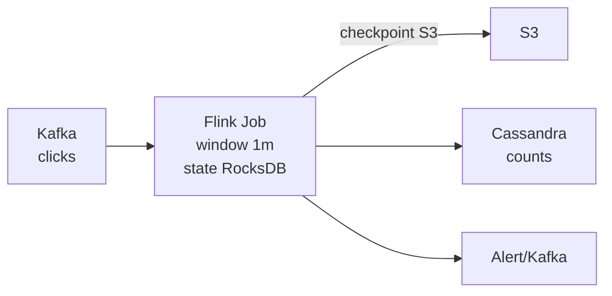

# Flink

> Stream processing — windows, watermarks, aur exactly-once jobs Kafka ke upar.

> **TL;DR Hinglish:** Flink ek tez dhobi hai jo Kafka ki nadi me behte events ko pakad ke window me jodta hai, late aane walon ka intezam watermark se, aur state RocksDB me safe rakhta hai. Crash hua to checkpoint se wapas.

Kafka log hai, Flink us log pe **stateful** kaam karta hai — count, join, session. Batch nahi, continuous.

## Kab chahiye?

- Ad clicks count per minute, YouTube Top-K per hour, fraud detection real-time
- Late events — mobile offline, 5 min late aaya to kya?
- Exactly-once billing — at-least-once se double count nahi chalega

**Mat lo:** simple ETL ya hourly batch — Spark/Batch kaafi.

## 4 cheezein Hinglish me

**1. Windows:** `Tumbling` (har 1 min alag), `Sliding` (har 30 sec, 1 min window), `Session` (gap pe). Window ke end pe emit.

**2. Watermarks:** "Ab tak ka time X tak aa gaya" ka signal. `watermark = maxEventTime - allowedLateness`. Isse window close karte hain. Late event → side output ya drop.

**3. State:** Har key ka count RocksDB me (disk + memory). Checkpoint har 30 sec S3/HDFS pe — fail pe wapas.

**4. Exactly-once:** Checkpoint + 2-phase commit to sink (Kafka transaction / DB idempotent). `at-least-once` easy, `exactly-once` me 2PC bolo.

**Backpressure:** downstream slow to Flink bhi slow — credit-based flow control.

**🔴 Galti:** "Har event pe DB update" — DB marega.
**✅ Sahi:** "Flink me window aggregate, fir sink me batch write."

**Phrase:** "Flink stateful stream — windows, watermarks for late, RocksDB state + checkpoint, exactly-once via 2PC."

**Yaad rakho:** Window = dibba, watermark = ghadi, state = RocksDB, checkpoint = photo, late → side output.

**See also:** [kafka](/system-design/kafka), [ad-click-aggregator](/system-design/ad-click-aggregator), [youtube-top-k](/system-design/youtube-top-k).
