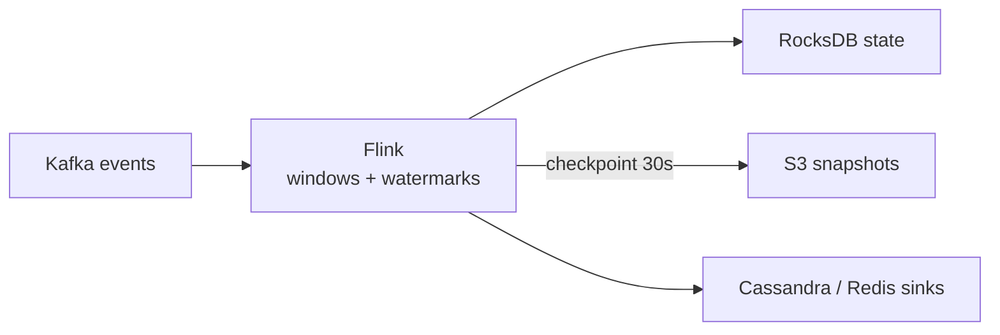

# Flink

> Stream processing: windows, watermarks, and exactly-once jobs over Kafka.

> Flink is a fast washerman catching events flowing in Kafka's river — grouping them into windows, handling late arrivals with watermarks, and keeping state safe in RocksDB. Crashes restore from checkpoints and resume without loss or duplication.

## When to pick it

1. Real-time aggregations (click counts, trending, fraud windows)
2. Event-time processing with late data (watermarks decide lateness)
3. Exactly-once stateful pipelines (checkpoints plus idempotent sinks)
4. Complex event patterns across streams (CEP library)

**Don't use for:** batch analytics (Spark/warehouse territory), simple queue workers, or tiny throughput.

## How it works

Events stream from Kafka into keyed windows (tumbling, sliding, session); watermarks (max event time minus lateness bound) trigger computation; state backends persist; checkpoints snapshot progress to durable storage every N seconds. Late events within allowed lateness update results; beyond it they route to side outputs.

## Failure modes to mention

1. **Late data floods** — watermarks too tight drop real events; size lateness from data, not guesswork.
2. **State blowup** — unbounded keyed state OOMs; TTL state and size alerts mandatory.
3. **Checkpoint failures** — slow checkpoints stall pipelines; monitor duration and alignment.
4. **Skewed keys** — hot keys overload single subtasks; salt keys or rebalance.

**Mistake:** "Treat streams like batch with cron."
**Correct:** "Windows plus watermarks for time, checkpoints for recovery, idempotent sinks for correctness."

**Phrase:** "Flink catches the river — windows group, watermarks forgive lateness, checkpoints survive crashes."

**Remember (Revision):** Event-time windows, watermarks bound lateness, RocksDB state with TTL, checkpoints every ~30s, idempotent sinks, salt hot keys.

**See also:** [kafka](/hld/kafka), [ad click aggregator](/hld/ad-click-aggregator), [metrics monitoring](/hld/metrics-monitoring).
