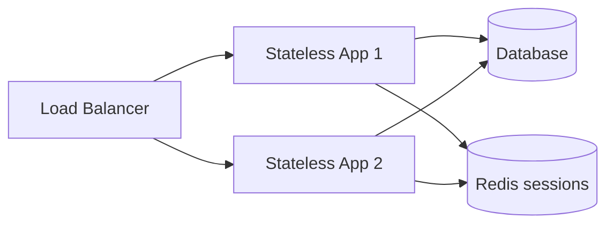

# System Design Fundamentals

> The vocabulary every design discussion uses — requirements, scale, availability, and the trade-offs between them.

> Before any boxes get drawn, three questions get answered: what must the system do (functional), how well must it do it (non-functional), and how big must it get (scale). Everything in system design is a trade-off between these answers.

## Functional Requirements

What the system does — users, actions, data. "Users post photos, follow others, see a home feed." Keep the list short (top 3-5); everything else is out of scope for v1. If a feature doesn't change boxes, it doesn't belong in the requirements discussion.

## Non-Functional Requirements

How well the system behaves, and where most interview depth lives:

- **Scalability** — handling growing load, up (bigger box) or out (more boxes).
- **Availability** — percentage of time the system answers (99.9%, 99.99%).
- **Reliability** — correct behavior over time, surviving faults.
- **Consistency** — do all readers see the same data, and how fast.
- **Durability** — committed data survives crashes.
- **Latency** — how fast one request returns (p50/p99, not average).
- **Throughput** — how many requests per second the system sustains.
- **Fault Tolerance** — continuing through component failures.
- **High Availability** — availability via redundancy plus automatic failover, typically 99.99%+.

## Horizontal vs Vertical Scaling

Scale up (vertical) adds CPU and RAM to one server — simple, but hardware-capped and a single point of failure. Scale out (horizontal) adds servers — near-unlimited, with availability included, but demands stateless services plus a load balancer and a distributed database. Default answer in interviews: scale out.

## Stateless vs Stateful Services

Stateless servers keep no session data, so any server handles any request — scaling is trivial. Stateful servers pin sessions locally, forcing sticky sessions or replication. Keep application servers stateless; push state into Redis or the database.

## Keep in mind

- Requirements first: top functional items, then only the non-functionals that matter.
- Latency is p99, not average — averages hide the worst users.
- Default to scale out with stateless servers behind a load balancer.
- Every non-functional requirement you name, be ready to design for.
- 100% availability is impossible — say which nine you target and why.
