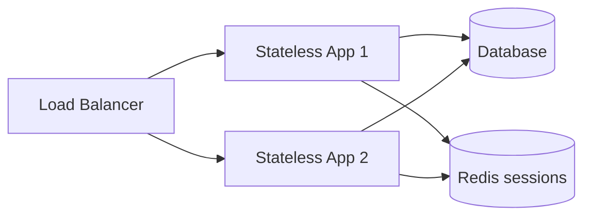

# System Design Fundamentals

> The vocabulary every design discussion uses — requirements, scale, availability, and the trade-offs between them.

> Before any boxes get drawn, three questions get answered: what must the system do (functional), how well must it do it (non-functional), and how big must it get (scale). Everything in system design is a trade-off between these answers.

## Functional Requirements

Functional requirements describe the user-visible behavior: who uses the system, what actions they perform, and what data moves. In an interview, state the top 3–5 flows in plain language — for example, "users upload photos, follow others, and scroll a personalized home feed." Resist scope creep: features that do not change your architecture (boxes, data stores, or traffic patterns) belong in a backlog, not in the v1 design. Tie each requirement to a concrete API or user journey so the interviewer can trace it to components later.

- Name **actors** (user, admin, third-party) and **core actions** per actor — one sentence each.
- Call out **read vs write** flows early; they drive caching and database choices.
- Explicitly mark **out of scope** for v1 so you do not over-build (e.g., "no video in v1").
- If two features share the same backend path, merge them in the requirements list.
- Every functional item should map to at least one box on the diagram.

## Non-Functional Requirements

Non-functional requirements (NFRs) define quality bars: how fast, how available, how consistent, and how much load the system must survive. Interview depth usually lives here — saying "low latency" without a number is weak; saying "p99 read under 200 ms for feed" forces CDN, caching, and fan-out choices. Pick only the NFRs that matter for the product: a internal admin tool cares about consistency and auditability more than 99.99% uptime. When you name an NFR, be ready to show the mechanism (replicas, queues, idempotency) that delivers it.

How well the system behaves, and where most interview depth lives:

- **Scalability** — handling growing load, up (bigger box) or out (more boxes).
- **Availability** — percentage of time the system answers (99.9%, 99.99%).
- **Reliability** — correct behavior over time, surviving faults.
- **Consistency** — do all readers see the same data, and how fast.
- **Durability** — committed data survives crashes.
- **Latency** — how fast one request returns (p50/p99, not average).
- **Throughput** — how many requests per second the system sustains.
- **Fault Tolerance** — continuing through component failures.
- **High Availability** — availability via redundancy plus automatic failover, typically 99.99%+.

- Quantify **latency** as p50/p99 and **availability** as nines with allowed downtime per year.
- Separate **strong vs eventual consistency** by read path — feeds vs payments.
- **Durability** is about committed writes; pair with replication and backup RPO/RTO.
- **Throughput** and **latency** trade off under load — state which you optimize first.
- Name **failure modes** (single AZ, DB primary down) and how NFRs still hold.

## Horizontal vs Vertical Scaling

Vertical scaling (scale up) adds CPU, RAM, or faster disks to one machine. It is the fastest path early — no code changes, no distributed failure modes — but you hit hardware ceilings and keep a single point of failure. Horizontal scaling (scale out) adds more identical servers behind a load balancer; capacity grows roughly linearly until the database or shared state becomes the bottleneck. Cloud-native designs default to scale out because it pairs with redundancy: losing one node should not take the service down. Mention when vertical still wins: small teams, strict serial workloads, or legacy monoliths before a split.

- **Scale up** when QPS fits one beefy box and ops simplicity beats elasticity.
- **Scale out** when you need **HA**, **geo**, or growth beyond one machine's RAM/CPU.
- Scale out requires **stateless app tier** and often **sharded or replicated** data tier.
- Watch **licensing and cost** — many vertical jumps are cheaper until a cliff (e.g., max instance size).
- Interview default: **horizontal app servers + LB**, then solve DB scaling separately.

## Stateless vs Stateful Services

Stateless application servers treat every request independently: session data, carts, and permissions live in Redis, the database, or signed tokens — not in local memory. That lets any instance serve any request, so autoscaling and rolling deploys stay simple. Stateful servers keep session or connection state on the box, which forces sticky sessions, careful drain on deploy, and harder failover. Push durable state to external stores; keep only ephemeral compute on the app tier. WebSocket or streaming gateways are often stateful by nature — plan shard-by-user or connection registry when you scale them.

- **Stateless** = horizontal scale without affinity; **stateful** = affinity or replication cost.
- Store **sessions** in Redis with TTL; avoid server-local session maps.
- **JWTs** reduce server session storage but complicate revocation — know the trade-off.
- For **uploads**, use pre-signed URLs to object storage so app servers stay stateless.
- Diagram: LB → N identical app nodes → shared DB/cache (see below).

- On deploy, **drain** connections on stateful tiers; stateless tiers can **terminate** quickly.
- If you must be sticky, prefer **external session store** over long-lived stickiness.

## Putting the pieces together

A typical production shape: DNS → CDN for static bytes → L7 load balancer → **stateless** app fleet → Redis cache-aside → sharded primary + read replicas → async work on a queue → blob storage for media. Each box above maps to a dedicated notes page — draw this once from memory before interviews.

## Keep in mind

- Requirements first: top functional items, then only the non-functionals that matter — with numbers.
- Latency is p99, not average — averages hide the worst users and tail latency drives churn.
- Default to scale out with stateless servers behind a load balancer; justify exceptions.
- Every non-functional requirement you name, be ready to design for with a specific component.
- 100% availability is impossible — say which nine you target, allowed downtime, and what you sacrifice (cost, consistency).
- Explicit out-of-scope items save you from designing Twitter on a todo-app prompt.
